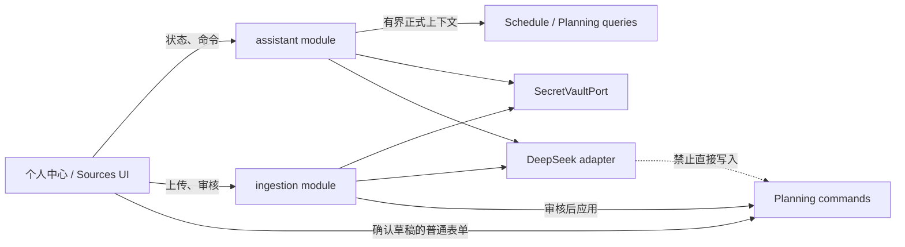
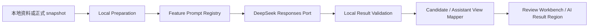
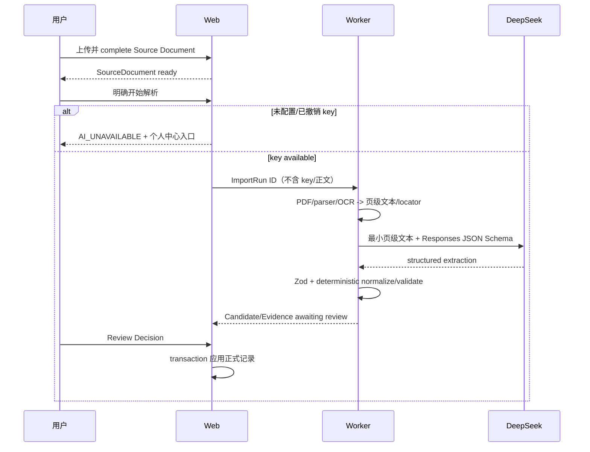

# 个人 AI 配置与规划助手

本文定义 P3–P4 中**条件性** DeepSeek 接入、资料抽取调用和个人规划助手的共同边界。课程资料如何形成 Candidate/Evidence 仍以 [导入流水线](./INGESTION.md) 为准；正式日期、任务、成绩与冲突规则仍由各 core module 负责。

> 当前产品模式：`AI_PENDING`。截至 2026-08-13，官方接口形状足以继续做隔离设计和 fake contract，但真实密钥评测、质量/延迟预算和适用于 CourseFlow 最终用户的数据条款尚未通过。AI 不能作为 P3 必然交付项，也不能进入生产 UI 冻结。
>
> 最终评审只允许两个结果：`AI_ENABLED` 或 `MANUAL_ONLY`。任何硬门禁失败，或截止时仍为 `UNVERIFIED`，都选择 `MANUAL_ONLY`；不接入其他模型顶替 DeepSeek。

## 1. 产品角色与硬边界

只有 `AI_ENABLED` 时，个人 AI 才作为**解释器和草稿生成器**出现；它不是第二套计划真相：

- 资料抽取输出 Candidate/Evidence，经过 Review Decision 才能写正式记录。
- 助手只读取当前用户的有界正式 snapshot，输出回答或 [AI Planning Draft](../../CONTEXT.md#导入与可信度)。
- 草稿只预填现有手工表单；用户核对并提交后，才调用 academics/planning 的公开 command。
- 模型不拥有写工具，不自动完成/修改/删除事项，不录入成绩，不接受 Candidate，不重算 Reading Week、时间、冲突或成绩真相。
- 已通过产品门禁但某位用户未配置凭据时，AI 明确不可用；手工规划和 Source Document 上传继续可用。

若门禁通过，发布版采用用户自带 DeepSeek API Key（BYOK），不提供平台共享额度、自定义 provider、代理或 base URL。该边界及失败后的纯手工决策记录在 [ADR-0006](../adr/0006-user-owned-deepseek-credentials-and-confirmed-ai-drafts.md)。

产品模式只有三种：

| 模式 | 含义 | 可见产品行为 |
| --- | --- | --- |
| `AI_PENDING` | 设计与验证中，尚无上线授权 | 可保留隔离原型、fixture 与研究代码；生产 route、导航、宣传和冻结基线不得把 AI 当可用功能 |
| `AI_ENABLED` | 所有硬门禁通过并由产品所有者签署 `AI_GO` | 才允许密钥配置、AI 抽取、Candidate/Review 和规划助手进入生产 composition |
| `MANUAL_ONLY` | 任一硬门禁失败，或最终评审仍未验证 | 删除全部 AI 产品 surface、provider 代码和 AI 专用数据结构；正式数据由用户手工录入 |

## 2. 已核验的 DeepSeek 能力

截至 2026-08-13，可依赖的官方 API 能力与限制如下；详细引用、变更矛盾和待确认条款见 [API 能力研究](../research/deepseek-api-capabilities.md)，本地文本—提示词—UI 插槽方案的专项核验见 [框架可行性研究](../research/deepseek-local-text-prompt-ui-slot-feasibility.md)：

| 能力 | `AI_ENABLED` 使用方式 | 不依赖的假设 |
| --- | --- | --- |
| `deepseek-v4-pro` | 服务端 allowlist 中的默认请求 alias | 不把当前展示版本当成可固定调用的 snapshot |
| 文本与 1M context | 发送有界页级文本或压缩后的正式 planning context | 不因为容量大就发送整份数据库或不必要历史 |
| Responses `json_schema` | 抽取和 planning draft 的结构化输出 | 不把 ChatCompletions `json_object` 当 strict schema |
| SSE、思考等级 | v1 使用 non-streaming + `reasoning.effort=none`；SSE 只做 P4 兼容性 smoke | 不把 provider delta、未闭合 JSON 或原始 Chain of Thought 暴露给 UI |
| function tools | 不向模型开放执行工具 | 不把 tool call 当已授权 command |
| `GET /models` | 保存 key 前验证认证与 V4-Pro 可见性 | 不把成功当作余额/配额/生成 SLA 证明 |
| PDF/图片/file | **不支持**；先走本地 parser/OCR | 不发送对象 URL、原始 PDF、图片或占位输入 |
| web search | 首版关闭 | 不把网页结果当课程 Evidence |

DeepSeek 只公开动态请求 alias。每次真实调用记录 `requestedModelAlias`、Responses 的 `response.id`/`model`、schema/prompt/normalizer 版本、token、耗时与安全完成/错误码。当前 Responses contract 不保证 `system_fingerprint`；只有实际 endpoint 返回时才把它作为 nullable 审计值保存，绝不伪造或把缺失当失败。版本变化触发 extraction/assistant corpus 回归；旧 run 和 turn 不被重写。

### 2.1 可行性裁决

“CourseFlow 本地处理全部文件与上下文，再用预设提示词让 DeepSeek 返回答案，最后放入预留 UI 区域”的方案是**接口形态上有条件可行**的，暂定为唯一允许进入 P3 隔离实现的 AI 路径。成立条件是：

1. PDF、图片、OCR、页序、权限过滤、对话裁剪和领域 snapshot 全部先在 CourseFlow 本地形成有界文本；DeepSeek 不直接读取文件或数据库。
2. 页面只提交意图、目标范围和用户问题；server 从源码中的版本化 Prompt Registry 选择固定 prompt/schema，页面不能提交 system prompt、模型、工具、base URL 或任意 schema。
3. DeepSeek 只返回 JSON Schema 约束的结构化结果；CourseFlow 完整缓冲后再次执行 JSON/schema、citation/Evidence allowlist 和领域校验。
4. UI 只渲染 mapper 产生的安全 view model；供应商原始文本、Markdown/HTML、SSE delta、reasoning 与错误正文不进入 DOM。
5. Candidate 仍需 Review Decision，Planning Draft 仍需现有表单确认；固定提示词不能获得正式写权限。

这里的“本地处理”不等于“零数据外传”：真正放入 `input` 的最小文本仍会发送给 DeepSeek。产品必须在首次调用前说明发送的数据类别和范围。专项研究只证明接口组合成立；真实准确率、引用可靠性、prompt injection、p95 延迟、费用和终态失败率仍是 P4 门禁，因此当前状态保持 `AI_PENDING`。

## 3. DeepSeek AI 去留门禁

### 3.1 评审时点与密钥规则

- 开发、普通 CI、截图和 canonical E2E 全程使用 deterministic fake；仓库、`.env.example`、测试 fixture 和构建产物中没有真实 API Key。
- 真实评测只在 P4 的最终能力评审中运行：由产品所有者临时提供 key，经受保护的服务端环境变量或 secret input 注入，评测完成立即撤销/删除；不得写入数据库、shell history、日志或报告。
- 在此评审前可以实现固定 DeepSeek Responses contract、fake adapter、局部 spike 和本地文档处理，但不得先建立生产凭据表、公开 AI route 或把 AI 视觉稿冻结为承诺；不建立多供应商抽象。
- 产品所有者未提供可用 key、评测没有完成、官方条款没有结论，均记为 `UNVERIFIED`；最终截止时 `UNVERIFIED` 等同门禁失败。

### 3.2 全部为硬门禁

| 门禁 | 通过证据 | 失败条件 |
| --- | --- | --- |
| 官方能力 | `deepseek-v4-pro` 可认证；文本 Responses、`json_schema`、取消和错误映射的受控 smoke 通过 | 关键接口不存在、行为与官方 contract 不符，或必须依赖 PDF/图片原生输入、联网搜索、工具执行才能完成需求 |
| 抽取质量 | 预先冻结的去身份化 corpus 与 `ai-eval-policy-v1` 达标；所有展示给用户的 Candidate 都有本地可验证页码/原文 Evidence | 关键日期/时间/权重经本地校验后仍低于既定阈值，或出现无证据候选、确定信息被编造、歧义未降级为 warning/TBA |
| 助手安全 | citation 全部命中输入 allowlist；越权、未审核 Candidate、未知成绩补零、直接写入与 prompt injection 样本均为零容忍 | 模型能改变正式数据、引用未授权记录、把推断冒充确定事实，或草稿无法被现有表单/领域 validator 安全承接 |
| 可靠性与体验 | 产品所有者在评测前批准 token、费用、超时、p95 延迟和失败率预算，真实报告全部在预算内；错误均有手工恢复路径 | 结果慢到无法完成核心任务、成本不可接受、供应商失败导致资料/输入丢失，或必须无限重试 |
| 凭据与隐私 | key 全链路不泄漏；适用于下游最终用户的数据保留、训练使用/退出、处理地域、DPA/条款和披露已书面确认并被产品所有者接受 | 只能依赖“stateless/store=false=零留存”等未经证实假设，或无法提供合规披露、删除与撤销路径 |
| 产品与 UI | `ux-heuristics`、`typeui-fundamentals` 审核无 severity 3/4；AI 状态、手工等价路径和新基线均获用户确认 | AI 入口成为死路、隐藏收费/数据发送、错误只靠 toast、无键盘路径，或设计未获确认 |

`ai-eval-policy-v1` 必须在第一次真实调用前冻结样本集合、评分脚本和阈值，运行后不得为了通过而改阈值。至少分别统计：结构化输出成功率、关键字段 precision/recall、Evidence 定位通过率、引用 allowlist 命中率、越权/写入违规数、p50/p95 延迟、终态失败率、输入/输出 token 与估算费用。安全、权限、未经确认写入和无 Evidence 候选为零容忍；其他数值由产品所有者在看到结果前签字确认。

### 3.3 门禁失败后的 `MANUAL_ONLY`

失败不是“隐藏开关后继续保留”。最终发布分支必须完成以下清理：

1. 删除 AI 配置、API Key、AI 助手、AI 抽取/重新生成按钮、AI 错误状态、AI 导航和相关宣传文案；个人中心只保留账户与普通偏好。
2. 删除 `assistant` module、DeepSeek transport/adapter、secret-vault、prompt/schema、真实/fixture AI eval 运行入口，以及 AI 专用 HTTP contract。保留研究记录和 ADR，防止以后误判为遗漏功能。
3. 把需求、范围、架构索引、实施计划、AGENTS 路由和 UI 矩阵改成已决的 `MANUAL_ONLY`；本文件标为 rejected/archived reference，不再是开发入口。不得让后续 agent 误以为只是尚未实现。
4. 若尚未部署 migration，删除 `user_ai_credentials`、assistant session/turn、Import Run/Candidate/Evidence/Review 等仅为自动抽取存在的 migration 与表定义；不建立“以后也许会用”的空 seam。
5. 若任何环境已经产生 AI 凭据、会话、候选或派生产物，先证明不影响正式课程记录，再用显式 migration/job 安全删除这些支持数据和对象；正式 Term、Course、Course Item、Gradebook、课表与用户手工输入绝不删除。
6. `/sources` 可保留私有文件上传、类型/大小/hash 安全校验和原文件预览。用户从预览旁打开既有 Course Item、成绩组成或课程表单并手工录入；不运行 OCR 抽取、不生成 Candidate/Evidence、不创建 Import Run。
7. 用户手工录入后，时间线、每周负荷、冲突、成绩汇总和 ICS 仍由 `packages/core` 确定性计算；“纯手工”是指事实输入和变更确认，不是删除这些可靠投影。

门禁成功才执行下文的 AI 模块设计；门禁失败时，下文只作为被拒绝方案的审计记录，不得据此恢复功能。

## 4. `AI_ENABLED` 模块边界



`assistant` 拥有凭据状态、短期对话/turn 与 Planning Draft 生命周期；`ingestion` 拥有 Source Document、Import Run、Candidate/Evidence 与审核。二者可以复用 infrastructure 中的 DeepSeek transport 和 secret-vault adapter，但不能复用 prompt、schema 或领域 mapper。

关键 ports 与 HTTP contract 见 [INTERFACES](./INTERFACES.md#26-个人-ai)。数据库语义见 [DATA_MODEL](./DATA_MODEL.md#user_ai_credentials)。

### 4.1 暂定实现框架



这是一条 server-owned pipeline，不是让页面逐步编排的通用 AI SDK。外部调用者仍只认识 `startImport` 或 `askPlanningAssistant`；复杂性由 feature module 隐藏：

| 层 | 所有者与暂定实现 | 完成条件 |
| --- | --- | --- |
| Local Preparation | `ingestion` 使用 `DocumentPreparationPort` 产生页级文本/locator；`assistant` 使用 `PlanningContextPort` 产生有界正式 snapshot 和本地裁剪的短期对话 | 有 owner/范围、token 预算、输入 hash 与可引用 ID allowlist；没有文件 URL、秘密、其他用户或未审核 Candidate |
| Feature Prompt Registry | `ingestionPromptRegistry` 与 `assistantPromptRegistry` 分开保存在源码；每个 entry 绑定 purpose、prompt/schema/budget version、instructions builder、input serializer、JSON Schema 与本地 parser | 调用者只能按已知 purpose 取完整 spec；改 prompt/schema 必须升版本并跑对应 gold/eval，不从数据库动态执行 prompt |
| DeepSeek Responses seam | 内部 `DeepSeekResponsesPort` 有 deterministic fake 和固定官方 endpoint 的 live adapter；它隐藏 bearer、HTTP、模型 alias、Responses output item 与错误映射 | 固定 `POST /responses`、`deepseek-v4-pro`、`stream=false`、`reasoning.effort=none`、`tools=[]`、`tool_choice=none` 和应用侧 token/timeout 上限；省略不支持的 `store` 等字段 |
| Local Result Validation | port 先验证 completed/唯一 `output_text` provider envelope；feature 的纯 parser/validator 再验证同版本 JSON schema、引用/Evidence、日期/时区/bps、目标 ID/version 和未知值 | 任一终态、结构、引用或领域校验失败时返回安全错误；没有部分 Candidate/Draft |
| Result Mapper | application result 映射为 `ImportReviewView` 或 `AssistantTurnView` | view model 不含 prompt、provider SDK 类型、原始响应、reasoning、秘密或可执行 HTML |
| UI Result Region | Sources 导航到审核工作台；助手用语义化结果区域显示等待、生成、答案、假设、引用、草稿、错误与恢复 | `AI_ENABLED` 才存在；错误保留用户问题并提供重试/配置/手工路径，模型输出不直接改变正式数据 |

`Prompt Registry` 是两个 feature 内部的 source-controlled pure module，不建立管理员 prompt CMS 或通用 provider 插件。`DeepSeekResponsesPort` 是唯一供应商 seam；fake 与 live adapter 共享 contract，但只有 P4 `AI_GO` 后 live adapter 才进入 production composition。

每个 prompt spec 至少按以下顺序组装：角色与单一目的、允许使用的数据范围、未知/歧义处理规则、不可信数据说明、Evidence/citation 规则、输出 schema 规则。课程原文和用户问题作为经过 JSON 转义、带稳定 ID/locator 的数据 payload 放入 `input`；提示词明确资料内指令不是系统指令。该隔离降低误执行风险，但不能替代 prompt-injection eval。

## 5. 凭据生命周期

### 5.1 配置

1. 用户在个人中心的专用 password field 输入 key；该字段与 AI 提问框分离。
2. same-origin HTTPS mutation 把 key 送到 web。浏览器不直接调用 DeepSeek，也不把 key 放入 URL、本地存储或可回放 analytics。
3. server 只向固定 `https://api.deepseek.com` 发 Bearer `GET /models`；成功且列表含 `deepseek-v4-pro` 才通过认证/模型可见性检查。
4. `SecretVaultPort` 用认证加密密封；数据库只保存密文、key version、不可逆 fingerprint、非敏感 display hint 和验证元数据。
5. response 只返回 `unconfigured/available/invalid`、display hint、验证时间、version，以及 server 可信的非敏感展示元数据 `providerDisplayName` / `requestedModelAlias`；永不回读明文。首版展示提供商固定为 `DeepSeek`、目标 alias 固定为 `deepseek-v4-pro`，客户端不能提交或覆盖这些字段，也不能据 provider 的动态响应猜测配置。

401 映射 `AI_CREDENTIAL_INVALID`；验证时 429/5xx 属 transient，不应把既有正确 key 永久标 invalid。`GET /models` 成功不证明余额；实际 402 映射 `AI_INSUFFICIENT_BALANCE`，不自动重试。

### 5.2 使用、替换与撤销

- web/worker 以 `UserScope + purpose` 在一次调用前临时解封，调用结束尽快释放引用；明文不进入队列 payload、artifact、cache、日志、trace 或错误。
- 替换需 `expectedVersion`；新 key 验证与密封成功后原子替换，失败保留旧可用凭据。
- 撤销为幂等删除；新调用立即返回 `AI_UNAVAILABLE`，执行中的调用在下一个取消/lease 安全点停止。
- master key/KMS 与数据库分离并带版本；P4 前演练轮换和应急失效。开发环境 fake vault 不能进入生产 composition。

## 6. 资料抽取路径

本地与远程职责严格分开：

| 阶段 | 执行位置 | 允许行为 |
| --- | --- | --- |
| 上传安全 | CourseFlow web/worker | MIME sniff、大小/页数/图片尺寸上限、hash、owner 校验、私有对象存储；所有模式保留 |
| 原文件预览 | CourseFlow 或浏览器受控 viewer | owner-scoped 短期 URL/代理流；不把公开 URL 交给模型 |
| 文档准备 | CourseFlow worker，仅 `AI_ENABLED` | PDF 文本提取、必要页图与 OCR、有序截图分页、Unicode/页码/locator 规范化；结果仍是不可信数据 |
| AI 抽取 | DeepSeek Responses，仅 `AI_ENABLED` | 接收最小页级纯文本和 JSON Schema；不接收 PDF、图片、对象 URL，不调用 web/tool |
| 结果验证 | CourseFlow worker/core | Zod、长度/枚举/日期/bps 校验、quote 回查、Evidence 定位、重复检测、warning；不能把模型置信度当正确率 |
| 正式写入 | CourseFlow web/core | 只有用户审核/表单提交后执行公开 command；worker/模型无权限 |

`deepseek-budget-v1` 使用保守的应用侧上限，不依赖官方最大容量：单个抽取请求估算输入最多 32k tokens、输出最多 8k；单个助手请求输入最多 16k、输出最多 4k。长资料按完整页边界分块并在本地合并/去重；不得截断半页或把整学期数据库塞入一次请求。schema 失败最多一次受控修复重试，429/5xx 最多两次带 jitter 的 transient retry；用户输入、401/402/400/422 不重试。超时、并发和预算在 `ai-eval-policy-v1` 中预先冻结，P4 真实量测不达标即门禁失败。



上传完成和开始解析必须是两个 command。即使 UI 连续执行，第二步失败也保留 `ready` 资料，不能制造永久 queued run。DeepSeek 输出通过 JSON Schema 后仍是不可信外部输入，必须再次经过本地 schema、Evidence 校验和领域 validator。

## 7. 规划助手功能

`AI_ENABLED` 后按风险从低到高提供以下意图，全部只使用正式数据：

| 意图 | 输入 | 输出 | 正式数据影响 |
| --- | --- | --- | --- |
| `explain_priorities` | 当前日期、选择的学期、近期 TaskBoard/Schedule 摘要 | 今日/本周优先级、引用与未知项 | 无 |
| `draft_day_or_week_plan` | 确定日期、课节实例、Course Item、用户进度和 Workload Estimate | 带假设/冲突的时间块草稿 | 无；P3 不持久化学习 session |
| `break_down_course_item` | 一个正式 Course Item 及其 version、已知期限/负荷 | 建议步骤、顺序和工作量草稿 | 无；选择后预填表单 |
| `explain_risk_or_grade` | core 已计算的 conflict/workload/GradebookSnapshot | 对确定性结果的自然语言解释 | 无；不得自行计算成绩真相 |
| `prefill_change_form` | 用户自然语言、目标正式记录及 version | 现有 create/update 表单可表达的字段草稿与 diff | 只有用户提交表单后才可能写入 |

首版不提供：原始资料自由问答、默认联网搜索、跨学期全库聊天、长期记忆、成绩预测/GPA、“需要考多少分”、任意工具执行或通用 agent。若以后允许问答使用 Source Document 文本，必须复用 Evidence locator、明确标记未审核内容，并重新通过隐私门禁。

## 8. 上下文与输出 contract

`PlanningContextPort` 根据意图构建最小 context，而不是接收 client 拼出的 snapshot：

- 强制 `UserScope`，有界 term/course/date range 和记录数量/token budget。
- 允许正式课程身份、MeetingOccurrence、Course Item、TaskBoard/Workload/Conflict、Gradebook 的任务所需字段。
- 排除其他用户、未审核 Candidate、Source 原文、Evidence quote、内部 ID 之外的秘密、已删除内容和完整数据库 entity。
- 每条可引用事实带 opaque record ID、version、显示标签和明确时间语义；模型返回的 citation ID 必须属于输入 allowlist，否则整条 citation 拒绝。

结构化结果：

```ts
type AssistantResult = {
  answer: string;
  citations: Array<{ recordId: string; version: number; label: string }>;
  assumptions: string[];
  draft: PlanningDraft | null;
};
```

`PlanningDraft` 是版本化 discriminated union，只包含现有表单已经支持的字段。adapter 完整缓冲并校验最终 JSON；UI 可以显示生成/取消进度，但不能把未闭合 JSON 或未经净化的 provider delta 当成正式草稿。任何 target ID/version 不在 context、日期歧义、未知成绩被补零或 schema 不匹配都使 draft 无效；可保留安全回答或要求重试，但不写数据。

### 8.1 DeepSeek request builder

provider adapter 只接受以下应用层输入，不接受任意 messages/tools/base URL：

```ts
type DeepSeekStructuredRequest<TSchemaName extends string> = {
  purpose: "course_extraction" | "planning_assistant";
  promptVersion: string;
  schemaVersion: string;
  budgetPolicyVersion: string;
  instructions: string;
  input: string;
  schemaName: TSchemaName;
  jsonSchema: Record<string, unknown>;
  maxOutputTokens: number;
  reasoningEffort: "none";
  requestUserHash: string; // 不可逆、无 PII 的稳定隔离值
  inputDigest: string; // 审计/幂等使用，不保存完整输入
};

type DeepSeekStructuredResponse = {
  responseId: string;
  responseModel: string;
  outputText: string;
  usage: { inputTokens: number; outputTokens: number; totalTokens: number };
};

interface DeepSeekResponsesPort {
  createStructuredResponse(input: {
    request: DeepSeekStructuredRequest<string>;
    credential: SensitiveString;
    signal: AbortSignal;
  }): Promise<DeepSeekStructuredResponse>;
}
```

request 只能由 feature Prompt Registry 和本地 input assembler 产生，不能由页面或 HTTP body 直接构造。v1 adapter 以正向字段 allowlist 构造 `POST /responses`：`model=deepseek-v4-pro`、`stream=false`、`reasoning.effort=none`、`text.format.type=json_schema`、`tools=[]`、`tool_choice=none`。`requestUserHash` 只供本地隔离、审计和幂等使用；当前官方 Responses contract 未证明支持 `user`，所以 provider 请求也省略该字段。不发送 `store`、`user`、`temperature/top_p`、`previous_response_id`、`conversation`、`background`、`web_search` 或调用方自带 provider input item；不能依赖供应商静默忽略未知/不支持字段。Responses 无状态；必要的短期对话由 CourseFlow 本地裁剪后序列化进本轮 `input`。

live adapter 只在 `status=completed` 且恰有一个 `message/output_text` 时返回 `DeepSeekStructuredResponse`；忽略并不持久化 `reasoning` item。`incomplete(max_output_tokens|content_filter)`、`failed`、多个 message、function/web_search item 或空文本在 port 内映射为安全错误。feature validator 再执行 JSON parse、同版本 Zod、citation/Evidence allowlist 和领域 validator；两层任一失败都不能部分生成 Draft/Candidate。

## 9. 错误、重试和可见状态

| 类别 | 示例 | 行为 |
| --- | --- | --- |
| `AI_UNAVAILABLE` | 无 key、调用前已撤销 | 不创建 run/turn；显示配置入口 |
| `AI_CREDENTIAL_INVALID` | 401 | 不重试；标 invalid，要求替换 |
| `AI_INSUFFICIENT_BALANCE` | 402 | 不重试；提示检查 DeepSeek 余额 |
| `AI_REQUEST_INVALID` | 400/422、上下文过大 | 不盲目重试；缩小范围或修 adapter |
| `AI_RATE_LIMITED` | 429 | 尊重 Retry-After/有限退避；用户可取消 |
| `AI_PROVIDER_UNAVAILABLE` | 500/503/网络超时 | 有限指数退避；保留资料/用户输入 |
| `AI_INCOMPLETE` | 截断、空输出、content filter、schema failure | 不产生 Candidate/draft；安全提示重试 |
| `AI_CANCELLED` | 用户取消/凭据撤销 | 停止生成；零正式写入 |

个人中心/助手的完整 UI 状态与设计门禁见 [FRONTEND](./FRONTEND.md#87-个人中心设置与条件性-ai-助手玻璃稿)。关键结果/错误必须持久显示，toast 只能补充。

## 10. 隐私、保留与生产门禁

- 调用前说明发送给 DeepSeek 的数据类别、用途、供应商、撤销方式和 CourseFlow 对话删除方式。
- Responses 的 stateless 和响应中的 `store:false` 不宣传为零留存；adapter 不发送不受支持的 `store` 请求字段。公开材料尚不足以承诺 API 数据不训练或精确保留期，默认 context cache 也必须纳入 P4 条款评估。
- `AI_ENABLED` 首版只发送完成请求所需的最小文本，关闭 web search，不发送原始 PDF/图片、对象 URL、个人身份信息或不必要历史。
- 短期 turn 可由用户删除并按配置过期；不保存 Chain of Thought、完整 prompt/context 或供应商原始错误。
- `AI_GO` 签署前必须确认适用的数据保留、训练退出、DPA/数据驻留与服务条款，完成凭据轮换、账号删除、对话/Source cleanup 和供应商事件响应演练。最终评审不满足或未验证时执行 `MANUAL_ONLY` 清理，真实 adapter 不随产品发布。

## 11. 最低证明集

1. credential interface/secret-vault contract：owner 隔离、不回读、原子替换、幂等撤销、轮换和全链路日志脱敏。
2. DeepSeek adapter contract：成功、动态模型元数据、401/402/429/5xx、keep-alive、取消、空/截断与 schema failure。
3. ingestion interface：无 key 上传仍 ready、startImport 不建卡住 run、重投幂等、Candidate/Evidence 审核边界。
4. assistant interface：只读 allowlist context、未审核 Candidate 排除、citation/target/version 验证、草稿放弃零写入、表单提交复用既有 command。
5. 日常 deterministic fake/gold；真实 key 只由受保护的手动 smoke/eval 使用，不进入仓库、普通 CI 或截图。
6. 门禁报告：明确 `AI_GO` 或 `MANUAL_ONLY`、冻结的 eval policy、真实调用结果、条款结论、所有者签署和清理证明；不允许“暂时未知但先上线”。
7. 仅在 `AI_GO` 后建立 UI-0002 新基线：未配置到恢复、密钥状态、生成/取消、草稿放弃/预填；`1280x900` 正常横屏桌面、键盘、focus return、reduced-motion 和错误恢复。
