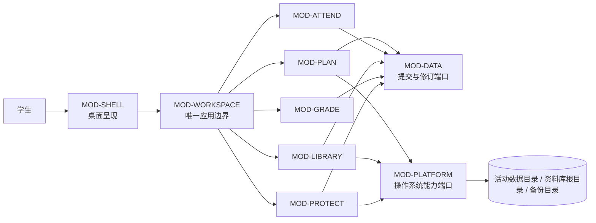

# CourseFlow 架构说明

> 状态：候选架构基线（设计已确认，待文档终审）
> 版本：0.13
> 日期：2026-08-21
> 适用范围：MVP-A、MVP-A-P、MVP-B、MVP-C1；仅为 C2、C3 和已知后续能力保留接缝

## 1. 文档目的与权限

本文定义 CourseFlow 的稳定逻辑架构：系统边界、模块所有权、依赖方向、公共接口形态、关键数据流、故障隔离、质量约束和未来扩展接缝。它同时服务于三类读者：

- 开发者与 Agent：据此识别实现边界，再进入 [MODULE_CONTRACTS.md](./MODULE_CONTRACTS.md) 领取具体契约与测试义务；
- ADR 作者：选择满足本文约束的技术实现，不重定义产品语义；
- roadmap 与 backlog 作者：引用稳定 ID 安排顺序和工作包，不把排期文件变成第二份架构。

本文不选择 UI 框架、编程语言、进程模型、数据库、事务机制、文件监听库、队列、快照格式或打包方案。它约束这些选择必须产生的可观察行为。

### 1.1 上游依据

产品行为与范围来自：

1. [PROJECT_BRIEF.md](../product/PROJECT_BRIEF.md)
2. [PRD.md](../product/PRD.md)
3. [MVP_SCOPE.md](../product/MVP_SCOPE.md)
4. [courseflow-product-definition-design.md](../superpowers/specs/2026-08-17-courseflow-product-definition-design.md)
5. [user-flow-design.md](../superpowers/specs/2026-08-17-user-flow-design.md)
6. [courseflow-ui-wireframes-page-spec-design.md](../superpowers/specs/2026-08-18-courseflow-ui-wireframes-page-spec-design.md)
7. [FUTURE_MEMO.md](../product/FUTURE_MEMO.md)
8. [utm-grading-gpa-rules.md](../research/utm-grading-gpa-rules.md)

产品文档定义“做什么”；本文定义“由谁负责、如何流动、哪些性质不可破坏”；模块契约定义逻辑接口的规范细节；ADR 只定义“采用什么技术实现”。若这些层次冲突，应修改拥有该语义的上游文档并重新确认，不以较新的日期静默覆盖。

仓库根目录的 `ATTEMPT.md` 仅是旧实现风险与可行性证据，不是当前规范；本文不继承其中的技术栈、页面或数据结构。

已识别的课节 TBA、授课人和自定义类型来源差异，以及尚缺数值定义的“临近提示”产品参数，集中记录并裁定于 [MODULE_CONTRACTS.md §1.3](./MODULE_CONTRACTS.md#13-已识别的上游来源差异与裁定)。ADR 和实现不得另行选择口径。

### 1.2 当前范围与非目标

当前架构必须完整承载：

- MVP-A：学期、课程、课节、假期、任务、Today/Week/Calendar、离线本地数据、备份与显式恢复；
- MVP-A-P：默认关闭、可独立降级的课节出席记录；
- MVP-B：单一受管理根目录的课程文件资料库；
- MVP-C1：直接权重成绩、等级与绩点模板、当前学期估算 SGPA。

当前架构只保留、但不实现：C2 目标计算、C3 Academic History、本周负荷、番茄钟、子任务/依赖、AI 或结构化导入候选、新文件处理器。

明确非目标包括账户、远程业务后端、多设备双向合并、协作角色、AI/OCR 自动写入、后台系统通知和移动端体验。多设备与协作需要新的身份、授权、同步与冲突模型，是架构跃迁而非当前兼容承诺。

## 2. 系统上下文与架构原则

CourseFlow 是一个单用户、本地优先的桌面工作区。正式结构化数据与课程文件位于本机；用户选择的云盘同步目录只保存可恢复快照，云盘同步工具不属于 CourseFlow 的业务后端。

架构遵守以下原则：

1. **深模块**：页面是入口，业务语义由少量模块拥有；接口应隐藏比自身更大的实现复杂度。
2. **单一应用边界**：Shell 只调用 Workspace Interface，不直接依赖领域模块、持久化或操作系统。
3. **本地真相**：活动结构化数据与真实资料库文件是正式真相；投影、索引缓存和快照都不是第二套真相。
4. **稳定身份**：跨页面、重算、规则分割和外围模块引用使用稳定 ID，不使用 UI 行号、日期文本或路径作为身份。
5. **显式未知**：TBA、未知、零、未出分、未标记、缺失、失败和不适用是不同状态。
6. **核心单向依赖**：MOD-PLAN 不依赖 ATTEND、LIBRARY、GRADE 或 PROTECT；外围故障不进入 MVP-A 的核心提交前置路径。
7. **成功先被证明**：只有越过相应事实提交边界后才能返回成功；异步备份不决定本地保存成功。
8. **扩展靠接缝，不靠空模块**：现在只定义已知稳定输入输出；当新能力具有独立事实、生命周期与失败边界时再建立模块。

## 3. 逻辑模块与依赖方向

| ID | 模块 | 类型 | 稳定责任 | 失败边界 |
|---|---|---|---|---|
| `MOD-SHELL` | 桌面呈现 | 呈现 | 页面、抽屉、模态框、临时编辑模型、键盘、焦点、可访问状态 | Shell 局部失败不得改变正式事实 |
| `MOD-WORKSPACE` | 工作区应用模块 | 编排 | 激活与生命周期、用例顺序、一致修订、影响预览、能力/健康聚合、跨模块结果组合 | 可进入 ready、limited、read-only 或 recovery |
| `MOD-PLAN` | 学习计划核心 | 核心领域 | 学期、课程、假期、课节/任务系列、规则段、例外、任务实例状态与统一计划实例 | 失败影响核心计划查询或写入，不能伪装为空数据 |
| `MOD-ATTEND` | 出席记录 | 用户可开关外围模块 | 启用周期、出席事实、出席率与覆盖率 | 降级自身；PLAN 回退到基础时间语义 |
| `MOD-LIBRARY` | 文件资料库 | 次级模块 | 单一本地根、根/文件身份、磁盘一致索引、标签、冲突、扫描、操作恢复、对账与受验证资源授权 | 普通故障降级自身、结构化模块继续；作为未收敛 Restore participant 时进入 recovery |
| `MOD-GRADE` | 成绩与当前 SGPA | 次级模块 | 评分方案、成绩事实、模板版本、结果来源、覆盖范围与确定性结果 | 降级自身；PLAN 和原始成绩事实不受影响 |
| `MOD-PROTECT` | 数据保护 | 核心支持 | 备份集、完整不可变快照、发布/保留状态、恢复会话、恢复前安全恢复集、激活协调状态与暂存/激活编排 | 备份失败不回滚本地成功；激活不确定时进入 recovery |
| `MOD-DATA` | 活动数据协议 | 基础端口 | 修订、幂等提交、一致读取、持久后续动作、导出、暂存与激活协议 | 可读不可写时进入 read-only；完整性不确定时进入 recovery |
| `MOD-PLATFORM` | 平台接缝 | 基础端口 | 时钟/时区、文件系统、监听、选择器、系统打开及平台能力 | 故障按所影响能力传播，不形成全局“平台失败”布尔值 |

### 3.1 边界澄清

- `MOD-SHELL` 拥有当前编辑体验；`MOD-WORKSPACE` 只持久化版本化 `DraftCheckpoint`。无效草稿不是 PLAN、GRADE 或其他领域事实。
- `MOD-WORKSPACE` 只编排，不实现重复展开、出席分母、成绩公式、文件对账或快照算法。
- 领域模块拥有事实含义与不变量；`MOD-DATA` 拥有提交协议，不拥有课程、任务或成绩语义。
- `MOD-PROTECT` 拥有备份集、快照格式/发布/保留、恢复会话、安全恢复集生命周期和跨资源激活编排；`MOD-WORKSPACE` 拥有维护/恢复模式、epoch、health 与路由；`MOD-DATA` 提供一致结构化导出、关闭/重开与激活；`MOD-LIBRARY` 提供目标根、完整已验证文件闭包、暂存和对账；`MOD-PLATFORM` 只兑现窄文件系统操作，不解释恢复阶段。
- ATTEND 是用户可开关能力。B 与 C1 的“次级”表示它们不阻塞 A 的发布和运行；某个版本一旦声明包含 B 或 C1，就必须完整满足相应需求。
- 每个模块产生自身 diagnostics 与 capabilities；Workspace 聚合它们。瞬时 health 可重建，持久操作状态必须可恢复。

### 3.2 允许与禁止的依赖

允许：

- Shell → Workspace Interface；
- Workspace → 各模块的领域接口；
- 领域模块 → 窄化的 DATA / PLATFORM 端口；
- 外围模块 → PLAN 发布的稳定身份或只读投影；
- PROTECT → DATA 导出/激活接口和 LIBRARY manifest/暂存接口。

禁止：

- Shell 绕过 Workspace 直接调用仓储、文件系统或领域模块；
- PLAN 反向依赖 ATTEND、LIBRARY、GRADE、PROTECT；
- 模块接口泄露数据库表、ORM 实体、真实路径格式、窗口组件或平台 API 类型；
- 用通用 Event、Repository、Calculation 或 Job 模块承接没有语义所有者的业务逻辑；
- 把 PostCommitChange 当成事实源或事件溯源日志。

## 4. 数据真相、身份与派生

### 4.1 正式事实所有权

| 事实 | 所有者 | 说明 |
|---|---|---|
| WorkspaceLifecycle、SetupProgress、持久草稿检查点 | `MOD-WORKSPACE` | 当前最低条件由正式事实派生；曾达标里程碑不因学期归档抹除；草稿与正式事实分层 |
| Term、HolidayRange、Course | `MOD-PLAN` | 一个 Workspace 可有多个历史学期，最多一个当前学期 |
| MeetingSeries / TaskSeries 及规则段 | `MOD-PLAN` | “本次及未来”结束旧段并创建新段，不重写历史段 |
| OccurrenceOverride、TaskOccurrenceState | `MOD-PLAN` | “仅本次”使用实例覆盖；完成、跳过、删除语义分开 |
| AttendanceWindow、AttendanceRecord | `MOD-ATTEND` | 引用 MeetingOccurrenceId；未标记不是缺席事实 |
| GradingScheme、GradeResult、GradeScaleVersion、CourseGradeBinding | `MOD-GRADE` | 版本、来源和覆盖范围不可丢失 |
| LibraryRootId、RootGeneration、LibraryRecord、CustomTag、FileOperation | `MOD-LIBRARY` | 真实文件内容在磁盘；根 marker 提供逻辑根身份；索引记录对应关系与验证状态 |
| BackupConfiguration、BackupSet、SnapshotManifest、SnapshotPublication、RestoreSession、RestoreSafetySet、恢复激活协调状态 | `MOD-PROTECT` | 每个备份配置拥有独立 BackupSet；快照在激活前不是活动真相；安全恢复集属于单次恢复会话，不进入 BackupSet 保留计数 |
| Revision、CommandReceipt、DurableFollowUp 持久记录 | `MOD-DATA` | DATA 拥有原子记录/恢复协议；每个 follow-up 的业务含义与完成策略仍归其命名模块 |

### 4.2 稳定身份

至少使用 `WorkspaceId`、`TermId`、`CourseId`、`MeetingSeriesId`、`TaskSeriesId`、`MeetingOccurrenceId`、`TaskOccurrenceId`、`GradingItemId`、`LibraryRootId`、`RootGeneration`、`FileId`、`GradeScaleVersionId`、`BackupSetId`、`SnapshotId`、`RestoreSessionId`、`SafetySetId` 和 `OperationId`。

- 规则重算、视图切换、应用重启和缓存重建不得改变同一逻辑对象的身份。
- 出席记录引用 `MeetingOccurrenceId`；任务状态引用 `TaskOccurrenceId`；成绩项关联任务时引用稳定任务身份。
- 路径、文件名、日期文本、列表位置和投影行号都不是身份。
- 假期变化可以重新派生可见实例，但不得静默删除例外、历史状态或出席记录；受影响引用进入可解释的核对状态。

### 4.3 派生与修订

`MeetingOccurrence`、`TaskOccurrence`、Today/Week/Calendar/TBA、出席统计、成绩结果、SGPA 和目录派生标签都是可重建投影。缓存可以丢弃，正确性不能依赖缓存幸存。

每次正式结构化提交推进单调 `Revision`。复合查询使用一个 `ReadSnapshot`，并返回包含该 revision、计算时刻、学期时区、能力和模块健康的 `ProjectionEnvelope`。页面不得混合多个 revision 后自行声称为同一状态。

### 4.4 三个位置与快照

1. **活动数据目录**：正式结构化事实和可恢复操作状态；
2. **资料库根目录**：真实课程文件与最小根身份 marker；MVP 只接受一个通过本地卷/已知云目录检查的活动根，已知云盘/远程位置拒绝，无法排除任意第三方同步时必须记录用户确认；
3. **云盘备份目录**：用户选择的独立位置，只保存 CourseFlow 管理的分 Workspace、分 BackupSet、完整且不可变的快照；不同 BackupSet 不互相自动清理。

三者不得重叠。Watcher 事件只是扫描线索；磁盘扫描与验证决定索引状态。根可访问且应用持续运行时，完整资料库核对最迟每五分钟启动一次；未映射普通文件仍属于资料库事实并保持待归类。备份快照只有在所选目录本地完整发布并重新验证后才是成功快照；这不证明外部云盘同步已经完成。恢复候选只有在当次验证、影响预览、用户确认、暂存和可恢复激活完成后才成为新的活动数据。

## 5. Workspace Interface 概览

Shell 只使用以下五种逻辑能力；规范字段和结果见 [MODULE_CONTRACTS.md §3](./MODULE_CONTRACTS.md#3-workspace-interface)：

| 能力 | 作用 | 关键约束 |
|---|---|---|
| `query` | 读取小型、修订化投影和操作状态 | 同一结果只使用一个 ReadSnapshot；失败不伪装为空结果 |
| `execute` | 提交幂等领域意图或启动长操作 | 同步返回 committed，或异步返回 accepted + OperationHandle |
| `preview` | 返回高影响操作的影响、选择和确认令牌 | 令牌绑定 revision；过期必须重新预览 |
| `observe` | 提示 revision、operation、capability、health 变化 | 通知是重查提示，不是事实源 |
| `accessResource` | 按 FileId 预览、定位或请求系统打开文件 | 每次用途独立重新验证路径、权限和 verification stamp；大内容不进入普通投影；非高风险普通文件的平台动作只报告 requested/failed，高风险可启动文件只允许定位 |

公共协议包括 `CommandEnvelope`、`ProjectionEnvelope`、`ImpactPreview`、`CommandOutcome`、`StructuredProblem`、`UndoCapability`、`DraftCheckpoint`、`OperationHandle`、`DurableFollowUp` 和 `PostCommitChange`。

## 6. 七条关键数据流

| ID | 名称 | 成功边界 | 失败或降级语义 |
|---|---|---|---|
| `FLOW-00` | Workspace 激活与生命周期 | 打开 DATA 或启动 Library watcher 前先判定恢复激活协调状态；活动数据完成验证；路由到 setup、today 或 recovery | 可选模块异常进入 health；数据不可读、协调证据冲突或激活未收敛进入 recovery |
| `FLOW-01` | 结构化命令与本地提交 | 事实、revision 与 DurableFollowUp 在一个逻辑提交中成立 | 提交前失败不改变正式事实；主事实成功但后续动作待处理时明确显示 pending |
| `FLOW-02` | 统一计划投影 | PLAN 在同一 ReadSnapshot 和 EvaluationContext 下生成所有计划实例 | ATTEND 可降级；PLAN 失败不得返回伪空日程 |
| `FLOW-03` | 资料库对账与资源访问 | 文件操作达到 index-committed，当前 RootGeneration 的完整扫描完成磁盘—索引对账，或一次重新验证后的资源请求返回受控预览/平台动作结果 | disk-applied 中断进入 reconciliation-required；身份歧义等待决定；权限/根身份丢失时索引标 unverified；资源失败保持 dataEffect unchanged 且不伪造已打开 |
| `FLOW-04` | 异步备份 | DATA 实际 revision 与完整 Library 闭包写入同一 BackupSet 的临时目录，完整验证、发布并再次验证后，成功水位覆盖该实际 revision | 本地提交保持成功；任一必需成员失败则不发布部分快照；既有已验证快照和待备份水位保留，外部云盘上传不冒充成功 |
| `FLOW-05` | 显式整库恢复 | 候选结构化数据重新打开并验证、资料库全量对账、设备相关能力失效且 FLOW-00 路由完成后，恢复成功回执与激活协调状态一致 | 检查点前失败保留原数据；检查点后中断停止普通打开，只允许证据支持的继续、回滚或诊断；不返回部分成功 |
| `FLOW-06` | 模块自有的确定性结果投影 | ATTEND/GRADE 分别从同一 revision 产出带来源、覆盖和未知原因的结果 | 模块结果 unavailable 不冒充零或旧的当前结果；PLAN 继续运行 |

完整步骤、输入输出和检查点见 [MODULE_CONTRACTS.md §8](./MODULE_CONTRACTS.md#8-七条-flow-的规范步骤)。

## 7. 故障隔离与工作区模式

### 7.1 影响半径

| 级别 | 影响 | 例子 | Workspace 响应 |
|---|---|---|---|
| L0 | 当前意图或决策 | 字段校验、版本冲突、过期确认令牌 | 保留输入，不提交；修正、重查或重新确认 |
| L1 | 单一模块或能力 | ATTEND 统计、GRADE 计算、LIBRARY 权限、PROTECT 备份失败 | `limited`；不受影响的核心能力继续 |
| L2 | 核心读写路径 | DATA 不可写、PLAN 投影失败 | 保留最后一致事实；可能进入 `read-only` |
| L3 | 工作区完整性 | 活动数据不可读、版本不兼容、恢复激活中断 | `recovery`；停止普通写入，只开放恢复动作 |

### 7.2 工作区模式

- `ready`：核心读写与已启用能力可用；
- `limited`：一个或多个外围/次级能力降级，核心仍可用；
- `read-only`：活动数据可读但不能安全写；正式命令明确拒绝；
- `recovery`：完整性或激活状态不确定，只允许事实所有者明确给出的恢复动作；没有未决激活时可以选择快照，存在 nonterminal Restore activation 时只能使用证据支持的诊断、继续或回滚，不得嵌套开始另一恢复。启动检查可以补记唯一可证明且不改变结构化数据/资料库的观察或完成状态，任何仍会改变物理资源的动作必须等待用户明确选择。

`StructuredProblem` 必须说明稳定 code、scope、dataEffect、affectedCapabilities、resolution 以及 revision/operation 上下文。Shell 负责可访问文案，但不得推断或改写 dataEffect。

### 7.3 不得伪成功

- 没有新 revision 就不能返回结构化提交成功，也不能触发正式撤销或备份；
- 文件已在磁盘改变但索引未提交时，只能报告中间/恢复状态；
- 主事实已提交但跨模块后续动作仍待处理时，返回“已提交 + pending follow-up”；
- 备份目录出现候选或本地 rename 完成都不足以报告成功；只有最终目录完整重验与成功水位提交均完成后才成功，且不声称云端上传完成；
- 恢复只有全部激活成功或未成功两种面向用户的最终结果，不提供“部分恢复成功”。

## 8. 质量约束

以下 `Q-*` 是稳定架构约束。详细测试映射见 [MODULE_CONTRACTS.md §10](./MODULE_CONTRACTS.md#10-测试义务)。

| ID | 约束 | 主要来源 |
|---|---|---|
| `Q-TRUTH-01` | 只有正式事实或已验证磁盘/索引越过提交边界才可宣称成功。 | NFR-002 |
| `Q-CONSIST-01` | 同一复合投影只使用一个 ReadSnapshot；页面不重复实现计划规则。 | NFR-009 |
| `Q-TIME-01` | 日期、时刻、范围、倒计时和归档按 Term Zone 解释，覆盖跨日和 DST。 | NFR-004 |
| `Q-STATE-01` | TBA、未知、零、未出分、未标记、缺失和失败保持不同类型。 | NFR-005、STATE-003/006 |
| `Q-PROTECT-01` | 三个用户位置不重叠；每个 BackupSet 的快照完整、不可变、可独立验证且保留最近两份已验证版本；高影响操作先预览并可恢复。恢复安全集与 BackupSet 分离，恢复只承诺跨资源可恢复的逻辑全有或全无，确认绑定候选、当前事实与目标。 | NFR-003/007 |
| `Q-ISOLATE-01` | ATTEND、GRADE 及普通 LIBRARY/PROTECT 能力失败不阻塞 PLAN 核心；只有活动真相完整性或恢复激活未收敛才可进入全局 recovery。 | NFR-010/011 |
| `Q-LOCAL-01` | 核心无需账户、网络、远程后端或 AI；未经明确操作不上传正式内容。 | NFR-001 |
| `Q-PROVENANCE-01` | 成绩与未来估算携带规则/模板版本、来源、覆盖范围和估算标识。 | NFR-008 |
| `Q-ACCESS-01` | 核心操作可键盘完成；状态有文字语义，焦点与消息可被辅助技术感知。 | NFR-006 |
| `Q-PORTABLE-01` | macOS 与 Windows 使用同一领域/Workspace 契约；平台差异留在窄适配器。 | MVP-DOD-007 |
| `Q-RESPOND-01` | 核心激活/保存不等待扫描、备份或外围计算；不可预测时长工作返回 OperationHandle。 | A-DATA-004 |
| `Q-EVOLVE-01` | 正式格式、模板、操作状态和快照版本化；未知新版本停止并解释。 | 版本与恢复要求 |
| `Q-USABILITY-01` | 首次用户约 20 分钟完成参考最低设置；可提前使用、退出并继续。 | MVP-DOD-001、UF-A-02 |
| `Q-CONTINUITY-01` | 重启后正式事实、设置进度、草稿、操作、后续动作和恢复会话不丢失、不重复。 | MVP-DOD-005、STATE-002 |
| `Q-DIAG-01` | 每个空、未知、失败、降级或恢复状态说明原因、dataEffect、影响能力和下一步。 | STATE-001/002 |

### 8.1 结构性能约束

- Workspace 可用状态不等待资料扫描、备份或可选模块；
- LIBRARY watcher 只降低发现延迟；启动、用户触发和五分钟限流核对均使用同一可恢复扫描协议，扫描不得并行；
- 时间视图按窗口查询，长列表分页或增量读取；增加历史学期不得强迫每次扫描全部历史；
- 大文件经 `accessResource` 旁路，不进入 `ProjectionEnvelope`；
- 扫描、备份、恢复和跨资源操作可查询、继续、重试或安全取消；
- 缓存只能改善性能，删除缓存不得改变正确结果。

现有产品文档未提供参考硬件、工作区规模和毫秒级预算。G7 要求在发布候选前版本化参考工作区与 macOS/Windows 设备档案，并校准启动、核心查询、正式提交和后台作业影响预算。这些数值是产品质量基线；ADR 证明选型满足它们，但不能自行降低。

## 9. 架构验收门

| Gate | 必须产生的证据 |
|---|---|
| `G1` 追溯完整 | 每条当前需求指向 MOD、IF、FLOW、适用 Q 和 TEST obligation；未来条目不计入当前覆盖率 |
| `G2` 依赖守卫 | Shell 不越过 Workspace；PLAN 不依赖外围；接口不泄露 UI、存储或平台实现类型 |
| `G3` 语义正确 | 规则段、时间、Reading Week、未知值、成绩与出席公式的性质/边界测试通过 |
| `G4` 故障可恢复 | 提交、文件、备份、恢复所有 failpoint 无伪成功、静默损坏或不可解释中间态 |
| `G5` 隔离成立 | 逐个外围模块故障时，MVP-A 核心旅程仍可运行 |
| `G6` 产品环境 | macOS、Windows、禁网、真实权限、键盘、焦点和状态公告验收通过 |
| `G7` 基线已校准 | 参考工作区、设备档案和数值性能预算已版本化并通过 |

MVP-A 必须独立通过全部适用 Gate。A-P、B、C1 各自增加模块证据，但不能放宽共同 Gate。

## 10. 未来扩展接缝

| ID | 输入接缝 | 新能力拥有 | 不得发生 |
|---|---|---|---|
| `EXT-C2` | 版本化 `GradeProjection` | 目标、假设、可达性和估算结果 | 回写 C1 正式/手工结果；把估算冒充正式结果 |
| `EXT-C3` | `FinalCourseOutcome` + `GradeScaleVersion` | 历史学年、学期、缺口、最终结果、累计范围 | 把历史缺口当无课程；把 C3 塞入当前 SGPA 模块 |
| `EXT-WORKLOAD` | `TaskOccurrenceId` 与显式估时/实际用时事实 | 周负荷统计与自己的未知语义 | 从标题或任务规模猜测小时数 |
| `EXT-TIMER` | `TaskOccurrenceId`、Clock/Platform 接缝 | 计时会话、暂停/恢复/取消与可选历史 | 默认自动完成正式任务；忽略睡眠/重启语义 |
| `EXT-TASK-RELATIONS` | 稳定 TaskId/OccurrenceId | 子任务或依赖关系 | 重写既有实例身份和历史状态 |
| `EXT-CANDIDATE-INTAKE` | 候选/Draft → Workspace 确认入口 | 导入来源、候选状态与确认记录 | AI、OCR 或导入器直接写正式事实 |
| `EXT-FILE-PROCESSOR` | 已验证 `accessResource` | 新预览或处理结果 | 绕过根目录、FileId 或验证标记 |
| `EXT-COLLABORATION-BREAK` | 无当前兼容承诺 | 未来身份、授权、同步与冲突模型 | 把备份目录误用为实时同步协议 |

每个未来模块在进入实现前必须声明语义所有者、criticality、适用与专属 Q、失败半径、未知/来源规则、重启语义、格式版本、平台/可访问证据和对 G7 基准的增量。

复杂评分规则不是预建空模块：它在产品规则与验收明确后，以新的版本化 `GradingScheme` 变体和 evaluator 扩展 `MOD-GRADE`；既有直接权重方案、历史模板绑定、来源与覆盖语义必须继续可读。若其失败半径或生命周期不再能被 GRADE 隐藏，再通过架构评审决定是否拆出新模块。

## 11. 需求追溯总览

| 需求族 | 主要所有者 | 主要 FLOW | 关键 Q | 详细契约 |
|---|---|---|---|---|
| A-TERM / COURSE / TASK | `MOD-PLAN`、`MOD-WORKSPACE` | 00、01、02 | TRUTH、CONSIST、TIME、STATE、CONTINUITY | Contracts §5.3、§8 |
| A-VIEW / CALENDAR | `MOD-PLAN`、`MOD-WORKSPACE`、`MOD-SHELL` | 02 | CONSIST、TIME、STATE、ACCESS、RESPOND | Contracts §6、§8.3 |
| A-DATA / PLATFORM | `MOD-DATA`、`MOD-PROTECT`、`MOD-PLATFORM` | 00、01、04、05 | TRUTH、PROTECT、LOCAL、PORTABLE、EVOLVE、CONTINUITY | Contracts §5.7–§5.9 |
| A-ATTEND | `MOD-ATTEND` | 01、02、06 | STATE、TIME、ISOLATE、DIAG | Contracts §5.4 |
| B-FILE | `MOD-LIBRARY`、`MOD-PLATFORM`、`MOD-PROTECT`、`MOD-SHELL` | 03、04、05 | TRUTH、PROTECT、ISOLATE、LOCAL、ACCESS、RESPOND、PORTABLE、EVOLVE、DIAG | Contracts §5.5、§5.9 |
| C-GRADE | `MOD-GRADE` | 01、06 | STATE、PROVENANCE、EVOLVE、DIAG | Contracts §5.6 |
| STATE / NFR / DOD | 跨模块 | 00–06 | 适用的全部 Q | Contracts §9–§11 |

完整 Requirement → MOD → IF → FLOW → Q/G → TEST 映射位于 [MODULE_CONTRACTS.md §11](./MODULE_CONTRACTS.md#11-完整追溯矩阵)。

## 12. ADR 主题与变更规则

下表只定义决策边界和状态索引，不在 Architecture 中复制技术结论。带“已接受”链接的主题以对应 ADR 为准；其余主题仍未决：

| ID | ADR 决策边界 | 必须满足的架构约束 |
|---|---|---|
| `ADR-TOPIC-01`（[ADR-01 已接受](./adr/ADR-01-desktop-runtime-ui-boundary.md)） | 桌面运行时、UI 与本地应用边界 | 单一 Workspace Interface、macOS/Windows、离线、可访问性 |
| `ADR-TOPIC-02`（[ADR-02 已接受](./adr/ADR-02-process-thread-deployment.md)） | 模块与进程/线程部署方式 | 逻辑依赖不因部署合并而消失；长操作不阻塞核心路径 |
| `ADR-TOPIC-03`（[ADR-03 已接受](./adr/ADR-03-sqlite-active-data-transactions.md)） | 活动数据存储、事务与并发控制 | revision、一致读取、幂等提交、durable follow-up、可恢复激活 |
| `ADR-TOPIC-04`（[ADR-04 已接受](./adr/ADR-04-schema-migration-compatibility.md)） | schema、迁移与兼容策略 | Q-EVOLVE、未知版本停止、备份/恢复可验证 |
| `ADR-TOPIC-05`（[ADR-05 已接受](./adr/ADR-05-library-watching-index-file-operations.md)） | 资料库监听、索引与文件替换策略 | 磁盘真相、FileOperation 状态机、Watcher 只是提示 |
| `ADR-TOPIC-06`（[ADR-06 已接受](./adr/ADR-06-resource-preview-system-open.md)） | 文件预览与系统打开实现 | accessResource 再验证、受限只读预览、非高风险普通文件可请求系统打开、高风险可启动文件只允许定位 |
| `ADR-TOPIC-07`（[ADR-07 已接受](./adr/ADR-07-snapshot-format-integrity-publication.md)） | 快照格式、完整性与发布方式 | 一致 checkpoint、完整 Library 闭包、canonical manifest、临时写入、验证后发布与分 BackupSet 保留 |
| `ADR-TOPIC-08`（[ADR-08 已接受](./adr/ADR-08-restore-activation-recovery.md)） | 恢复激活、回滚与启动恢复机制 | RestoreSession、单一活动真相、无部分成功 |
| `ADR-TOPIC-09` | 本地诊断、日志与用户导出 | Q-LOCAL、Q-DIAG，不自动上传正式内容 |
| `ADR-TOPIC-10` | 打包、签名、更新与平台发布 | Q-PORTABLE、G6；不能造成平台功能缺失 |

变更权限：

- 改变用户行为、范围或验收：先修改产品文档；
- 改变模块所有权、依赖方向、事实真相、FLOW 或 Q：修改本文并重新架构评审；
- 在既有边界内新增 Intent、Query、Problem 或 TEST obligation：修改 MODULE_CONTRACTS；
- 选择或替换满足契约的实现技术：建立或更新 ADR；
- 安排顺序、切片和实现任务：由 roadmap/backlog 引用稳定 ID 完成，不复制语义。

Agent 实现工作包必须指定目标 Requirement/MOD/IF/FLOW/Q/TEST、允许依赖、不变量、失败语义和 ADR 依赖。工作包模板见 [MODULE_CONTRACTS.md §12.2](./MODULE_CONTRACTS.md#122-agent-实现工作包模板)。
