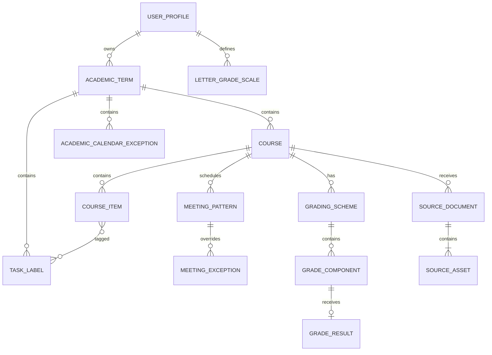

# CourseFlow 数据模型

本文定义 P4 `MANUAL_ONLY` 发布后的正式数据、Source 与派生投影。实际 migration 可以拆表或增加索引，但不能改变这里的业务语义。

## 1. 建模约定

- ID 是不透明 UUID；contract 使用品牌类型，调用方不解析 ID。
- 持久化字段使用 `snake_case`，TypeScript 领域值使用 `camelCase`，映射集中在 repository adapter。
- 审计时间使用 UTC `timestamptz`；课程日期遵守第 4 节的显式时间语义。
- 可变 aggregate root 从 `version = 1` 开始；更新命令必须提供 `expectedVersion`。
- 业务比例使用整数基点：`10000 = 100%`；成绩分数使用精确 decimal，不用浮点数。
- `NULL` 表示未知/不适用；`0` 只表示已知为零。
- 用户资料按 `owner_user_id` 或所属学期隔离。repository 每个读写方法都接收 `UserScope`，不提供无作用域 `findById`。
- P4 发布 schema 不包含远程模型凭据、自动解析、候选、审核、对话或模型结果表。

## 2. 关系总览

## 3. 用户、学期与课程

### `user_profiles`

- `id`, auth subject, display name, avatar reference。
- `display_time_zone`, `week_starts_on` 与普通显示偏好。
- `created_at`, `updated_at`, `version`。

### `academic_terms`

- `id`, `owner_user_id`, `name`, `start_date`, `end_date`, `time_zone`。
- `status`：active/archived；同一用户至多一个 active term。
- 日期必须满足 `start_date <= end_date`。

### `courses`

- `id`, `term_id`, `code`, `title`, optional section/instructor/credit value。
- `color_key`, optional `letter_grade_scale_id`, optional course time-zone override。
- `(term_id, normalized_code, normalized_section)` 保持可解释唯一性；冲突不能静默合并。

### `academic_calendar_exceptions`

- 属于 term，保存 name、纯日期起止、是否抑制普通课节。
- Reading Week 是该表的命名业务值，不是硬编码周号。

### `meeting_patterns`

- 属于 course；保存 kind、section/title、星期集合、本地起止时间、地点和可选有效日期范围。
- 只保存重复规则，不预生成无限课节实例。

### `meeting_exceptions`

- 键为 meeting pattern + 原 occurrence date。
- action 为 cancelled/kept/rescheduled；改期另存 replacement date/time/zone/location。
- 原 occurrence identity 保持稳定，便于跨页面与 ICS 更新。

## 4. 时间值对象

Course Item 时间是显式 union：

- `unscheduled`：尚无唯一日期，可带 note。
- `date`：纯日期，不转成 UTC 午夜。
- `deadline`：带 offset 的 instant 与用于显示/解释的 IANA zone。
- `interval`：起止 instant 与 IANA zone；必须 `startsAt < endsAt`。

Meeting Pattern 使用课程时区下的本地时间和星期；Schedule 只在有界查询范围内展开。DST、Reading Week 与单次例外在 `schedule` core 统一处理，页面不自行实现。

## 5. 正式规划数据

### `course_items`

- 属于 course；保存 title、kind、temporal union、details、estimated minutes、state、optional progress bps。
- state 为 planned/completed/cancelled；删除策略与审计要求由 command 明确处理。
- 事项的创建与修改只来自用户提交的正式表单。

### `task_labels` 与关联

- 属于 term；显示名保留大小写，trim + case-fold 后同学期唯一。
- join table 连接 Course Item；系统派生标签不持久化成用户标签。

### `grading_schemes`

- 属于 course；保存 name、is_primary、optional condition text。
- 一个课程可以有多个方案，但查询只明确选择一个，不把方案混算。

### `grade_components`

- 属于 scheme；保存 title、optional `weight_bps`、optional rule text 与稳定顺序。
- 权重未知保持 NULL；合计非 10000 产生 warning，不自动归一化。

### `grade_results`

- 每个 component 至多一条用户录入结果；保存 exact earned/possible 与 optional note。
- 没有行表示未出分；`possible > 0`，不得以零伪装未知。

### `letter_grade_scales`

- 属于 user；固定 A/B/C/D/F 五档及单调、无重叠的百分比下界。
- 只有 course 显式关联后才计算字母等级；不提供学校默认值。

## 6. 课程资料

### `source_documents`

- `id`, `owner_user_id`, `course_id`, `display_name`, `kind`, `status`, timestamps, version。
- status 为 uploading/ready/failed/deleted。
- 上传成功只表示原文可回看，不触发任何正式数据写入。
- 删除时记录 `cleanup_status` 与对象清理尝试；deleted 立即对读取 fail closed。

### `source_assets`

- 属于 Source Document；保存稳定 `position`、原文件名、对象 key、byte size、verified MIME、可选 checksum。
- 对象 key 随机且不含用户输入；一份 Source 至少一个 asset。
- 数据库不保存文件正文或签名 URL。

## 7. 派生数据：不建表

以下值从正式表按版本化 policy/query 计算：

- 学期进度、教学周、课节实例、今日/下一节课。
- Task Board 的 near/major/tba 分组与雷达。
- 每周负荷、热力图、确定时间重叠与截止扎堆。
- 当前成绩：已获加权百分点、已出分部分百分比、覆盖权重与可选字母等级。
- ICS events 与稳定 UID。

派生结果可缓存，但 cache key 必须包含 owner、term/range 和 policy/source version；正式 mutation 精确失效。不得为页面方便建立第二套真相表。

## 8. 技术支持表

### `idempotency_records`

- scope、operation、idempotency key、request hash、response/status 与过期时间。
- 相同 key + 不同 hash 必须冲突；相同请求返回原结果。

队列、对象清理 outbox 或 auth adapter 若未来需要技术表，必须保持业务表边界，不引入已拒绝的远程模型语义。

## 9. 索引与约束基线

- 所有 owner/term/course foreign key 与常用范围查询有索引。
- `(meeting_pattern_id, occurrence_date)`、label normalized name、source asset position 等用数据库唯一约束保护。
- 日期、基点、earned/possible、版本和状态转移同时由数据库约束与 core 校验。
- migrations 在空库及上一个生产快照上验证；生产不使用 schema push。

## 10. 删除与保留语义

- 删除 Source 先撤销可见性，再删除对象；失败可幂等重试。
- 删除 Source 不删除用户已经手工确认的 Course Item、课表或 Gradebook 数据。
- 删除 course/term/account 的级联与保留策略必须在 UI 提前说明，并通过 owner-scope integration test。
- 日志、备份、对象版本与签名 URL 遵守 [质量与数据生命周期](./QUALITY.md)，不记录原文正文。
