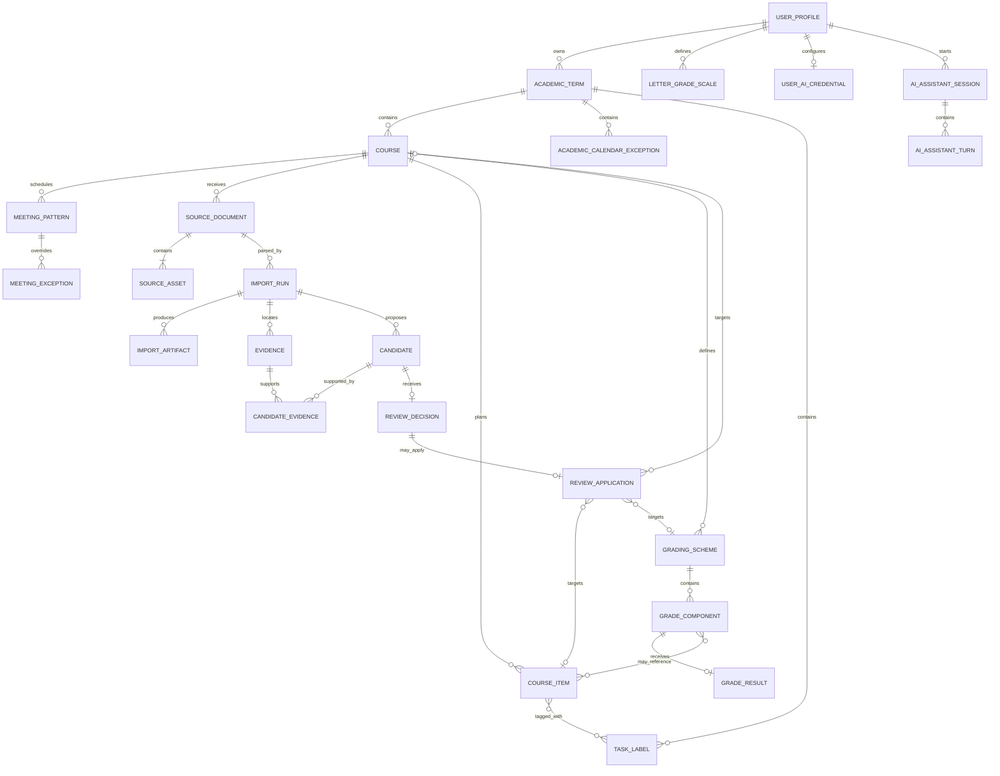

# CourseFlow 数据模型

本文定义正式数据、Source、条件性导入候选和派生投影的语义。它是 schema 与领域类型的依据；实际 migration 可以拆表或增加索引，但不能改变这里的业务含义。

关系总览画出 `AI_ENABLED` 的超集。当前 `AI_PENDING` 不能据此提前把 AI 表加入默认生产 migration；`MANUAL_ONLY` 只保留正式领域表及 `source_documents/source_assets`，删除 `USER_AI_CREDENTIAL`、assistant、Import Run/Artifact、Evidence、Candidate 与 Review 表。正式手工数据不受模式决定影响。

## 1. 建模约定

- 所有 ID 是不透明 UUID；contract 使用带品牌的 `TermId`、`CourseId` 等类型，调用方不解析 ID。
- 持久化字段使用 `snake_case`，TypeScript 领域值使用 `camelCase`，映射集中在 repository adapter。
- 技术审计时间 `created_at`、`updated_at` 使用 UTC `timestamptz`；课程日期遵守第 4 节的显式时间语义。
- 可变 aggregate root 带从 `1` 开始的 `version`，更新命令必须提供 `expectedVersion`。
- 业务比例不用浮点数：`weight_bps = 10000` 表示 `100%`，`confidence_milli = 1000` 表示模型声明的 `1.0`。
- `NULL` 表示未知/不适用；`0` 只表示已知为零。
- JSONB 仅用于**带版本的不可变外部 payload**（模型 artifact、候选、审核快照）。正式课程数据保持关系化并受数据库约束。
- 用户资料按 `owner_user_id`/所属学期隔离。repository 的每个读写方法都接收 `UserScope`，不提供无作用域的 `findById`。

## 2. 关系总览



## 3. 用户、学期与课程

### `user_profiles`

| 字段                      | 类型/规则       | 含义                                                                              |
| ------------------------- | --------------- | --------------------------------------------------------------------------------- |
| `id`                      | UUID PK         | 内部用户 ID                                                                       |
| `auth_subject`            | text unique     | auth provider 的稳定 subject；不使用 email 作为身份                               |
| `display_name`            | text nullable   | 展示名                                                                            |
| `locale`                  | text            | BCP 47，例如 `zh-CN`                                                              |
| `time_zone`               | text            | 有效 IANA zone，例如 `Asia/Shanghai`                                              |
| `week_starts_on`          | smallint `0..6` | 周起始日，ISO 对应 `0=Monday ... 6=Sunday`；首版账户默认 Monday，用户可在设置修改 |
| `active_term_id`          | UUID nullable   | 当前 dashboard 默认学期，必须属于该用户                                           |
| `created_at`,`updated_at` | timestamptz     | 技术审计时间                                                                      |

### `user_ai_credentials`

本节只适用于 `AI_ENABLED`。账户级用户自带 AI 凭据与普通 profile 字段分表，避免常规资料查询或导出意外选出秘密；每个用户最多一份 DeepSeek 凭据：

- `owner_user_id`：PK/FK；删除账户时一并擦除。
- `provider`：固定枚举 `deepseek`；不保存自定义 endpoint。
- `encrypted_secret`、`encryption_key_version`：由 server-side `SecretVaultPort` 产生的认证加密密文与轮换版本；数据库中不保存可独立解密的 master key。
- `secret_fingerprint`：带服务端 pepper 的不可逆摘要，用于检测重复替换/审计；不是 API key 的裸 hash。
- `display_hint`：非敏感掩码提示；不得保存足以重建 key 的片段。
- `status`：`available/invalid`。未配置由“无行”表达，不使用空字符串。
- `verified_model_alias`、`last_verified_at`、`last_error_code`、`version`、`created_at`、`updated_at`；错误只用安全枚举，不保存供应商正文。

明文 key 只存在于配置请求和一次供应商调用所需的短生命周期内存中。repository 不提供 list/read-secret API；解封需 `UserScope`、明确用途和受审计的 secret-vault port。替换/撤销使用 `expectedVersion`，撤销是幂等删除并使后续 AI job 在下一安全检查点失败为 `AI_UNAVAILABLE`。

### `ai_assistant_sessions` 与 `ai_assistant_turns`

本节只适用于 `AI_ENABLED`。个人助手历史是可删除、短期保留的支持数据，不是正式课程记录，也不进入 `ScheduleSnapshot`：

- session：`id`, `owner_user_id`, `title`（可空/用户可改）, `created_at`, `updated_at`, `expires_at`, `deleted_at`。
- turn：`id`, `session_id`, `role=user/assistant`, `content`（纯文本/受控 Markdown，大小上限）, `status=generating/completed/cancelled/failed`, `safe_error_code`, `provider`, `credential_version`（非秘密）, `requested_model_alias`, `response_id`, `response_model`, nullable `system_fingerprint`, 输入/输出 token、`created_at`, `completed_at`。UI 不持久化未经 schema 校验的 streaming delta。
- 可选 `planning_draft` 使用带版本的不可变 JSONB union，只允许现有表单可表达的 draft；它不是 Candidate，也不带已应用标志。正式写入由用户之后提交的既有 command/idempotency/version 记录解释，不从 turn 直接推断。
- 不持久化原始 Chain of Thought、明文 API key、完整 prompt、未审核 Candidate、整个数据库 snapshot 或供应商原始错误。为可解释性只保存用户可见的简洁回答、引用的正式 record IDs/versions 与安全元数据。

P3 可先把 session 设为短期、按用户显式删除；具体保留天数在生产放量前写入 privacy 配置与文案。若首个切片仅需单轮交互，可以不提前创建 session 表，但不得把对话塞进 `user_profiles` 或 Import Run artifact。

### `academic_terms`

| 字段                    | 类型/规则             | 含义                                                            |
| ----------------------- | --------------------- | --------------------------------------------------------------- |
| `id`                    | UUID PK               | 学期 ID                                                         |
| `owner_user_id`         | UUID FK               | 租户作用域                                                      |
| `name`                  | text, trim 后 `1..80` | 如 `2026 Fall`                                                  |
| `start_date`,`end_date` | date，`start <= end`  | 学期本地日期范围                                                |
| `time_zone`             | text, IANA            | 课程未指定时的默认时区                                          |
| `week_numbering_policy` | enum                  | 首版 `teaching_weeks_v1`：从 start 所在周起，停课例外不计教学周 |
| `archived_at`           | timestamptz nullable  | 归档不等于删除                                                  |
| `version`               | integer               | 乐观并发版本                                                    |

同一用户的学期日期可以重叠；交换项目、短学期等场景使重叠合法，只产生提示。

### `courses`

| 字段                    | 类型/规则                | 含义                                                                     |
| ----------------------- | ------------------------ | ------------------------------------------------------------------------ |
| `id`                    | UUID PK                  | 课程 ID                                                                  |
| `term_id`               | UUID FK                  | 所属学期                                                                 |
| `code`                  | text `1..32`             | 用户可见代码，保留大小写                                                 |
| `title`                 | text `1..160`            | 课程名称                                                                 |
| `section`               | text nullable            | 课节/班号                                                                |
| `time_zone`             | text nullable            | 空值时继承学期；只影响未来输入默认值                                     |
| `color_key`             | text                     | 从设计系统课程色板选择的语义键，不存任意 CSS                             |
| `instructor_name`       | text nullable            | 仅展示，不作为身份                                                       |
| `credit_value_milli`    | integer nullable, `>= 0` | 用户填写、最多三位小数的课程学分 ×1000；只表示课程学分值，不宣称已经获得 |
| `letter_grade_scale_id` | UUID nullable FK         | 用户确认的 A/B/C/D/F 换算表；空值时不显示字母等级                        |
| `archived_at`           | timestamptz nullable     | 归档状态                                                                 |
| `version`               | integer                  | 乐观并发版本                                                             |

课程唯一性不由 `(term, code)` 强制；同一学生可能同时有不同 section。创建时对相似 code/title 给 warning。

### `academic_calendar_exceptions`

学期包含零到多个命名校历例外；首个 UI 至少编辑 Reading Week，但模型不把它写成固定字段：

| 字段                    | 类型/规则            | 含义                                         |
| ----------------------- | -------------------- | -------------------------------------------- |
| `id`,`term_id`          | UUID                 | 例外及所属学期                               |
| `kind`                  | enum                 | 首版 `reading_week/holiday/closure/other`    |
| `name`                  | text `1..120`        | 用户可见名称，如 `Reading Week`              |
| `start_date`,`end_date` | date，`start <= end` | 含首尾的学期本地日期区间                     |
| `suppresses_meetings`   | boolean              | 是否默认停开周期课节；Reading Week 默认 true |
| `version`               | integer              | 乐观并发版本                                 |

例外可以重叠；同一日期是否停课取任一 `suppresses_meetings=true`。显式 `MeetingException` 优先于学期默认例外。

### `meeting_patterns`

`MeetingPattern` 是正式、可编辑的周期课节规则，不为每周预先持久化实例：

| 字段                                        | 类型/规则                      | 含义                                                                      |
| ------------------------------------------- | ------------------------------ | ------------------------------------------------------------------------- |
| `id`,`course_id`                            | UUID                           | 课节及所属课程                                                            |
| `kind`                                      | enum                           | `lecture/tutorial/practical/other`；TUT/PRA 是 UI 缩写                    |
| `title`                                     | text nullable                  | 学校原词或 section 描述；空时由 kind 本地化                               |
| `section`                                   | text nullable                  | 课节 section，例如 `TUT0101`                                              |
| `weekdays_mask`                             | smallint，至少一位             | ISO Monday–Sunday 的星期集合；首版 UI 可先一次选择一个星期                |
| `local_start_time`,`local_end_time`         | time                           | 课程时区下的墙上时间，`end > start`；首版不支持跨午夜课节                 |
| `location_text`                             | text nullable                  | 教室或线上地点名称/TBA 的安全展示文本；首版不存可点击 URL，也不是地图坐标 |
| `effective_start_date`,`effective_end_date` | date nullable                  | 空值分别继承学期起止，且有效范围须与学期相交                              |
| `version`,`archived_at`                     | integer / timestamptz nullable | 并发与可逆停用                                                            |

课节使用课程有效 IANA 时区解释。展开到 DST gap/overlap 时不得静默移动：异常实例进入 schedule data-quality 状态，等待用户明确单次覆盖。

### `meeting_exceptions`

课节单次例外用 `(meeting_pattern_id, occurrence_date)` 唯一定位原计划日期：

- `action`: `cancelled/rescheduled/kept`。
- `cancelled` 不含替代时间；`rescheduled` 必须有替代本地日期、开始/结束时间、可选时区与地点；`kept` 显式覆盖学期的停课例外。
- 保存 `note`、`version` 和技术审计时间。一次改期只产生一个实际 occurrence，不同时保留原实例。
- 展开后的 `MeetingOccurrence` ID/日历 UID 由 pattern ID + 原 occurrence date 稳定派生；改期不制造重复身份。

`MeetingOccurrence` 是派生值，至少包含稳定 occurrence key、course/pattern identity、kind、原计划日期、实际 start/end instant、display time zone、location 和 `status=scheduled/rescheduled/kept`。

展开优先级固定为：先由 Pattern 生成原计划日期 → 若有 `cancelled` 则删除 → 若有 `rescheduled` 则使用替代时间/地点 → 若有 `kept` 则保留原实例 → 否则应用学期 `suppresses_meetings` 例外。`MeetingException` 只允许指向 Pattern 按星期与有效范围本应发生的原日期；任意一次性非周期安排用 `CourseItem interval`，不滥用 kept/rescheduled。

## 4. 时间值对象

`CourseItemTemporal` 是 discriminated union，数据库用 `time_kind` 加 check constraints 表达同一不变量。

```ts
type CourseItemTemporal =
  | { kind: "unscheduled"; note: string | null }
  | { kind: "date"; date: LocalDate; note: string | null }
  | { kind: "deadline"; at: Instant; timeZone: IanaTimeZone; note: string | null }
  | {
      kind: "interval";
      startsAt: Instant;
      endsAt: Instant;
      timeZone: IanaTimeZone;
      note: string | null;
    };
```

语义与约束：

- `unscheduled`：没有可唯一确定的日期。“Week 6”“TBA”“after reading week”保留在 `note`，不会被伪造为某天。
- `date`：只有课程日历上的 `YYYY-MM-DD`，适合“Oct 10”但没有截止时刻的信息。它不是 UTC 午夜。
- `deadline`：一个绝对 instant 加解释/展示它的 IANA 时区，适合 `2026-10-10 23:59 America/Toronto`。
- `interval`：考试或展示等实际占用时间；要求 `endsAt > startsAt`。
- 输入的本地日期时间必须先结合课程默认 IANA zone 转成 instant。DST 不存在或一对多的本地时刻进入用户确认，不静默纠正。
- 修改课程默认时区不会移动已有 exact instant。若未来需要批量重新解释，使用独立、带预览的命令。
- dashboard 分桶时：`date` 使用自身日期；instant 按用户显示时区转换为日期。排序同日先 all-day/date，再按 exact time，`unscheduled` 独立置于待定区。

数据库建议字段：`time_kind`、`local_date`、`due_at`、`starts_at`、`ends_at`、`time_zone`、`temporal_note`。每种 kind 的非适用列必须为 null。

## 5. 正式规划数据

### `course_items`

| 字段                      | 类型/规则                   | 含义                                                                    |
| ------------------------- | --------------------------- | ----------------------------------------------------------------------- |
| `id`,`course_id`          | UUID                        | 事项及所属课程                                                          |
| `kind`                    | enum                        | `assignment/exam/quiz/lab/project/presentation/reading/milestone/other` |
| `title`                   | text `1..200`               | 正式标题                                                                |
| `details`                 | text nullable               | 用户可编辑说明；纯文本/受控 Markdown，渲染前净化                        |
| `state`                   | enum                        | `planned/completed/cancelled`                                           |
| 时间字段                  | 见第 4 节                   | 日期/时间及原始待定说明                                                 |
| `estimated_minutes`       | integer nullable, `> 0`     | 资料明确或用户确认的预计投入                                            |
| `estimate_source`         | nullable enum               | 非空时为 `document` 或 `user`；系统启发式不持久化在此                   |
| `progress_bps`            | integer nullable `0..10000` | 用户自报推进程度；不是成绩结果，completed 在 view model 中显示为 100%   |
| `version`                 | integer                     | 乐观并发版本                                                            |
| `deleted_at`              | timestamptz nullable        | 用户删除后的 tombstone，默认查询排除                                    |
| `created_at`,`updated_at` | timestamptz                 | 技术审计时间                                                            |

事项完成不会从历史热力图消失；它只改变待办展示。取消/删除项从当前投影和导出排除，来源候选和 Review Decision 仍保留。

### `grading_schemes`

一门课程至少可以有零个方案，也可以有多个替代方案，例如“期末高者取方案 A/B”。

| 字段             | 类型/规则     | 含义                                   |
| ---------------- | ------------- | -------------------------------------- |
| `id`,`course_id` | UUID          | 方案及所属课程                         |
| `name`           | text          | 如 `Default`、`Exam-heavy alternative` |
| `condition_text` | text nullable | 适用条件原文；MVP 不执行任意公式       |
| `is_primary`     | boolean       | UI 默认显示；每课程至多一个            |
| `version`        | integer       | 并发控制                               |

### `grade_components`

| 字段                     | 类型/规则                   | 含义                                          |
| ------------------------ | --------------------------- | --------------------------------------------- |
| `id`,`grading_scheme_id` | UUID                        | 组成及方案                                    |
| `title`                  | text                        | 如 `Weekly quizzes`                           |
| `weight_bps`             | integer nullable `0..10000` | 已知占比；未知不是零                          |
| `rule_text`              | text nullable               | 如 “best 8 of 10”；保留复杂规则而不伪装已计算 |
| `sort_order`             | integer                     | 用户可控顺序                                  |

`grade_component_items(component_id, course_item_id)` 是可选关联。同一组成可以关联多个事项；关联用于追踪对应评估，不用事项完成状态推断成绩。一个方案的已知占比总和不等于 `10000` 只产生 warning，因为 bonus、替代方案和未知组成都可能合理。Gradebook 默认只汇总 `is_primary` 方案；存在多个方案且没有 primary 时要求用户选择，不跨方案混算。

### `grade_results`

首版一项成绩组成至多一个当前手工结果；修改通过乐观锁覆盖当前值，技术审计保留时间，未来若需要完整历史再引入 audit stream：

| 字段                                 | 类型/规则              | 含义                                   |
| ------------------------------------ | ---------------------- | -------------------------------------- |
| `id`,`grade_component_id`            | UUID，component unique | 结果及所属成绩组成                     |
| `earned_milli`                       | bigint `>= 0`          | 已得分 ×1000，避免浮点误差             |
| `possible_milli`                     | bigint `> 0`           | 满分 ×1000                             |
| `recorded_by_user_id`                | UUID FK                | 手工确认结果的用户                     |
| `note`                               | text nullable          | 曲线、bonus 等说明；首版不执行任意公式 |
| `version`,`recorded_at`,`updated_at` | integer/timestamps     | 并发与审计                             |

`earned_milli` 可以高于 `possible_milli` 以表达 bonus，但产生 warning。百分比与贡献不持久化：

- `resultPercent = earned / possible`。
- 已获总评百分点 = 对每个“结果已知且 weight 已知”的组成求 `resultPercent × weight`。
- 已覆盖权重 = 上述组成 weight 之和。
- 已出分部分百分比 = 已获总评百分点 / 已覆盖权重；覆盖为 0 时未知。

每一步使用精确整数/有理数计算，view model 最终按产品统一的显示精度做 half-up rounding；持久化值不写回四舍五入后的百分比。

不得把无 `GradeResult` 的组成当作 0 分，也不得把未知 weight 的结果放进加权当前成绩；它们在 Gradebook data quality 中单独列出。

### `letter_grade_scales` 与边界

字母等级表属于用户，可以被多门课程引用：

- `letter_grade_scales`: `id`, `owner_user_id`, `name`, `version`, timestamps。课程引用时数据库 FK 加所有权约束无法单独证明同用户，core/repository 必须验证 scale 与课程 owner 一致。
- `letter_grade_bands`: `(scale_id, letter)` 复合唯一键；`letter` 限 `A/B/C/D/F`，`minimum_percent_bps` 为 `0..10000`。
- 五档必须全部存在且下界严格满足 `A > B > C > D > F`；`F` 下界固定为 `0`，确保非负百分比都有分类，其余边界由用户提供。
- 百分比落在最高满足下界的档位；超过 100% 仍为 A。表未配置、结果未知或 data quality 不足时字母等级未知。
- 当前字母等级只由 `GradebookSnapshot.gradedPortionPercent` 派生，并与 `gradedWeightBps` 同时返回；不由已获总评百分点直接换算。

首版不建 GPA point、pass/fail 或“已获学分”字段。

### `task_labels` 与事项关联

任务标签是正式课程事项的组织信息，不是新的 Task aggregate：

- `task_labels`: `id`, `term_id`, `display_name`, `normalized_name`, `color_key`, `version`, timestamps；`normalized_name` 采用 Unicode NFKC、trim、连续空白折叠和 locale-independent case fold，`(term_id, normalized_name)` 唯一。
- `course_item_labels(course_item_id, label_id)` 使用复合主键；core 验证事项课程与标签属于同一学期。
- 系统从 `CourseItem.kind/state/temporal` 生成的“作业/实验/复习/TBA”等展示标签不写入 `task_labels`，避免系统语义与自定义标签冲突。
- “今天/明天、本周推进、持续准备”由 `TaskGroupingPolicy` 从正式事项、时间、重要性与成绩权重派生，不存储 group 字段。

### 负荷投影

正式表只保存用户或资料明确的 `estimated_minutes`。`schedule` 使用一个代码定义、带 `policyVersion` 的 `WorkloadPolicy` 为缺失值提供启发式分钟数，并在 view model 中返回：

```ts
type EffectiveWorkload = {
  minutes: number;
  source: "document" | "user" | "heuristic";
  policyVersion: string | null;
};
```

MVP 固定 `workload-v1` 默认值，避免各页面自行猜测：`assignment=180`、`exam=480`、`quiz=90`、`lab=150`、`project=600`、`presentation=240`、`reading=90`、`milestone=60`、`other=120` 分钟。资料/用户分钟始终覆盖默认值。周强度固定为 `none=0`、`light=1..120`、`moderate=121..360`、`busy=361..720`、`overloaded>720`；view model 同时返回 confirmed minutes、heuristic minutes、事项数和 band，让 UI 清楚标注估计成分。修改数值或 band 必须发布新的 policy version 并更新 golden tests。

MVP 的热力图表示**事项落点所在周的截止压力**：完整分钟数计入 `date/deadline` 的到期周或 `interval` 的开始周，不凭空把工作平摊到此前几天。无日期事项不进入格子，并单独计数。以后引入学习 session 后可增加真实日程投影，但不能回写或重释历史事项。

## 6. 课程资料与条件性导入数据

### `source_documents` 与 `source_assets`

`SourceDocument` 是用户概念，一组连续截图是一份资料；`SourceAsset` 是存储对象。

`source_documents`：

- `id`, `course_id`
- `kind`: `syllabus/assignment_brief/screenshot_set/other`
- `display_name`: 用户看到的名称
- `status`: `uploading/ready/rejected/deleted`
- `cleanup_status`: `not_requested/pending/complete`；删除先置 pending 并撤销预览，对象清理成功后置 complete，同 version 重试继续 pending 清理
- `content_fingerprint`: 所有 asset 内容 hash 与顺序形成的 hash，用于重复提示
- `page_count`: 准备后已知，可空
- `deleted_at`, `created_at`, `version`

`source_assets`：

- `id`, `source_document_id`, `position`
- `storage_key`: 私有对象键，不能是长期公开 URL
- `original_filename`, `sniffed_mime_type`, `byte_size`, `sha256`
- 可选 `width`, `height`

同一资料的 `position` 唯一。文件名和客户端 MIME 仅供展示；安全判断使用服务端 sniff 结果。

### `import_runs`

以下 `import_runs` 到 `review_applications` 仅在 `AI_ENABLED` 中存在。每次解析尝试一行；重试新建 run，不覆盖失败历史。

- 身份：`id`, `source_document_id`, `attempt_number`
- 状态：`status`, `current_stage`, `progress_current`, `progress_total`
- 版本：`pipeline_version`, `extraction_schema_version`, `normalization_policy_version`, `prompt_version`
- 供应商审计：`provider`, `credential_version`, `requested_model_alias`, `response_id`, `response_model`, nullable `system_fingerprint`（均非秘密；Responses 未返回 fingerprint 时保持未知）
- 生命周期：`queued_at`, `started_at`, `last_heartbeat_at`, `finished_at`
- 安全错误：`error_code`, `error_category`, `safe_error_message`; stack/供应商原文只进受限日志
- 成本指标：输入/输出 token、页数、远程耗时；不得记录课程正文
- `version` 用于状态迁移 compare-and-set

同一 Source Document 最多一个非终态 run。终态为 `reviewed/failed/cancelled`。

### `import_artifacts`

artifact 是不可变调试/重放材料，唯一键 `(import_run_id, kind, artifact_version)`：

- `kind`: `prepared_pages/raw_extraction/normalized_extraction/validation_report`
- `inline_json` 或 `storage_key` 恰有一个
- `sha256`, `created_at`

写入后不 update；重新处理产生新 run 或新的明确 artifact version。原始模型输出必须通过供应商 schema 校验后才可进入 normalized artifact。

### `evidence`

- `id`, `import_run_id`, `source_asset_id`
- `page_number`: 对整份 Source Document 的 1-based 页码
- `quote`: 短原文，不超过配置上限
- `bbox_x/y/width/height`: 可空、`0..1` 的标准化坐标，原点左上
- `locator_status`: `verified_text/vision_only/unverified`
- `text_hash`: 用于证明 quote 未被 UI 修改

Evidence 永不包含公开对象 URL。展示时由授权 endpoint 生成短期 URL 或代理受控页图。

### `candidates`

Candidate 是带 schema 版本的不可变 discriminated union：

- `kind = course_patch`：只建议课程 code/title/section/instructor 等可选字段。
- `kind = course_item`：建议一个完整 `CourseItemDraft`。
- `kind = grading_scheme`：建议一个方案以及其全部 Grade Components，保证方案内一致审核。

字段：`id`, `import_run_id`, `kind`, `schema_version`, `proposed_payload` JSONB, `confidence_milli`, `fingerprint`, `sort_order`, `created_at`。payload 在写入和读取时都由对应 Zod schema 验证。Candidate 写入后不可变，因此不设置无意义的乐观锁版本；Candidate ID 与内容 hash 唯一指向该 payload。

`candidate_evidence(candidate_id, field_path, evidence_id, field_confidence_milli, inference_text, is_primary)` 把受控 RFC 6901 JSON Pointer（如 `/temporal/at`）连到 Evidence；字段置信度约束为 `0..1000`，推断说明是非空、受长度限制的纯文本。每个实际提议字段必须至少关联一条本地可回查 Evidence，不能只用候选级置信度或一条日期 Evidence 覆盖整份 payload。`candidate_warnings` 保存代码定义的 warning code、severity 和结构化参数，UI 文案由 web 本地化。

Candidate 不保存可变 `accepted` flag。是否已决策由唯一 `review_decisions.candidate_id` 推导，避免双重状态源。

### `review_decisions`

- `id`, `candidate_id`（unique）, `decided_by_user_id`
- `decision`: `accepted/accepted_with_edits/rejected/duplicate`
- `final_payload`: accepted 类决定的完整、已验证快照；其余为空
- duplicate 类决定用 `duplicate_course_item_id/duplicate_grading_scheme_id` 两个 nullable FK 表达，并以 check constraint 保证恰有一个与 Candidate kind 兼容的目标；其他决定二者都为空
- `note`: 可选用户说明
- `decided_at`

### `review_applications`

只有 `accepted/accepted_with_edits` 才产生一行，记录候选如何应用到正式数据：

- `review_decision_id`：unique FK，保证一次决定只应用一次。
- `action`: `created/updated`。
- 目标由 `target_course_id/target_course_item_id/target_grading_scheme_id` 三个 nullable FK 表达，并以 check constraint 保证恰有一个非空；不用无法维护外键的通用 `target_type + target_id`。
- `target_version_before`：create 时为空，update 时等于用户审核所见版本。
- `target_version_after`：transaction 完成后的版本。
- `applied_at`。

Review Decision、Review Application 和正式数据写入在同一个数据库 transaction：

- `accepted`：`final_payload` 必须与 proposed payload 规范化后相同；用户仍需明确 `create` 或 `update_existing`。
- `accepted_with_edits`：保存完整 final payload，不只存 patch，便于审计。
- `rejected`/`duplicate`：不得创建正式数据。
- `update_existing`：target 必须属于同一课程、类型与候选兼容，且 `expectedVersion` 匹配；否则 Candidate 保持未决并返回冲突。
- 重复相同请求返回已有结果；不同 final payload 再次提交返回 `VERSION_CONFLICT`。

允许的应用矩阵固定为：`course_patch -> update 当前课程`；`course_item -> create 或 update 同课程 Course Item`；`grading_scheme -> create 或 update 同课程 Grading Scheme`。`duplicate` 只适用于后两类且目标类型相同。

正式记录通过 Review Application 反向追踪所有由资料造成的 create/update；后续手工编辑不会覆盖历史 Decision 的 final payload 和应用版本。课程字段 patch 使用同一机制。

## 7. 派生数据：不建表

以下内容默认每次由正式数据产生，不拥有独立真相：

- `DashboardSnapshot`
- `CourseTimeline`
- `WorkloadHeatmap`
- `ConflictSet`
- `CalendarExport`
- `MeetingOccurrence[]`
- `TaskBoardSnapshot`
- `GradebookSnapshot`
- `Insight[]`

如性能数据证明需要缓存，缓存键必须包含用户、term、查询区间和 policy version；缓存可以随时删除并重建，不能被命令直接编辑。

### 冲突分类

- `hard_overlap`：任意两个已确认占用区间（课节实例或 `CourseItem interval`）的半开区间 `[start, end)` 真正重叠；结果标明 `meeting/assessment` 来源，使添加课程预览可解释。
- `deadline_cluster`：`conflict-v1` 在同一用户显示日期有至少 3 个到期事项，或至少 2 个事项且 effective workload 合计不少于 480 分钟时触发。
- `outside_term`：事项落点在课程学期范围外；它是数据质量 warning，不自动改日期。
- `unknown_schedule`：存在 unscheduled 的 exam/project，或关联已知权重不少于 `1000 bps` 的事项；提示用户补充，不称为时间冲突。

规则由带版本的纯 `ConflictPolicy` 计算；阈值在产品配置中定义，同一 snapshot 返回 policy version。

`hard_overlap` 的当前视图涵盖课节↔课节、课节↔考试/展示 interval、interval↔interval。纯日期和 deadline 没有占用时长，不进入 hard overlap；它们只参与 deadline cluster/日期质量提示。

## 8. 技术支持表

### `idempotency_records`

重试敏感 HTTP mutation 用一张有限保留期的技术表：

- `owner_user_id`, `intent`, `key_hash` 构成唯一键；只存 key 的 hash。
- `request_hash` 用于拒绝同 key 不同 body。
- `state`: `processing/completed/failed`，并记录 lease/过期时间，崩溃后可安全接管。
- 完成后保存 `response_status` 和有大小上限、已净化的 response body；不得保存上传 URL、文档正文或供应商秘密。
- `created_at`, `completed_at`, `expires_at`；后台按配置清理。

pg-boss 的队列表由其 adapter 管理，不作为领域 schema 对外读取。若所选 queue adapter 不能与创建 Import Run 共用 transaction，则增加最小 `import_outbox(run_id unique, published_at, attempts, next_attempt_at)`，dispatcher 发布后标记；只有出现该真实差异时才创建 outbox。

## 9. 索引与约束基线

至少建立：

- 所有 FK 索引；`academic_terms(owner_user_id)`；`courses(term_id, archived_at)`。
- `academic_calendar_exceptions(term_id, start_date, end_date)`；`meeting_patterns(course_id, archived_at)`；`meeting_exceptions(meeting_pattern_id, occurrence_date unique)`。
- `course_items(course_id, deleted_at)`，以及 `local_date`、`due_at`、`starts_at` 的 partial index。
- `source_documents(course_id, created_at desc)`；`source_assets(source_document_id, position unique)`。
- `import_runs(source_document_id, attempt_number unique)`；每资料一个 active run 的 partial unique index。
- `candidates(import_run_id, sort_order)`；`review_decisions(candidate_id unique)`。
- `review_applications(review_decision_id unique)` 及三个 target FK 的 partial indexes。
- `grade_components(grading_scheme_id, sort_order)`；join table 两列复合主键。
- `grade_results(grade_component_id unique)`；`letter_grade_scales(owner_user_id)`；`letter_grade_bands(scale_id, letter unique)`。
- `task_labels(term_id, normalized_name unique)`；`course_item_labels(course_item_id, label_id)` 复合主键及反向索引。
- `idempotency_records(owner_user_id, intent, key_hash unique)` 和 `expires_at` 清理索引。
- `user_ai_credentials(owner_user_id PK)`；凭据 fingerprint 不建立可枚举的公开查询入口。
- `ai_assistant_sessions(owner_user_id, updated_at desc)`、`expires_at` 清理索引；`ai_assistant_turns(session_id, created_at)`。

数据库 check constraints 保护时间 union、课节本地时间、比例/分数范围、正分钟数、页码和 bbox。`meeting_exceptions` 按 action 检查替代字段恰当为空/非空；`letter_grade_bands` 限五个 letter。跨行规则（评分合计、等级边界、课节/学期范围、标签同学期和所有权）由 core 验证并在 integration test 中覆盖。

## 10. 删除与保留语义

- 归档学期/课程是可逆业务动作，不级联删除。
- 归档课程时其课节规则不再进入默认 occurrence snapshot，但规则与例外保留；删除单次例外只恢复该日期按原规则/学期例外重新派生。
- 删除 Grade Result 使该组成恢复“未出分”，不把值写成 0；删除自定义 Task Label 只移除标签及 join，不删除课程事项。
- 删除 Source Document 会先取消活动 run、把 `cleanup_status` 置为 pending 并立即撤销预览访问，再清除对象、页图、正文 artifact、Evidence quote/bbox 和未审核 Candidate payload；成功后置 complete，失败保留 pending 供同版本幂等重试。已经产生正式记录时，正式记录与 Review Decision 的 final payload 保留；Candidate 只保留 ID、kind、schema version、fingerprint 与内容 hash，界面标注“来源已删除”。
- 撤销 AI 凭据删除 `user_ai_credentials` 行并使新调用立即不可用；不会删除正式课程数据。短期 assistant session/turn 可由用户删除并按 `expires_at` 清理，Planning Draft 随 turn 删除且从不回滚或删除用户后来通过普通表单创建的正式记录。
- 删除正式事项先写 `deleted_at`，使稳定 ICS UID 和导入审计仍可解释；未来提供隐私硬删除时由专门流程清理引用。
- 删除用户账号属于单独的全租户擦除流程：停止任务、删除对象、级联结构化数据、记录不含个人内容的完成凭证。
