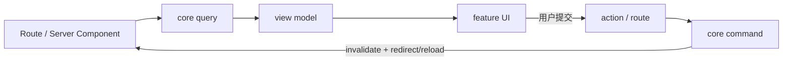

# 前端架构与 UI 整合

本文规定页面如何读取 CourseFlow 数据，以及如何把用户分批提供的 UI 整合成一致产品。P4 发布面是 `MANUAL_ONLY`：前端没有模型配置、自动解析、候选审核或规划助手。

## 1. 前端分层

```text
apps/web/
  app/                         # URL、layout、loading/error/not-found
  features/
    dashboard/ courses/ tasks/ grading/
    sources/ calendar/ insights/
      components/             # feature 内展示组件
      mappers/                # contract -> UI props
      actions/                # mutation 协调，不含领域规则
      state/                  # 短暂交互状态，不复制 server truth
  composition/                # query/command adapter 装配
packages/ui/
  tokens / primitives / patterns / courseflow components
```

route 组合 feature；feature 使用 UI 与 contract；UI package 不 import feature/core/Next route。只有第二个真实消费者且语义相同时，才提升共享抽象。

## 2. Server、Client 与 View Model

- 页面默认 Server Component，直接读取有界 query snapshot。
- Client Component 只负责 dialog、筛选、上传进度、表单 draft 和瞬时反馈；不重算日期、成绩、负荷或冲突。
- mutation 通过稳定 action/Route Handler；server 永远重新验证 auth、Zod、owner、expected version 与领域规则。
- UI 只消费明确 view model，不直接读取数据库 row、对象存储类型或 provider SDK 类型。
- production route 不包含 fixture；测试/story fixture 显式隔离。

## 3. 页面组合与数据流



用户上传 Source 后只刷新 Source view；用户从预览旁打开手工表单，明确提交正式 command 后才刷新 Dashboard/Timeline。页面不能因上传成功乐观插入正式课程事实。

## 4. 设计系统

### 4.1 Token 与 Primitive

- token 覆盖语义色、表面/文字/边框、课程色、字体、spacing、radius、shadow、z-index、motion。
- 业务代码使用语义 token，不散落孤立 hex、任意 z-index 或每页一套 shadow。
- primitive 负责 keyboard/focus/ARIA 与基础 variant，不理解课程语义。
- 扩展顺序：复用现有 → 通用 variant → 项目持有的可访问 primitive → 确有新语义才新建。

### 4.2 CourseFlow 组件

- `CourseBadge`、`MeetingTypeBadge`、`MeetingTimePlace`、`TemporalLabel`。
- `WorkloadLegend`、`ConflictCard`、`GradeCoverageSummary`、`TaskLabelList`。
- Source 组件只显示 metadata、上传/预览/删除状态与“打开手工表单”；不展示置信度、候选数或自动解析状态。

组件只消费 view model，不 fetch、不 import core。

### 4.3 当前视觉基线

`ui-v1` 约束全局 shell/token，`p3-manual-v1` 冻结 Sources 手工增量。P4 删除的是未冻结的条件性 surface，不改变已确认 token/geometry。后续可见变化按 [设计冻结流程](../design/DESIGN_BASELINE.md) 登记；不能用历史原型覆盖冻结基线。

产品以正常横屏桌面 Web 为主，`1280x900` 是像素参考。圆角、克制 motion、浅/深主题和 browser fallback 服从冻结 token；reduced motion 有等价体验。

## 5. 用户提供 UI 代码的整合协议

1. **记录视觉意图**：页面任务、层级、geometry/typography/color/depth/density/motion、所有状态与 viewport。
2. **建立映射**：route shell、feature、primitive、token、contract/view model、action 各有唯一归属。
3. **隔离原型**：不完整输入先在开发专用环境验证，移除 document reset、CDN/inline script 和 mock persistence。
4. **提取基础**：只提升真实复用的 token/primitive，不制造薄 wrapper。
5. **接真实 contract**：删除 hard-coded 数据；处理 validation/version conflict；生产不 import infrastructure。
6. **浏览器验收与清理**：按冻结 viewport、主题、键盘、200% zoom、长文本和状态矩阵检查，删除旧实现与未用样式。

冲突优先级：正确性/安全/隐私/a11y → 领域与 contract → 用户明确视觉意图 → 冻结 token/navigation → 片段实现技巧。

## 6. 关键页面

### Dashboard

顺序为学期/本地日期 → 今日与下一节 → 下一步/本周负荷 → 风险与重要评估 → 课程入口。课节与任务不能混成同一种可勾选行；数据来自同一 Schedule snapshot。

### Courses、Tasks、Gradebook

- Courses 保持列表 + 选中课程摘要；选择可落入 URL/search params。
- 添加课程为可返回的分步表单：学期/基本信息 → 多课节 → Reading Week/冲突预览 → 保存。
- Tasks 使用“先完成 / 本周推进 / 持续准备”和标签筛选；分组由 server snapshot 给出。
- Gradebook 同时显示已获总评百分点、已出分百分比和覆盖权重；准备进度不复用成绩百分比语义。

### Timeline、Calendar、Insights

- Calendar 显示课节 occurrence 与有日期 Course Item，并有非颜色类型文字；TBA 留在独立区域。
- 时区分桶、Reading Week、改期与冲突都来自 server view model；client 不重算。
- ICS 下载前说明范围、显示时区和 skipped TBA 数。
- Insights 只有正式指标定义后才显示；否则是真实空状态，不插入随机图表。

### Sources

- `/sources` 是跨课程资料库：按课程筛选、上传、私有预览、删除、从旁打开既有手工表单。
- `/courses/[courseId]/sources` 是同一 feature 的课程投影，不维护第二套实体或样式。
- 主动作使用“对照资料添加事项/成绩组成/课表”等手工语言。原文预览和表单形成可返回流程。
- 页面不含“解析”“智能提取”“候选”“审核”“助手”或永久不可用卡片，也没有相关隐藏 DOM/route。

### 个人中心与设置

个人中心只承载账户摘要、账户与隐私、显示时区、周起始日和其他普通偏好。P4 删除未冻结的模型配置/助手原型；账户与普通设置若后续实现，需建立不含相关 surface 的新冻结基线。

## 7. 表单与反馈

- 简单 server form 优先原生表单；复杂客户端表单只有真实收益时引入库。
- 字段有持久 label；错误紧邻字段并在提交处提供 summary/focus。
- 每个 panel 一个明确主动作；同排输入/按钮等高且标签不换行。
- 上传、完成校验与删除分别显示持久状态；长操作不只让按钮无限旋转。
- destructive action 显示具体对象名和影响；toast 只用于跨页确认或次要反馈。

## 8. 桌面、国际化与无障碍

- 正常横屏桌面为产品布局；`1280x900` 像素基线，200% zoom 保留功能。二维日历/热力图可在自身语义容器滚动，页面不产生意外水平滚动。
- 文案支持中英文结构；日期/数字使用 Intl，不拼接含变量句子。
- 长课程名、文件名与 Unicode 测试；Source 原文件名不进入普通 analytics/log。
- WCAG 2.2 AA：语义 HTML、可见 focus、键盘完整、对比度、约 44px 目标、非颜色错误/状态。
- Dialog 关闭后焦点返回触发点；向导切步聚焦标题，校验失败聚焦 error summary。
- 动画只说明状态/空间关系并尊重 reduced motion；dropzone 同时提供标准 file input。

## 9. 验证清单

- `1280x900` 浅/深主题及已冻结状态。
- 200% zoom 内容、控件、错误和键盘保留。
- 中文/英文/长文本，0/1/大量条目。
- loading、empty、error、success、version conflict。
- temporal 四个 variant、时区/DST、Reading Week。
- 无颜色也能区分课程、事项类型和冲突 severity。
- Sources 上传 → 预览 → 手工表单 → 正式回读，且页面/DOM/network 无已删除远程模型 surface。
- 可见前端变化使用内置 Browser 检查 page identity、交互、console 与 screenshot。
