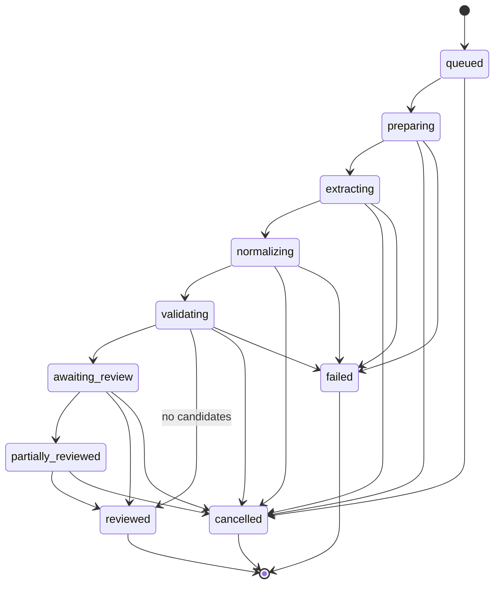

# 课程资料导入流水线

本流水线把不可信 PDF/图片变成可审核 Candidate。它追求可恢复和可解释，不追求“上传后立即自动写日历”。

> 适用条件：Source 上传、安全校验和原文件预览属于所有产品模式；Prepare/OCR/Extract、Import Run、Candidate/Evidence 与 Review 只有 [DeepSeek 去留门禁](./AI_ASSISTANT.md#3-deepseek-ai-去留门禁) 得到 `AI_GO` 后才进入生产。当前 `AI_PENDING` 只允许隔离 fake/contract。最终为 `MANUAL_ONLY` 时删除自动导入 surface 和 AI 专用 schema，用户从 Source 预览旁打开既有表单手工录入。

## 1. 外部 interface

所有模式都暴露 Source Library 的少量高杠杆操作；只有 `AI_ENABLED` 才额外装配自动导入操作：

```ts
type SourceLibraryModule = {
  beginUpload(input: BeginUploadInput): Promise<UploadPlan>;
  completeUpload(input: CompleteUploadInput): Promise<SourceDocumentSummary>;
  deleteSource(input: DeleteSourceInput): Promise<void>;
};

type AiIngestionModule = {
  startImport(input: StartImportInput): Promise<ImportRunSummary>;
  retryImport(input: RetryImportInput): Promise<ImportRunSummary>;
  reviewCandidate(input: ReviewCandidateInput): Promise<ReviewResult>;
};
```

进度和候选通过专用 query interface 读取。调用者不编排 `extractText -> callModel -> normalize`；这些都是模块 implementation。

内部真实 seam：

```ts
interface ObjectStorePort {
  createUploadTarget(input: UploadTargetInput): Promise<SignedUploadTarget>;
  stat(key: StorageKey): Promise<StoredObjectMeta>;
  read(key: StorageKey): AsyncIterable<Uint8Array>;
  deleteMany(keys: StorageKey[]): Promise<void>;
}

interface ImportQueuePort {
  enqueue(runId: ImportRunId): Promise<void>;
}

interface DocumentPreparationPort {
  prepare(document: SourceDocumentInput): Promise<PreparedDocument>;
}

interface ExtractionPort {
  extract(input: ExtractionInput): Promise<RawExtractionArtifact>;
}
```

`ObjectStorePort` 服务所有模式的 Source 上传/预览。`ImportQueuePort`、`DocumentPreparationPort` 与 `ExtractionPort` 只在 `AI_ENABLED` 装配；`ExtractionPort` 隐藏 DeepSeek request、动态模型版本、模型响应和 token 细节，core 只认识版本化 artifact。生产 adapter 使用用户自带凭据，日常测试使用 deterministic fake；`MANUAL_ONLY` 删除三个 AI port 与其 adapters，不建立空的 provider 框架。

## 2. 上传协议

### 2.1 开始上传

`beginUpload` 输入包含 `courseId`、资料类型和每个 asset 的文件名/声明 MIME/字节数/顺序。服务端：

1. 验证用户拥有课程且课程可写。
2. 验证 asset 数量、声明 MIME 和大小上限。
3. 创建 `uploading` Source Document 与预期 assets。
4. 返回每个 asset 的短期预签名 PUT URL、对象键对应的 opaque upload token 和到期时间。

对象键由服务端生成，不能包含原文件名或用户 ID。bucket 私有，禁止 public-read。

### 2.2 完成上传

浏览器上传完所有 asset 后调用 `completeUpload`。服务端逐个 `stat` 并进行服务端验证：

- 对象存在、字节数在上限内且与声明相容。
- magic bytes/sniffed MIME 是 PDF、PNG、JPEG 或 WebP；扩展名不能替代 sniff。
- PDF header/结构可读，图片可解码；拒绝加密 PDF 并给明确错误。
- 计算 SHA-256；同课程相同 document fingerprint 给重复提示，可继续或取消。
- PDF 页数和尺寸遵守上限；必要时隔离恶意/解压炸弹输入。

验证成功后，在一个 transaction 中把资料改为 `ready` 并返回 Source Document；此时**不自动创建** Import Run。资料上传不依赖 AI 成功。

`MANUAL_ONLY` 到此结束：页面提供预览和“手工录入”入口，不调用 `startImport`。仅 `AI_ENABLED` 时，用户明确开始解析才调用 `startImport`。服务端重新鉴权并检查该用户的 DeepSeek 凭据为 `available`，然后在一个 transaction 中创建 `ImportRun(queued)` 并提交任务。若未配置或已撤销，返回 `AI_UNAVAILABLE`，资料继续保持 `ready`；若队列 adapter 无法和业务 transaction 共享连接，使用 transactional outbox，不能出现数据库有 run 却永远没有任务的窗口。UI 可以把“完成上传 → 开始解析”连续呈现，但必须保留两个失败边界。

`uploading` 资料有明确过期时间。定期 cleanup 把超过时限且未完成的资料标为 `rejected`，删除已上传的孤立对象并使 upload token 失效；`completeUpload` 在过期后返回可重建上传的错误，不能复活旧对象。

## 3. 状态机



状态定义：

| 状态                 | 完成条件                                                                                                     |
| -------------------- | ------------------------------------------------------------------------------------------------------------ |
| `queued`             | run 与任务均已持久化                                                                                         |
| `preparing`          | worker 已 claim，正在构建页级输入                                                                            |
| `extracting`         | PreparedDocument 已校验并写 artifact                                                                         |
| `normalizing`        | 原始 structured output 已通过供应商 schema                                                                   |
| `validating`         | 候选已规范化，正在做确定性检查与去重                                                                         |
| `awaiting_review`    | 全部 Candidate/Evidence 原子写入，尚无或仍有未决候选                                                         |
| `partially_reviewed` | 至少一项有决定且仍有未决项                                                                                   |
| `reviewed`           | 每个 Candidate 恰有一个 Review Decision；零候选 run 在验证完成后直接进入此状态，并在资料页显示“未提取到候选” |
| `failed`             | 某阶段终止，存安全错误分类；现有正式数据未改变                                                               |
| `cancelled`          | 用户取消/删除来源且 worker 已在安全检查点停止；未审核候选按删除规则清理，已确认正式记录不回滚                |

worker 用 compare-and-set 转移状态。旧任务、重复投递或失去 lease 的 worker 不能把较新 run 状态倒退。

## 4. Worker 阶段

### 4.1 Claim 与幂等

- queue payload 只含 `runId`，不含正文或签名 URL。
- handler 读取数据库 run 并验证当前状态；终态直接成功返回。
- 每次远程或重 CPU 阶段前后检查取消状态和 lease/heartbeat。
- artifact 使用唯一键和 content hash；重复执行同一步返回既有 artifact。
- 任务超时由队列重投。实现必须假设至少一次执行，业务结果保持一次。

### 4.2 Prepare

`DocumentPreparationPort` 将 PDF 或有序图片转成统一 `PreparedDocument`：

```ts
type PreparedPage = {
  pageNumber: number; // 1-based
  text: string | null;
  textSource: "embedded" | "ocr" | "none";
  imageRef: InternalObjectRef;
  width: number;
  height: number;
};

type PreparedDocument = {
  pages: PreparedPage[];
  languageHints: string[];
  contentHash: string;
};
```

- 有文本层 PDF：本地抽取文本，同时生成受限页图供用户核对 Evidence、坐标映射和后续重处理；DeepSeek 不读取该页图。
- 扫描 PDF/图片：保留页图供用户核对，并由受限 OCR adapter 产生带区域定位的非可信文本。OCR 结果可以作为 DeepSeek 的抽取输入，但不是正式事实；关键字段必须回到对应页/区域并经用户审核。没有可用文本/OCR 的页面不伪装成已解析成功。
- 页顺序稳定；截图 set 按用户上传 position，不靠文件名字母排序。
- 页面渲染在受限进程/容器执行，限制 CPU、内存、页数和像素总量。

### 4.3 Extract

首个真实 `ExtractionPort` 使用 DeepSeek Responses API 的 `deepseek-v4-pro` 文本输入与 `text.format=json_schema`。DeepSeek API 当前不支持 PDF、图片、vision 或 file input；adapter 只接收 `PreparedDocument` 产生的有界页级文本/OCR 与 locator，不能把对象 URL、原始文件或图片占位符发给模型。供应商 schema 不是领域信任边界，响应随后仍过本地 Zod 与 validator。模型输出只允许：

- 资料级课程字段建议。
- 课程事项草稿，包含 `temporal` union，未知用 `unscheduled`。
- 完整评分方案及组成。
- 每个关键字段的 Evidence locator（页码、quote、可选 bbox）。
- 字段/候选置信度和模型发现的歧义说明。

Prompt 原则：

- 抽取而非补全；资料没写就返回 null/unscheduled。
- 保留原语言标题和 Evidence quote；规范化与本地化在后续 deterministic 阶段。
- 不将常识（如“作业通常晚上 11:59 截止”）当作资料事实。
- 冲突信息全部返回，不让模型自行选择新旧版本。
- 对评分规则保留 `ruleText`，不要把 “best 8 of 10” 展开为虚构事项。

暂定实现不让 worker handler 手工拼 prompt 或供应商 request，而是调用以下内部链：

```text
PreparedDocument
  -> ExtractionInputAssembler（页边界、locator、token budget、input digest）
  -> IngestionPromptRegistry（purpose + prompt/schema/budget version）
  -> DeepSeekResponsesPort（deterministic fake / conditional live adapter）
  -> ExtractionOutputParser（唯一完整 output_text + 同版本 schema）
  -> Evidence/领域 validator
  -> immutable raw/normalized artifact
```

`IngestionPromptRegistry` 是 `ingestion` 内部的 source-controlled pure module；entry 同时持有 instructions builder、input serializer、JSON Schema、parser 和预算 policy 引用。HTTP、数据库和 Source Document 都不能覆盖 prompt/schema。课程资料以带页码和稳定 locator 的不可信数据 payload 进入 `input`，不能混进 `instructions`。改动 prompt 或 schema 必须升版本并重跑 gold/eval；不能在真实评测后静默改阈值或只改 prompt 不留版本。

`DeepSeekResponsesPort` 使用正向请求字段 allowlist，固定请求 alias（v1 为 `deepseek-v4-pro`）、`stream=false`、`reasoning.effort=none`、`tools=[]`、`tool_choice=none` 和输入/输出预算；省略不支持的 `store`、会话和任意 tool/provider 参数。相关版本与调用元数据写 run，完整正文不进普通日志。port 只有在 `status=completed` 且唯一 `message/output_text` 时返回文本；其他终态、function/web output 或空文本映射为安全错误。feature parser 再拒绝非法 JSON 或本地校验失败，两层都不产生部分 Candidate。由于官方只暴露动态 alias，Responses 的 `response.id` 与实际 `model` 写入审计；`system_fingerprint` 只有所用 endpoint 实际返回时才 nullable 保存。变化触发 corpus eval，不能把展示名称当作可调用的固定 snapshot。

### 4.4 Normalize

确定性规范化负责：

- trim、Unicode 正规化、受控枚举映射。
- 解析明确 ISO/英语月份等日期，使用课程/学期时区；不唯一则保持 unscheduled 并 warning。
- 百分比转换为 bps，拒绝 NaN/负数/超过结构范围。
- Evidence `field_path` 使用正向 allowlist；每个实际提议字段都必须有 locator/quote、`0..1000` 字段置信度与非空纯文本推断说明，quote、说明和 bbox 分别做长度/标记/范围校验。
- 为候选生成稳定 fingerprint：规范化 kind/title/日期/评分结构，不含置信度和 Evidence ID。
- 保存 raw artifact 与 normalized artifact，二者均不可变。

Normalizer 是纯函数，以 fixture/table tests 覆盖。它不能访问数据库或模型。

### 4.5 Validate 与重复检测

Validator 对 normalized output 产生 Candidate 和 warning：

- 日期在学期外：`DATE_OUTSIDE_TERM`。
- date/instant 组合无效：阻止该候选进入审核并记录 validation issue。
- 同方案已知权重合计异常：`WEIGHTS_NOT_100_PERCENT`。
- 同一 run 内 fingerprint 重复：合并 Evidence，并产生 `MERGED_DUPLICATE_EXTRACTION`。
- 与正式 Course Item/Grading Scheme 高相似：`POSSIBLE_EXISTING_MATCH`，给候选 target ID、当前 version 和差异摘要；审核者可选择更新已有、仅标重复、或仍作为新记录创建。
- Evidence 缺失或 quote 无法在抽取文本中验证：`EVIDENCE_UNVERIFIED`，提高审核注意级别。
- 多个资料字段互相矛盾：分别保留候选或生成 field-level warning，用户决定。

置信度只决定默认排序/是否允许出现在批量接受列表。任何阈值都不能把候选直接提升为正式数据。

`confidence-v1` 仅用于一致展示：`high=850..1000`、`medium=650..849`、`low=0..649`。批量接受还要求 `high`、没有 blocking/existing-match warning、Evidence 已验证且 payload 未编辑。置信度标签必须称为“AI 估计”，不能包装成正确率；改变阈值要发布新 policy version。

### 4.6 Persist

所有 Evidence、Candidate、warning 与最终 artifact 在一个 transaction 写入，再把 run 变为 `awaiting_review`。页面永远看不到半批候选。

## 5. 审核工作流

### 5.1 读取审核队列

`getImportReview(runId, userScope)` 返回：

- 来源摘要与安全预览 URL。
- 当前 run 阶段、版本和 schema/policy 元数据。
- 候选 view model：proposed payload、field Evidence、confidence label、warning、可能的重复目标。
- 对兼容匹配目标提供当前正式摘要、version 和字段差异；不把 repository entity 暴露给页面。
- 已做决定及其 final payload。
- 进度：总数、accepted、edited、rejected、duplicate、remaining。

UI 不读取 raw model output，也不理解供应商类型。

### 5.2 提交决定

`reviewCandidate` 输入包括 `candidateId`、`idempotencyKey`、decision、对应 payload，以及 accepted 类决定的 `application: create | update_existing(targetId, expectedVersion)`。处理顺序：

1. 鉴权并锁定 Candidate；确认其 Source Document 所属课程属于用户。
2. 若已有相同 idempotency key/语义决定，返回原结果。
3. 确认 Candidate 仍未决、来源未被删除，并验证 final payload schema；Candidate 本身不可变，无需伪版本号。
4. 验证 application target 与候选 kind、课程和用户作用域兼容，再调用 `planning.applyReviewedCandidate` 执行正式领域校验。
5. 同一 transaction 中写正式记录、Review Decision、Review Application，并更新 run 汇总状态。
6. 返回创建/更新的正式 view model 与新审核进度。

UI 可以默认突出“作为新记录接受”，但提交 contract 必须明确 application。课程 patch 固定更新当前课程；Course Item/Grading Scheme 可新建或更新匹配目标。任何更新都要求 target `expectedVersion`，冲突则保持候选未决并让用户刷新比较，不能自动覆盖用户在解析期间做的修改。

### 5.3 批量接受

批量操作只是对多个决定的明确组合：

- 只包含没有 blocking warning、没有 existing-match warning 且 payload 未编辑、明确作为新记录创建的 Candidate。
- 请求展示 candidate IDs 和预览，用户确认后提交。
- 每个 Candidate 独立 transaction，或小批 transaction 并返回逐项结果；一个坏候选不应让几十个已验证决定全部丢失。
- 服务端逐项重新验证，不能相信 UI 筛选。

## 6. 错误、重试与恢复

错误类别：

| 类别                 | 示例                              | 自动重试                      |
| -------------------- | --------------------------------- | ----------------------------- |
| `invalid_input`      | 加密/损坏 PDF、格式不支持、超页数 | 否；提示用户替换资料          |
| `provider_transient` | 429、5xx、网络超时                | 指数退避 + jitter，有限次数   |
| `provider_permanent` | 模型拒绝该输入、schema 持续不匹配 | 最多一次修复/再调用，然后失败 |
| `credential_invalid` | 401、调用前凭据已撤销             | 否；标记凭据无效/提示重新配置 |
| `insufficient_balance` | 402                             | 否；提示用户检查供应商余额    |
| `resource_limit`     | 渲染超时、像素/内存上限           | 否或降低批次后一次重试        |
| `internal`           | constraint/代码错误               | 有限重试并告警，隐藏内部详情  |
| `cancelled`          | 用户请求取消                      | 否                            |

每次自动 retry 属于同一 Import Run 和队列 job attempt；用户点击“重新解析”创建新的 Import Run，从而允许新 pipeline/model/version 并保留历史。

页面进度用短轮询开始（处理中约 2–3 秒、后台 tab 降频），接口支持 `ETag`/`updatedAt`；不为 MVP 增加 WebSocket。终态停止轮询。

## 7. 安全与隐私

- 上传资源视为恶意输入；文件类型 sniff、尺寸/页数/像素限制、隔离解析、禁止宏/脚本执行。
- 对象存储默认私有；预签名 URL 短时、单对象、限制 method/content length。
- 用户输入和文档正文不能成为 system/developer 指令；prompt 明确把它们标为待抽取数据，模型不具备工具调用权限。
- 只向 AI provider 发送完成当前导入所需的页级文本块，不附加其他课程、原始 PDF/图片、对象 URL 或用户资料。
- DeepSeek P3 adapter 不上传 provider File；若未来供应商增加文件能力，必须重新核验数据条款、清理语义并更新本节后才可采用。
- worker 只按 Import Run owner 与用途临时解封凭据；明文 key 不进队列 payload、artifact、日志、trace 或错误响应。凭据在执行中被撤销时，于下一安全检查点停止并记录 `AI_UNAVAILABLE`。
- 日志记录 ID、stage、耗时、错误 code、token 数，不记录全文、Evidence quote 或签名 URL。
- 所有预览 endpoint 每次验证所有权；缓存头使用 private/no-store（或严格用户作用域 cache）。

## 8. 提取质量评估

在任何真实调用前先冻结 `ai-eval-policy-v1` 的去身份化 fixture corpus、评分器、阈值和零容忍项；P3 只跑 fake/gold，P4 才由用户临时提供 key 运行真实评测。任一硬门禁失败或最终仍未验证时，不调低阈值补救，而是执行 `MANUAL_ONLY` 清理。corpus 至少覆盖：

- 有文本层的标准 syllabus。
- 扫描 PDF。
- 单张和多张截图。
- 多列/表格评分方案。
- 只有日期、含明确时区时刻、相对周次和 TBA。
- 替代评分方案、“best N of M”、bonus 导致权重非 100%。
- 同一事项在资料中多次出现且日期冲突。
- 中文/英文混合资料。

每个 fixture 有人工 gold JSON 和 Evidence page/quote。评估至少报告：事项 precision/recall、明确日期 exact match、权重 exact match、Evidence page accuracy、无依据字段率。schema/prompt/normalization 变化必须运行 corpus；回归超过约定阈值时不能升级生产版本。
