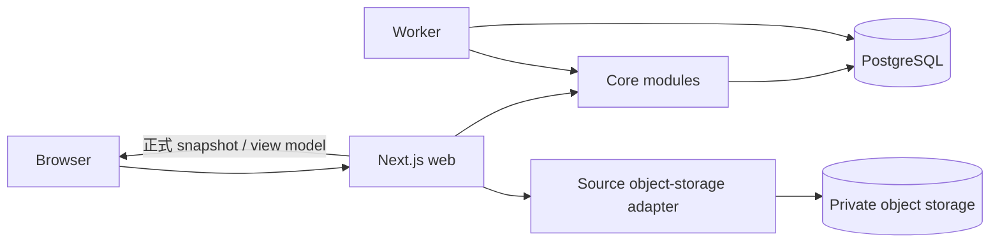
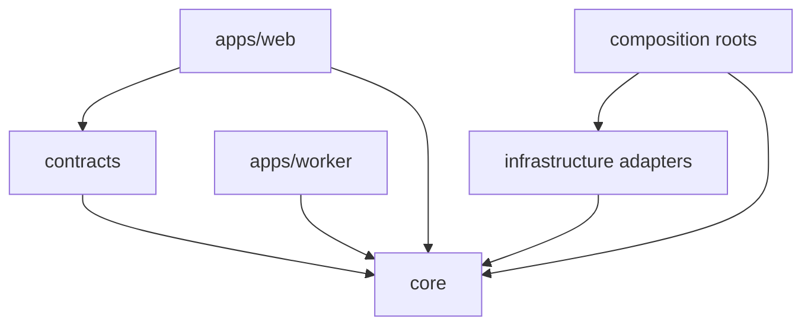

# CourseFlow 系统架构

## 1. 架构目标

1. **可信**：正式数据只来自用户明确提交的手工表单；上传 Source 不改变计划。
2. **可核对**：用户可以从手工表单返回私有原文预览，核对页序和内容。
3. **一致**：日期、Reading Week、成绩、任务分组、负荷、冲突与 ICS 由 core 的统一正式 snapshot 派生。
4. **可替换基础设施**：PostgreSQL、object storage 和 queue 位于 port/adapter seam；领域类型不泄漏供应商 SDK。
5. **发布面收敛**：P4 已签署 `MANUAL_ONLY`，不包含远程模型、自动解析、候选审核或规划助手。

## 2. 运行时全景



- `web`：页面渲染、身份验证、上传协调、HTTP contract、查询投影和 ICS 下载。
- `worker`：只承载明确、可重试的本地后台任务，例如 Source 对象清理；不处理远程模型作业。
- `postgres`：正式领域数据与 Source metadata 的权威存储。
- `object storage`：私有原始文件；访问必须通过短期、owner-scoped 授权。

## 3. 技术基线

| 层 | 选择 | 约束 |
| --- | --- | --- |
| Web | Next.js App Router + React | 页面默认 Server Component；只为交互岛使用 Client Component |
| Contract | Zod | HTTP、配置和 view model 边界校验 |
| Core | TypeScript strict | 无 React/Next/Drizzle/供应商 SDK 依赖 |
| Database | PostgreSQL + migrations | schema 由 migration 管理；生产不用 push |
| Object storage | S3-compatible | 生产 adapter 与本地 MinIO/test adapter 共享 port |
| Testing | Vitest + Playwright | interface、adapter、迁移和真实用户旅程分层验证 |
| Observability | 结构化日志 + request/domain IDs | 不记录 Source 正文、签名 URL 或秘密 |

## 4. 仓库结构

```text
apps/
  web/                 # route、UI、composition root
  worker/              # 本地后台 handler/composition
packages/
  core/src/
    academics/         # 学期、课程、课节规则与例外
    planning/          # 事项、标签、评分与成绩
    schedule/          # 正式 snapshot、任务分组、负荷、冲突、ICS model
    sources/           # Source 上传、预览、删除生命周期
    shared/            # 真正共享的值对象
  contracts/           # HTTP DTO / Zod schema
  infrastructure/      # PostgreSQL、object storage、queue adapters
  ui/                  # token、primitive、通用展示组件
  test-support/        # builders、固定 clock/ID、fake adapters
tests/
  e2e/                 # Playwright canonical journey
docs/                  # 产品、架构、设计、ADR 与研究归档
```

## 5. 模块所有权

| 模块 | 拥有 | 公开 interface | 不负责 |
| --- | --- | --- | --- |
| `academics` | term/course/meeting/calendar exception | 学期、课程与课表 command/query | 页面布局、文件存储、任务分组 |
| `planning` | Course Item、标签、评分方案与成绩结果 | 手工 command、Gradebook/query snapshot | 文件预览、课节展开 |
| `schedule` | 无独立写模型；从正式数据派生 | Dashboard/Task/Calendar/Conflict/ICS queries | 修改正式记录 |
| `sources` | Source metadata、asset lifecycle、owner policy | begin/complete/list/preview/delete | 从文件推断课程事实 |
| `insights` | 代码定义的指标口径 | 有界 Insight query | 通用指标 DSL 或任意 SQL |

## 6. 依赖规则



- `core` 不 import Next.js、React、Drizzle、S3 SDK 或远程服务 SDK。
- 每个模块通过 `index.ts` 暴露少量公开 interface；跨模块禁止深路径 import。
- Route Handler 完成 auth、parse、invoke、error mapping，不承载领域判断。
- 跨模块读取使用目标模块提供的 snapshot/query，不从页面直接 join 数据库。
- P4 `MANUAL_ONLY` 扫描阻止模型凭据、route/module/adapter/table/config 或 UI 回流。

## 7. 关键数据流

### 7.1 手工创建事项

1. transport 验证用户、request schema 与幂等信息。
2. `planning` 验证 course owner、时间 union、标签与 expected version。
3. repository transaction 写正式记录。
4. Dashboard/Timeline/Tasks 重新读取同一正式 snapshot。

### 7.2 建立课程与课表

1. `academics` 原子创建课程身份与零到多条 Meeting Pattern。
2. Reading Week 保存在 term calendar exceptions；单次取消/改期/保留保存在 Meeting Exception。
3. `schedule` 在有界范围展开 occurrence，并统一供 Dashboard/Calendar/ICS 使用。

### 7.3 Source 与手工核对

1. web 获取 owner-scoped 上传授权，浏览器把资源放入私有 object storage。
2. complete command 检查实际对象、大小、签名与 MIME，Source 进入 ready。
3. 用户安全预览原文并从旁打开既有手工表单。
4. 只有用户明确提交表单，`academics`/`planning` 才写正式记录。
5. 删除 Source 立即关闭读取，再幂等清理对象；不删除已确认的正式记录。

### 7.4 雷达、成绩与日历

- Task Board、负荷、冲突和 ICS 只读取正式 Course Item/Meeting snapshot。
- 未知日期保留在 TBA 区，不落入具体日历格。
- Gradebook 只计算已出分且已知权重的数据，并同时显示覆盖权重。

## 8. 配置与环境

启动时用 Zod 一次性验证：数据库 URL、object-storage endpoint/bucket/region/credentials、可选 queue/auth/observability 配置及上传限制。`.env.example` 只含安全示例；client bundle 只暴露显式 allowlist 的 `NEXT_PUBLIC_` 非秘密值。

没有远程模型 endpoint、model alias 或 API key 配置。秘密扫描会拒绝常见 token 格式和相关凭据变量。

## 9. 架构护栏

- 正式数据可由领域 command 重建与解释；页面和缓存不形成第二套真相。
- schema 变更提交 migration，并在空库和当前快照验证。
- 远程调用（例如 object storage）有超时、有限重试和分类错误；用户输入错误不重试。
- 删除 Source 同时处理 metadata、对象与备份/保留说明。
- MVP 不引入微服务、事件总线、GraphQL、通用插件系统或运行时指标 DSL。
- `MANUAL_ONLY` 的改变需要新的用户授权与 ADR，不能由普通 feature 自行解除。

## 10. 进一步阅读

- [数据模型](./DATA_MODEL.md)
- [需求基线](../product/REQUIREMENTS.md)
- [资料流水线](./INGESTION.md)
- [模块与 HTTP interface](./INTERFACES.md)
- [前端与 UI 整合](./FRONTEND.md)
- [质量要求](./QUALITY.md)
- [实施计划](./IMPLEMENTATION_PLAN.md)
- [P4 决策归档](./AI_ASSISTANT.md)
- [P4 签署报告](../quality/P4_MANUAL_ONLY_SIGNOFF.md)
