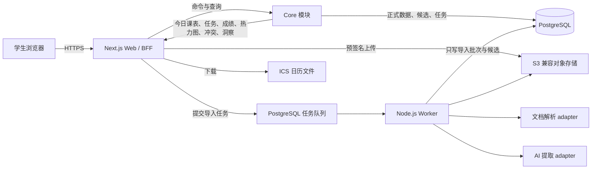
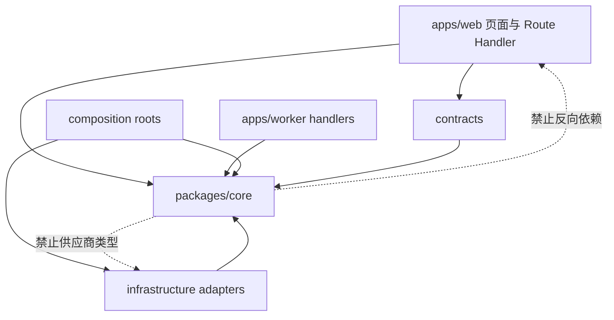

# CourseFlow 系统架构

本目录是实现 CourseFlow 的技术单一来源。根目录 `AGENTS.md` 负责把任务路由到这里；本文说明全局形状，细节由同目录的专门文档负责。

## 1. 架构目标

CourseFlow 的核心难点不是显示一个日历，而是把不可靠的外部资料变成**可追溯、可纠正、日期语义准确**的正式计划。架构优先级如下：

1. **可信**：AI 只生成候选，正式数据必须经过用户审核。
2. **可追溯**：候选字段能回到页码、原文和可选图片坐标。
3. **日期正确**：纯日期、确定时刻、时间区间和待定信息分别建模。
4. **先纵向闭环**：先完成一门课程从手工事项到雷达展示，再接真实 AI。
5. **容易演进**：统计页和供应商 integration 保留小而稳定的 seam，不预建插件平台。
6. **低运维成本**：首版采用模块化单体和独立 worker，不拆微服务。
7. **单一计划真相**：周期课节展开为课节实例，课程事项投影为任务；页面分组不另建互相竞争的数据模型。

## 2. 运行时全景



### 运行进程

- `web`：页面渲染、身份验证、上传协调、HTTP contract、审核命令、查询投影和 ICS 下载。
- `worker`：执行耗时且可重试的资料准备、文本/图像处理、AI 提取、规范化和候选持久化。
- `postgres`：正式数据、导入状态、候选、审核决定和后台任务的权威存储。
- `object-store`：原始 PDF/图片和体积较大的派生产物。开发环境使用 S3 兼容实现，生产可换任意兼容服务。

worker **没有**把候选提升为正式记录的权限。只有 web 中经过当前用户授权的审核命令能完成这一步。

### 部署拓扑

生产以两个独立、可水平扩展的 Node.js 进程部署 `web` 和 `worker`，连接同一 PostgreSQL 与私有对象存储。worker 必须是常驻进程，不能寄生在 serverless 请求生命周期中；web 若部署到 serverless 平台，Route Handler 仍使用 Node runtime，PDF 渲染只在 worker 执行。migration 作为单次 release job 在新代码接流量前运行，且遵守向后兼容的 expand/migrate/contract 顺序。生产供应商暂不写入业务代码，由相同 image/config 部署到选定平台。

## 3. 技术基线

版本在初始化阶段锁入 lockfile；本文只锁定技术方向，避免复制易过期的小版本号。

| 层            | 默认选择                                  | 约束与理由                                                                    |
| ------------- | ----------------------------------------- | ----------------------------------------------------------------------------- |
| 语言          | TypeScript，`strict`                      | web、worker、contract 和领域类型共享一个类型系统                              |
| 工作区        | pnpm workspace                            | 两个应用和少量共享 package；暂不引入任务编排平台                              |
| Web           | Next.js App Router + React                | 页面默认 Server Component；只有交互岛使用 Client Component                    |
| HTTP          | Next.js Route Handlers，JSON `/api/v1`    | 上传、轮询和客户端变更使用明确 contract；页面服务端查询可直接调用 core        |
| 样式          | Tailwind CSS + CSS variables              | 接纳用户提供的 React/Tailwind 页面代码，同时由 token 统一视觉语言             |
| UI primitives | 项目内持有的 Radix/shadcn 风格 primitives | 代码归项目所有，便于整合零碎设计；不把业务规则塞入 primitives                 |
| Contract 校验 | Zod                                       | 环境变量、HTTP 输入、AI structured output 和 view model 边缘校验              |
| 数据库        | PostgreSQL + Drizzle                      | schema 在代码中定义，生成并提交 SQL migration；生产禁用直接 `push`            |
| 异步任务      | pg-boss 或同等 PostgreSQL 队列 adapter    | 利用现有 PostgreSQL，支持重试、并发控制和任务幂等，不增加 Redis               |
| 对象存储      | S3-compatible                             | 生产 adapter + 本地 MinIO/test adapter 形成真实 seam                          |
| AI            | OpenAI Responses adapter 作为首个实现     | 文件/图片输入与 strict JSON Schema；供应商 request/response 类型不得进入 core |
| 测试          | Vitest + Testing Library + Playwright     | 领域 interface、数据库 adapter、关键页面旅程分层验证                          |
| 可观测性      | 结构化日志 + trace/request/import run ID  | 能从用户请求追到任务、模型调用和审核结果                                      |

技术依据：[Next.js App Router](https://nextjs.org/docs/app)、[Route Handlers](https://nextjs.org/docs/app/getting-started/route-handlers)、[Drizzle migrations](https://orm.drizzle.team/docs/migrations)、[pg-boss](https://github.com/timgit/pg-boss)、[OpenAI Structured Outputs](https://platform.openai.com/docs/api-reference/responses-streaming/response/output_item/done)。

## 4. 仓库目标结构

```text
CourseFlow/
├─ apps/
│  ├─ web/
│  │  ├─ app/                    # route、layout、Route Handler；保持薄
│  │  ├─ features/               # 页面级组合与交互岛
│  │  └─ composition/            # 生产依赖装配；唯一 composition root
│  └─ worker/
│     ├─ src/jobs/               # 队列 handler，只做适配和调度
│     └─ src/composition/        # worker 的 composition root
├─ packages/
│  ├─ core/
│  │  └─ src/
│  │     ├─ academics/           # 学期与课程
│  │     ├─ ingestion/           # 资料、批次、候选、审核工作流
│  │     ├─ planning/            # 事项、标签、成绩组成/结果、负荷估计
│  │     ├─ schedule/            # 课节实例、时间线、热力图、冲突、ICS 模型
│  │     ├─ insights/            # 代码定义的纯统计查询
│  │     └─ shared/              # ID、日期值对象、Result；仅真正共享项
│  ├─ contracts/                 # HTTP DTO、view model、Zod schema
│  ├─ infrastructure/            # Postgres、对象存储、队列、AI/解析 adapters
│  ├─ ui/                        # token、primitives、通用展示组件
│  └─ test-support/              # builders、固定 clock/ID、fake adapters
├─ tests/
│  ├─ integration/               # PostgreSQL/对象存储/队列 contract 测试
│  ├─ e2e/                       # Playwright 用户旅程
│  └─ fixtures/documents/        # 获授权且去身份化的解析样本
├─ docs/
│  ├─ architecture/
│  ├─ product/
│  └─ adr/
├─ AGENTS.md
└─ CONTEXT.md
```

初始实现允许 `contracts` 或 `infrastructure` 先作为 `core`/应用内目录存在；只有出现第二个真实调用方时才提升成独立 package。目标结构表达依赖方向，不要求第一天创建所有空目录。

## 5. 模块和所有权

| 模块        | 拥有的数据/规则                                                            | 小型公开 interface                                                         | 不负责                           |
| ----------- | -------------------------------------------------------------------------- | -------------------------------------------------------------------------- | -------------------------------- |
| `academics` | 学期、校历例外、课程、课节重复规则/单次例外、课程时区、学分、归档          | 管理学期/课程/课表规则；读取课程身份与正式课节定义                         | 展开今日实例、文件上传、事项计算 |
| `ingestion` | 课程资料、导入批次、证据、候选、审核决定                                   | 全局/课程资料查询；开始/重试导入；读取审核队列；提交审核                   | 时间线展示、AI SDK 细节          |
| `planning`  | 课程事项、任务标签、评分方案、成绩组成、手工成绩结果、字母等级表、负荷估计 | 手工编辑；任务/Gradebook 查询；把已审核 payload 原子应用为正式数据         | 文件解析、页面布局、课节重复规则 |
| `schedule`  | 无独立写模型；从 academics/planning 正式数据计算投影                       | 学期进度、今日/下一课、课节实例、时间线、任务分组、雷达、热力图、冲突、ICS | 修改课节/事项/成绩、发送通知     |
| `insights`  | 无通用指标表；代码定义的统计口径                                           | `getInsights(snapshot)`                                                    | 动态插件市场、任意 SQL           |

模块的外部 interface 同时是调用面和测试面。数据库表不是 interface，Route Handler 不是领域规则所在地，React hook 也不是第二套 application layer。

## 6. 依赖规则



- `core` 不 import Next.js、React、Drizzle、pg-boss、S3 SDK 或 AI SDK。
- `contracts` 可以把 core 值对象映射为 JSON DTO，但不能实现领域规则。
- `infrastructure` 实现 core 内部 seam 的 port；业务命名优先于通用 CRUD 命名。
- app 是 composition root 和 transport adapter。Route Handler 完成 auth、解析、调用、错误映射四件事。
- 模块间禁止深路径 import。每个模块用 `index.ts` 暴露其 interface；ESLint `no-restricted-imports` 固化规则。
- 跨模块读取使用目标模块提供的 query/snapshot；不得跨模块直接 join 后把规则散落到页面。复杂只读投影可以由 `schedule` 的专用 query adapter 一次读取。

## 7. 关键数据流

### 7.1 手工创建事项

1. Route Handler 验证用户和 request contract。
2. `planning` 验证课程所有权、日期组合和占比。
3. 数据库 adapter 在一个 transaction 中写正式记录。
4. 返回由 contract mapper 生成的 `CourseItemView`；页面刷新相关 server projection。

### 7.2 建立课程与课表

1. `academics` 在一个 transaction 中创建课程身份与零到多个 `MeetingPattern`；课程允许先无课节保存。
2. 每个课节保存星期集合、本地起止时间、类型、地点和有效日期范围；Reading Week 等 `AcademicCalendarException` 属于学期。
3. `schedule` 在有界查询区间内把课节规则展开为 `MeetingOccurrence`，再应用学期例外与单次取消/改期/保留。
4. dashboard、课程摘要与 calendar 消费同一 occurrence snapshot；页面不自行实现重复日期、DST 或倒计时规则。

### 7.3 导入课程资料

1. web 获取上传授权，浏览器把资源放入对象存储。
2. web 完成上传并创建 `ImportRun`，同一 transaction 中提交队列任务。
3. worker 读取资源，生成页级内容，调用 AI adapter，做确定性规范化和校验。
4. worker 写入不可变提取 artifact、Evidence 和 Candidate，状态变为待审核。
5. 用户逐项接受、修改后接受、拒绝或标记重复。
6. 审核命令在一个 transaction 中写 `ReviewDecision` 和正式记录；任何失败都整体回滚。

完整状态机见 [导入流水线](./INGESTION.md)。

### 7.4 雷达与日历

1. `schedule` query 只读取已确认正式数据，包括正式课节规则/例外与正式课程事项。
2. 同一份 `ScheduleSnapshot` 驱动今日/下一课、近期截止、任务分组、课程时间线、热力图、冲突和 ICS，防止页面口径分叉。
3. 未知日期保留在“待定”区域，不出现在具体日历格，也不偷偷补成学期末日期。

### 7.5 手工录入成绩

1. `planning` 校验成绩组成所有权、`earned/possible` 精度和并发版本。
2. adapter 写入或替换该组成的 `GradeResult`；未出分组成仍没有结果记录。
3. Gradebook query 纯计算每项百分比、已获总评百分点、已出分部分百分比与已覆盖权重；不持久化“当前成绩”。
4. 只有课程关联了用户确认的 A/B/C/D/F 等级表时才派生字母等级；课程学分单独展示，首版不计算 GPA/已获学分。

## 8. 配置与环境

配置在进程启动时一次性通过 Zod 校验，内部只接收类型化 `Config`。预期变量类别：

- 数据库：`DATABASE_URL`
- 对象存储：endpoint、bucket、region、access key/secret、签名 URL 有效期
- 队列：schema、worker concurrency、retry policy
- AI：供应商 key、model snapshot、请求超时、最大并发
- auth：base URL、secret、provider credentials
- 上传策略：允许 MIME、单资源/单资料大小、最大页数
- 可观测性：环境名、log level、OTLP/Sentry 等可选 endpoint

`.env.example` 只含键名和安全示例，不含真实凭据。client bundle 只暴露带明确 `NEXT_PUBLIC_` 前缀且经过白名单的非秘密配置。

## 9. 架构护栏

- AI schema、prompt 和规范化 policy 都带版本；旧批次保持可解释。
- Meeting expansion、学期进度、任务分组、负荷、冲突和成绩汇总 policy 带版本；页面不保存或复制派生结论。
- 任何派生视图都能由正式数据重算；热力图和冲突默认不持久化。
- schema 变更提交 migration；migration 必须能在空库和上一生产版本快照上验证。
- 远程调用有超时、有限重试和分类错误；用户输入错误不重试。
- 删除课程资料时删除对象和敏感派生产物；正式记录保留时明确显示“来源已删除”。
- MVP 不引入微服务、事件总线、GraphQL、通用插件系统或运行时指标 DSL。

## 10. 进一步阅读

- [数据模型](./DATA_MODEL.md)
- [需求基线](../product/REQUIREMENTS.md)
- [导入流水线](./INGESTION.md)
- [模块与 HTTP interface](./INTERFACES.md)
- [前端与 UI 整合](./FRONTEND.md)
- [前端设计基线与冻结](../design/DESIGN_BASELINE.md)
- [质量要求](./QUALITY.md)
- [实施计划](./IMPLEMENTATION_PLAN.md)
- [Agent 开发执行流程](./DEVELOPMENT_WORKFLOW.md)
