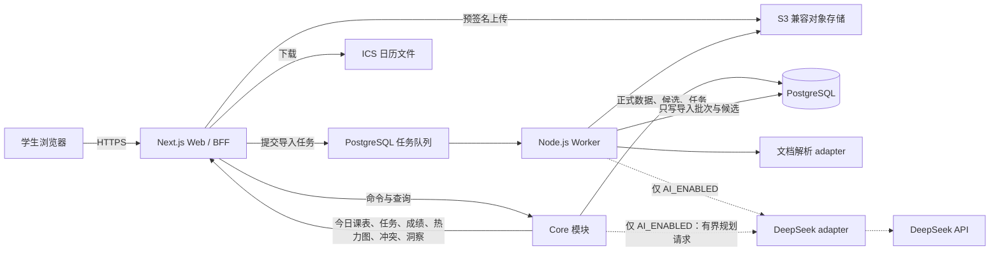
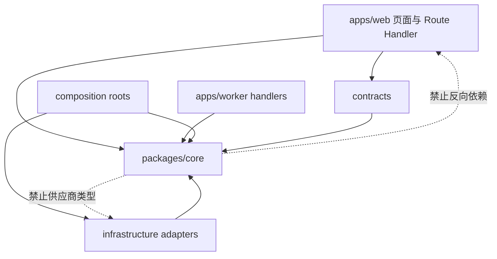

# CourseFlow 系统架构

本目录是实现 CourseFlow 的技术单一来源。根目录 `AGENTS.md` 负责把任务路由到这里；本文说明全局形状，细节由同目录的专门文档负责。

## 1. 架构目标

CourseFlow 的核心难点不是显示一个日历，而是把不可靠的外部资料变成**可追溯、可纠正、日期语义准确**的正式计划。架构优先级如下：

1. **可信**：正式数据默认由用户手工表单确认；只有 DeepSeek 门禁通过时，资料 AI 才生成 Candidate、个人助手才生成 Planning Draft，且仍需用户确认。
2. **可追溯**：Source 可回到原文件；`AI_ENABLED` 时候选字段还能回到页码、原文和可选图片坐标。
3. **日期正确**：纯日期、确定时刻、时间区间和待定信息分别建模。
4. **先纵向闭环**：先完成 Source 预览到手工事项与雷达展示；DeepSeek 是通过最终去留门禁后才进入 composition 的条件性能力。
5. **容易演进**：统计页和供应商 integration 保留小而稳定的 seam，不预建插件平台。
6. **低运维成本**：首版采用模块化单体和独立 worker，不拆微服务。
7. **单一计划真相**：周期课节展开为课节实例，课程事项投影为任务；页面分组不另建互相竞争的数据模型。

## 2. 运行时全景



### 运行进程

- `web`：页面渲染、身份验证、上传协调、HTTP contract、审核命令、查询投影和 ICS 下载。
- `worker`：`AI_ENABLED` 时执行耗时且可重试的资料准备、文本/图像处理、AI 提取、规范化和候选持久化；纯手工发布不启动 AI 导入 job。
- `postgres`：正式数据和 Source metadata 的权威存储；只有 `AI_ENABLED` 才增加导入状态、候选、审核决定和 AI 后台任务。
- `object-store`：原始 PDF/图片和体积较大的派生产物。开发环境使用 S3 兼容实现，生产可换任意兼容服务。
- `DeepSeek API`：条件性、唯一允许的 AI 供应商，使用用户自己的凭据；只接受由 worker 或有界 planning query 准备的文本，不接收原始 PDF/图片。门禁失败时整个节点从发布拓扑删除，不换供应商。

worker **没有**把候选提升为正式记录的权限，assistant 也没有正式 planning 表写权限。只有 web 中经过当前用户授权的审核命令或现有手工表单 command 能完成正式写入。

### 部署拓扑

生产以两个独立、可水平扩展的 Node.js 进程部署 `web` 和 `worker`，连接同一 PostgreSQL 与私有对象存储。worker 必须是常驻进程，不能寄生在 serverless 请求生命周期中；web 若部署到 serverless 平台，Route Handler 仍使用 Node runtime，PDF 渲染只在 worker 执行。migration 作为单次 release job 在新代码接流量前运行，且遵守向后兼容的 expand/migrate/contract 顺序。生产供应商暂不写入业务代码，由相同 image/config 部署到选定平台。

## 3. 技术基线

版本在初始化阶段锁入 lockfile；本文只锁定技术方向，避免复制易过期的小版本号。

| 层            | 默认选择                                  | 约束与理由                                                                    |
| ------------- | ----------------------------------------- | ----------------------------------------------------------------------------- |
| 语言          | TypeScript，`strict`                      | web、worker、contract 和领域类型共享一个类型系统                              |
| 工作区        | pnpm workspace                            | 两个应用和少量共享 package；暂不引入任务编排平台                              |
| Web           | Next.js App Router + React                | 页面默认 Server Component；只有交互岛使用 Client Component                    |
| HTTP          | Next.js Route Handlers，JSON `/api/v1`    | 上传、轮询和客户端变更使用明确 contract；页面服务端查询可直接调用 core        |
| 样式          | Tailwind CSS + CSS variables              | 接纳用户提供的 React/Tailwind 页面代码，同时由 token 统一视觉语言             |
| UI primitives | 项目内持有的 Radix/shadcn 风格 primitives | 代码归项目所有，便于整合零碎设计；不把业务规则塞入 primitives                 |
| Contract 校验 | Zod                                       | 环境变量、HTTP 输入、AI structured output 和 view model 边缘校验              |
| 数据库        | PostgreSQL + Drizzle                      | schema 在代码中定义，生成并提交 SQL migration；生产禁用直接 `push`            |
| 异步任务      | pg-boss 或同等 PostgreSQL 队列 adapter    | 利用现有 PostgreSQL，支持重试、并发控制和任务幂等，不增加 Redis               |
| 对象存储      | S3-compatible                             | 生产 adapter + 本地 MinIO/test adapter 形成真实 seam                          |
| AI（条件性）  | 通过 `AI_GO` 后启用 DeepSeek Responses adapter | `deepseek-v4-pro` 文本输入与 JSON Schema；失败/未验证即 `MANUAL_ONLY` 并从发布 composition 删除 |
| 测试          | Vitest + Testing Library + Playwright     | 领域 interface、数据库 adapter、关键页面旅程分层验证                          |
| 可观测性      | 结构化日志 + trace/request/import run ID  | 能从用户请求追到任务、模型调用和审核结果                                      |

技术依据：[Next.js App Router](https://nextjs.org/docs/app)、[Route Handlers](https://nextjs.org/docs/app/getting-started/route-handlers)、[Drizzle migrations](https://orm.drizzle.team/docs/migrations)、[pg-boss](https://github.com/timgit/pg-boss)、[DeepSeek Responses API](https://api-docs.deepseek.com/guides/responses_api/)、[DeepSeek Models & Pricing](https://api-docs.deepseek.com/quick_start/pricing/)。供应商能力核验与已知不确定项见 [DeepSeek API 研究记录](../research/deepseek-api-capabilities.md)。

## 4. 仓库目标结构

```text
CourseFlow/
├─ apps/
│  ├─ web/
│  │  ├─ app/                    # route、layout、Route Handler；保持薄
│  │  ├─ features/               # 页面级组合与交互岛
│  │  └─ composition/            # 生产依赖装配；唯一 composition root
│  └─ worker/
│     ├─ src/jobs/               # 队列 handler，只做适配和调度
│     └─ src/composition/        # worker 的 composition root
├─ packages/
│  ├─ core/
│  │  └─ src/
│  │     ├─ academics/           # 学期与课程
│  │     ├─ sources/             # 所有模式的资料上传、预览与删除
│  │     ├─ ingestion/           # 仅 AI_ENABLED：批次、候选、审核工作流
│  │     ├─ planning/            # 事项、标签、成绩组成/结果、负荷估计
│  │     ├─ schedule/            # 课节实例、时间线、热力图、冲突、ICS 模型
│  │     ├─ insights/            # 代码定义的纯统计查询
│  │     ├─ assistant/           # 仅 AI_ENABLED：凭据状态、正式上下文与规划草稿
│  │     └─ shared/              # ID、日期值对象、Result；仅真正共享项
│  ├─ contracts/                 # HTTP DTO、view model、Zod schema
│  ├─ infrastructure/            # Postgres/对象存储；条件性队列、AI/解析 adapters
│  ├─ ui/                        # token、primitives、通用展示组件
│  └─ test-support/              # builders、固定 clock/ID、fake adapters
├─ tests/
│  ├─ integration/               # PostgreSQL/对象存储/队列 contract 测试
│  ├─ e2e/                       # Playwright 用户旅程
│  └─ fixtures/documents/        # 获授权且去身份化的解析样本
├─ docs/
│  ├─ architecture/
│  ├─ product/
│  └─ adr/
├─ AGENTS.md
└─ CONTEXT.md
```

初始实现允许 `contracts` 或 `infrastructure` 先作为 `core`/应用内目录存在；只有出现第二个真实调用方时才提升成独立 package。目标结构表达依赖方向，不要求第一天创建所有空目录。

## 5. 模块和所有权

| 模块        | 拥有的数据/规则                                                            | 小型公开 interface                                                         | 不负责                           |
| ----------- | -------------------------------------------------------------------------- | -------------------------------------------------------------------------- | -------------------------------- |
| `academics` | 学期、校历例外、课程、课节重复规则/单次例外、课程时区、学分、归档          | 管理学期/课程/课表规则；读取课程身份与正式课节定义                         | 展开今日实例、文件上传、事项计算 |
| `sources` / 条件性 `ingestion` | 所有模式拥有课程资料；`AI_ENABLED` 另拥有导入批次、证据、候选、审核决定 | 资料上传/预览/删除；条件性开始导入、读取审核队列、提交审核 | 时间线展示、AI SDK 细节 |
| `planning`  | 课程事项、任务标签、评分方案、成绩组成、手工成绩结果、字母等级表、负荷估计 | 手工编辑；任务/Gradebook 查询；把已审核 payload 原子应用为正式数据         | 文件解析、页面布局、课节重复规则 |
| `schedule`  | 无独立写模型；从 academics/planning 正式数据计算投影                       | 学期进度、今日/下一课、课节实例、时间线、任务分组、雷达、热力图、冲突、ICS | 修改课节/事项/成绩、发送通知     |
| `insights`  | 无通用指标表；代码定义的统计口径                                           | `getInsights(snapshot)`                                                    | 动态插件市场、任意 SQL           |
| 条件性 `assistant` | 仅 `AI_ENABLED`：凭据状态、最小上下文、短期对话与 Planning Draft 生命周期 | 配置/撤销凭据；基于正式 snapshot 解释和生成草稿；把草稿交给现有表单 | 直接写正式数据、重算领域真相、审核 Candidate |

模块的外部 interface 同时是调用面和测试面。数据库表不是 interface，Route Handler 不是领域规则所在地，React hook 也不是第二套 application layer。

## 6. 依赖规则



- `core` 不 import Next.js、React、Drizzle、pg-boss、S3 SDK 或 AI SDK。
- `contracts` 可以把 core 值对象映射为 JSON DTO，但不能实现领域规则。
- `infrastructure` 实现 core 内部 seam 的 port；业务命名优先于通用 CRUD 命名。
- app 是 composition root 和 transport adapter。Route Handler 完成 auth、解析、调用、错误映射四件事。
- 模块间禁止深路径 import。每个模块用 `index.ts` 暴露其 interface；ESLint `no-restricted-imports` 固化规则。
- 跨模块读取使用目标模块提供的 query/snapshot；不得跨模块直接 join 后把规则散落到页面。复杂只读投影可以由 `schedule` 的专用 query adapter 一次读取。

## 7. 关键数据流

### 7.1 手工创建事项

1. Route Handler 验证用户和 request contract。
2. `planning` 验证课程所有权、日期组合和占比。
3. 数据库 adapter 在一个 transaction 中写正式记录。
4. 返回由 contract mapper 生成的 `CourseItemView`；页面刷新相关 server projection。

### 7.2 建立课程与课表

1. `academics` 在一个 transaction 中创建课程身份与零到多个 `MeetingPattern`；课程允许先无课节保存。
2. 每个课节保存星期集合、本地起止时间、类型、地点和有效日期范围；Reading Week 等 `AcademicCalendarException` 属于学期。
3. `schedule` 在有界查询区间内把课节规则展开为 `MeetingOccurrence`，再应用学期例外与单次取消/改期/保留。
4. dashboard、课程摘要与 calendar 消费同一 occurrence snapshot；页面不自行实现重复日期、DST 或倒计时规则。

### 7.3 课程资料与条件性导入

1. web 获取上传授权，浏览器把资源放入对象存储。
2. web 完成上传并验证资源，把 Source Document 标为 `ready`；此时不创建 `ImportRun`，因此上传成功不依赖 AI。
3. 所有产品模式都允许预览 Source，并从旁打开 P1 已有手工表单；只有表单提交才写正式记录。
4. 仅 `AI_ENABLED` 时，用户可开始解析；web 检查其可用 DeepSeek 凭据，再创建 `ImportRun` 并提交队列任务。
5. AI 路径中 worker 本地生成页级文本/OCR 与 Evidence 定位，调用文本 adapter，再做确定性规范化和校验。
6. worker 写入不可变 artifact、Evidence 和 Candidate；用户逐项接受、修改后接受、拒绝或标记重复。
7. 审核命令在一个 transaction 中写 `ReviewDecision` 和正式记录；任何失败整体回滚。`MANUAL_ONLY` 不存在第 4–7 步。

完整状态机见 [导入流水线](./INGESTION.md)。

### 7.4 雷达与日历

1. `schedule` query 只读取已确认正式数据，包括正式课节规则/例外与正式课程事项。
2. 同一份 `ScheduleSnapshot` 驱动今日/下一课、近期截止、任务分组、课程时间线、热力图、冲突和 ICS，防止页面口径分叉。
3. 未知日期保留在“待定”区域，不出现在具体日历格，也不偷偷补成学期末日期。

### 7.5 手工录入成绩

1. `planning` 校验成绩组成所有权、`earned/possible` 精度和并发版本。
2. adapter 写入或替换该组成的 `GradeResult`；未出分组成仍没有结果记录。
3. Gradebook query 纯计算每项百分比、已获总评百分点、已出分部分百分比与已覆盖权重；不持久化“当前成绩”。
4. 只有课程关联了用户确认的 A/B/C/D/F 等级表时才派生字母等级；课程学分单独展示，首版不计算 GPA/已获学分。

### 7.6 `AI_ENABLED` 后配置并使用个人 AI

1. 用户从头像打开个人中心，把 DeepSeek API Key 通过 same-origin HTTPS 提交给 web；浏览器不直连供应商。
2. `assistant` 通过固定官方 endpoint 的 credential verifier 检查认证和 `deepseek-v4-pro` 可见性，再调用 secret-vault port 加密保存；普通 profile query 只返回状态、掩码提示和验证时间。
3. 资料导入时 worker 先在本地准备页级文本/OCR 与定位，再按 Import Run 所有者解析用户凭据并调用 DeepSeek adapter；供应商不支持 PDF/图片输入，不能绕过 prepare 阶段。
4. 个人助手只读取当前用户、当前请求所需的 `ScheduleSnapshot`/Gradebook/事项摘要。确定性事实由 core 计算，模型只输出解释或 `AI Planning Draft`。
5. 任何变更草稿都进入现有手工表单；用户提交后才调用 academics/planning 的公开 command。assistant 与模型没有正式 planning 表写权限。

条件性 AI 的暂定内部链统一为 `Local Preparation → Feature Prompt Registry → DeepSeek Responses Port → Local Result Validation → Safe View Model → UI Result Region`。页面不传 prompt/schema/provider 参数，也不渲染供应商原始响应；抽取与助手分别拥有自己的 prompt、validator 和 mapper，只复用固定 DeepSeek transport seam。完整 contract 与可行性边界见 [个人 AI 配置与规划助手](./AI_ASSISTANT.md#41-暂定实现框架)。

未配置或被撤销凭据时，上传完成后 Source Document 保持 `ready`，`startImport` 返回稳定的 `AI_UNAVAILABLE`，不创建 Import Run 或队列任务；手工规划继续可用。

当前为 `AI_PENDING`。P3 只构建隔离 contract/fake 与手工 Source 闭环；P4 用用户临时提供的 key 做最终评审。失败或未验证执行 `MANUAL_ONLY`，删除本节全部 route/module/table/config/UI，保留 7.1–7.5 的手工能力。

## 8. 配置与环境

配置在进程启动时一次性通过 Zod 校验，内部只接收类型化 `Config`。预期变量类别：

- 数据库：`DATABASE_URL`
- 对象存储：endpoint、bucket、region、access key/secret、签名 URL 有效期
- 队列：schema、worker concurrency、retry policy
- AI（仅 `AI_ENABLED`）：固定供应商 endpoint、允许模型别名、请求超时、最大并发、输入/输出预算；用户长期 API key 不属于进程环境变量，受控最终 eval 的临时 key 只经 secret input 注入
- 凭据加密（仅 `AI_ENABLED`）：versioned master-key/KMS reference、密钥版本和轮换配置；生产启动时缺失则 AI readiness 失败
- auth：base URL、secret、provider credentials
- 上传策略：允许 MIME、单资源/单资料大小、最大页数
- 可观测性：环境名、log level、OTLP/Sentry 等可选 endpoint

`.env.example` 只含键名和安全示例，不含真实凭据。client bundle 只暴露带明确 `NEXT_PUBLIC_` 前缀且经过白名单的非秘密配置。

## 9. 架构护栏

- AI 只有在去留门禁全部通过并签署 `AI_GO` 后才能进入生产；任一失败或最终未验证就执行 `MANUAL_ONLY`，不以其他 provider 顶替，也不保留隐藏死代码。
- `AI_ENABLED` 时 schema、prompt 和规范化 policy 都带版本；旧批次保持可解释。
- DeepSeek 的可调用名是动态 alias；每次 Responses 调用记录请求 alias、响应 `id`/`model`。`system_fingerprint` 只在实际 endpoint 返回时 nullable 保存；变化须触发 corpus/assistant eval，不能被称为已固定 snapshot。
- 用户 AI key 只由 server/worker 在调用瞬间解封；不得进入 client bundle、普通日志、队列 payload、artifact、prompt 或 analytics。固定官方 endpoint，不提供用户自定义 base URL。
- Meeting expansion、学期进度、任务分组、负荷、冲突和成绩汇总 policy 带版本；页面不保存或复制派生结论。
- 任何派生视图都能由正式数据重算；热力图和冲突默认不持久化。
- schema 变更提交 migration；migration 必须能在空库和上一生产版本快照上验证。
- 远程调用有超时、有限重试和分类错误；用户输入错误不重试。
- 删除课程资料时删除对象和敏感派生产物；正式记录保留时明确显示“来源已删除”。
- MVP 不引入微服务、事件总线、GraphQL、通用插件系统或运行时指标 DSL。

## 10. 进一步阅读

- [数据模型](./DATA_MODEL.md)
- [需求基线](../product/REQUIREMENTS.md)
- [导入流水线](./INGESTION.md)
- [个人 AI 配置与规划助手](./AI_ASSISTANT.md)
- [DeepSeek 本地文本—提示词—UI 插槽可行性研究](../research/deepseek-local-text-prompt-ui-slot-feasibility.md)
- [模块与 HTTP interface](./INTERFACES.md)
- [前端与 UI 整合](./FRONTEND.md)
- [前端设计基线与冻结](../design/DESIGN_BASELINE.md)
- [质量要求](./QUALITY.md)
- [实施计划](./IMPLEMENTATION_PLAN.md)
- [Agent 开发执行流程](./DEVELOPMENT_WORKFLOW.md)
