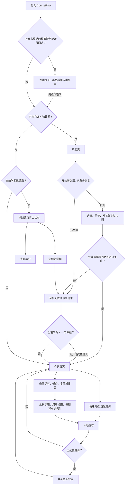

# CourseFlow MVP-A User Flow 设计

> 状态：已批准实现基线
> 版本：0.7
> 日期：2026-08-28
> 方法：Superpowers brainstorming + visual companion
> 适用范围：macOS / Windows 本地优先桌面应用

## 1. 设计目标与边界

本文把 CourseFlow 的产品基线转换成可供 UI 线框图、开发和验收共同使用的用户流程。每条流程包含用户目标、前置状态、编号步骤、分支、失败恢复、完成状态及稳定需求编号。

本轮详细覆盖：

- 九条核心 MVP-A 流程：首次启动、首次设置、今日首页、课程课表、任务、周日历、数据保护、学期切换，以及手动更新/迁移回退。
- 一条不阻塞核心发布的 MVP-A 外围流程：可选课节出席记录。
- MVP-B 文件资料库、MVP-C1 成绩/当前学期估算 SGPA、EXT-C2 目标计算只保留衔接入口，不在本轮展开。
- 本周负荷与番茄钟只记录后续布局位置与产品备忘，不在 MVP 中显示空入口。

首版仍只有一种用户：管理自己当前学期课程的学生。无账户、无远程业务后端、无教师或协作角色。

## 2. 依据与优先级

本设计依据：

1. `docs/product/PROJECT_BRIEF.md`
2. `docs/product/PRD.md`
3. `docs/product/MVP_SCOPE.md`
4. `docs/research/utm-grading-gpa-rules.md`
5. `ATTEMPT.md` 中可用于证明风险与可行性的旧实现证据

`ATTEMPT.md` 不是当前规范。若旧页面、旧功能或旧数据与当前产品文档冲突，以当前产品文档及本文已确认决策为准。

本文新增并同步回产品基线的决策包括：

- 课程级教学日期范围及课节范围继承。
- 首页的今日完成数、今日待完成数和学期日期进度。
- 多日假期在周日历中的单一跨日长条。
- 默认关闭、从启用当天开始的可选课节出席记录。
- Coursework/Assessment 两组任务类型、与类型解耦的可选进度，以及显式成绩关联。
- Present、Absent、Late、Excused 与 Unmarked 的出席状态和统计口径。
- 本周负荷与番茄钟的后续布局备忘。

## 3. 流程目录

| 流程编号 | 用户目标 | 发布层级 |
|---|---|---|
| UF-A-01 | 首次启动时开始新数据或安全恢复备份 | 核心 MVP-A |
| UF-A-02 | 可中断地建立最低可用学期 | 核心 MVP-A |
| UF-A-03 | 打开应用后立即判断今天先做什么 | 核心 MVP-A |
| UF-A-04 | 建立并维护课程与周期课表 | 核心 MVP-A |
| UF-A-05 | 建立、执行和修改单次或重复任务 | 核心 MVP-A |
| UF-A-06 | 在本周、周日历和议程中理解课节、任务、假期与 TBA | 核心 MVP-A |
| UF-A-07 | 可靠保存、异步备份并显式恢复 | 核心 MVP-A |
| UF-A-08 | 学期结束后查看历史或创建新学期 | 核心 MVP-A |
| UF-A-09 | 在应用外手动更新，并在需要时安全迁移或回到精确兼容版本 | 核心 MVP-A |
| UF-A-P01 | 可选地手工记录课节出席并查看课程统计 | MVP-A 外围目标 |

## 4. 总体流程



## 5. 共同状态与计算规则

### 5.1 首次设置完成条件

首次设置达到以下两项后标记为完成：

1. 已有一个当前学期。
2. 当前学期至少有一门课程。

用户可以在任何步骤提前进入“今天”。未完成的设置清单继续保留；缺少数据的首页区域显示真实空状态和下一步，不显示模拟课程、任务或数字。

首次设置尚未达标时，下次启动默认恢复设置清单，同时保留“进入今天”操作。达标后每次启动默认进入“今天”。

### 5.2 课程和课节范围

- 课程具有教学开始日和结束日，默认继承当前学期范围，且必须位于学期范围内。
- 每条 LEC、TUT、PRA 课节规则默认继承课程范围。
- 个别课节规则可以使用位于课程范围内的更短范围，用于晚开始或提前结束的 Tutorial、Practical 等。
- 上课地址属于课节规则，可为空；为空时显示 `TBA`。
- 教授/授课人是课程级可选信息，在该课程的课节备注中引用显示。MVP 不提供课节级授课人覆盖。

课节实例的统一派生规则：

```text
课节实例
= 课程/课节有效范围内所有匹配星期
− 命名假期
+ 单次例外
```

范围包含开始日与结束日，并按学期时区解释。若边界日不是所选星期，从范围内第一个匹配星期开始，到最后一个匹配星期结束。

### 5.3 任务时间与状态

- 精确时间任务在截止时刻后变为逾期。
- 纯日期任务在学期时区该日期结束后变为逾期。
- TBA 任务不进入虚构时间格、不参与倒计时或逾期计算，进入“待确定时间”区域。
- 待完成、已完成、已跳过和删除是不同语义。
- 任意任务可以明确开启可选进度；完成时显示 100%，恢复完成状态时还原完成前的自报进度。
- 重复任务每个实例拥有独立状态。
- 每周重复任务的结束日期默认建议为课程教学结束日，用户必须确认，也可缩短。

### 5.4 今日摘要

首页右上摘要显示：

- 今日已完成。
- 今日待完成。
- 学期进度。

任务计数：

- 截止日期或重复实例日期属于今天的已完成任务进入“今日已完成”。提前完成的未来任务和今天才完成的过往逾期任务仍归属其原实例日期，不混入今日计划计数。
- 截止日期或重复实例日期属于今天且仍待处理的任务进入“今日待完成”。
- 已跳过、TBA 和此前日期的逾期任务不进入这两个数，在详情中分别显示。

课节出席功能关闭时：

- 当天结束时间已过且未取消的课节进入“今日已完成”。这里的“完成”只表示计划时间已经结束，不表示用户实际出席。
- 当天正在进行或尚未开始的课节进入“今日待完成”。
- 假期抑制或明确取消的课节不进入两个数。
- 跨日课节归入开始日期，并在实际结束时刻以前保持正在进行。

课节出席功能开启后，只对处于有效出席记录周期内的课节使用手工状态：

- 已出席课节进入“今日已完成”。
- 正在进行或尚未开始的课节进入“今日待完成”。
- 已结束但未标记的课节进入独立的“待确认出席”状态。
- 缺席课节显示为缺席，不进入“已完成”或“待完成”。
- 开启日期以前的课节状态与既有摘要不会被回溯修改。

摘要可以展开查看任务与课节分别贡献的数量，以及跳过、缺席和待确认出席等未计入状态。

学期进度使用日历日、当前学期时区和包含首尾两日的公式：

```text
学期进度
= clamp(
    (今天 − 学期开始日 + 1)
    ÷ (学期结束日 − 学期开始日 + 1),
    0%,
    100%
  )
```

Reading Week 不从分母扣除。学期开始前显示 0%，结束后显示 100%。

### 5.5 假期

- 假期是一个具有名称、开始日和结束日的范围对象，不是每天一条记录。
- Reading Week 暂停周期课节及选择“跟随教学周”的重复任务。
- 一次性作业、考试和明确截止事项继续显示。
- 在周日历全天层，一个连续假期显示为横跨可见起止日期的单一长条。
- 若假期跨越周视图边界，每个可见周最多显示一个连续片段，不能拆成每天一条。
- 议程视图显示一条带起止日期的范围事项。

### 5.6 保存与备份

- 本地正式数据先保存成功，产品状态和派生视图才更新。
- 本地保存失败时保留用户输入，不触发备份，不声称数据已改变。
- 本地保存成功后，若配置了云盘目录，再异步生成不可变、完整且可独立验证的快照；任一必需资料库文件缺失、未验证或复制期间变化时整份失败，不发布部分快照。
- 同一备份集保留最近两份已验证快照；备份失败不回滚本地成功修改，也不删除既有已验证快照。
- “备份成功”只表示快照已在所选目录本地发布并重新验证；云盘工具是否已上传完成是独立、不可由 CourseFlow 冒充的状态。
- 活动数据目录、资料库根目录与云盘备份目录必须分开。

## 6. 详细流程

### UF-A-01：首次启动与恢复选择

**用户目标**：在无账户前提下明确开始新的本地数据，或从可信快照恢复。

**前置状态**：应用未找到有效本地活动数据。

**主流程**：

1. 应用先检查是否存在未完成的恢复；只有恢复状态已收敛，才检查默认活动数据目录和数据完整性。
2. 显示欢迎页，说明无需账户、核心功能离线可用、正式数据保存在本机。
3. 用户选择“开始新的本地数据”或“从备份恢复”。
4. 选择新数据时，应用初始化空白活动数据并进入 UF-A-02。
5. 选择恢复时，用户选择备份目录与快照。
6. 应用验证格式版本、完整性、可读性及数据范围；候选含资料库且没有可安全替换的当前根时，用户选择一个经过验证的新建或空本地目录。
7. 应用展示快照时间、学期、课程、事项、文件、资料库目标与所需空间的恢复预览。
8. 用户明确确认后，应用进入恢复维护状态，完成目标位置暂存、再验证和可恢复激活；应用不自动扫描云盘、不自动选最新副本、不合并两个副本。
9. 结构化数据重新打开、资料库全量对账并恢复启动路由后，应用才显示成功，并按恢复数据完整度进入“今天”或 UF-A-02。

**失败与恢复**：

- 快照损坏、不兼容、不可读、目标不安全或容量不足时，在激活检查点前停止并解释原因；用户可重选快照、目标，取消或开始新数据。
- 激活检查点后中断时先进入恢复页，不打开可能混合的新旧数据；用户可按已验证证据继续，或回滚到“尚无活动数据”的欢迎状态。
- 已有本地数据时，从设置发起的恢复走 UF-A-07 的替换保护流程。

**完成状态**：存在可打开的本地数据；用户进入首次设置或今天首页。

**需求追溯**：A-DATA-001、A-DATA-005、A-DATA-006、STATE-002、MVP-DOD-006、MVP-DOD-008。

### UF-A-02：可中断、可恢复的首次设置

**用户目标**：约 20 分钟内建立最低可用的当前学期，同时能够随时退出或提前使用首页。

**前置状态**：存在空白或未达到最低条件的本地数据。

**主流程**：

1. 用户创建当前学期，填写名称、开始日、结束日和默认时区。这是首次设置的唯一必需步骤。
2. 用户可以创建课程，填写代码、名称、教学日期范围及可选 section、教授、颜色和学分；课程由课程页的创建抽屉拥有，不阻塞首次设置。
3. 用户可以在课程表单中添加零至多条 Time Slot；每条只选择一个星期、LEC/TUT/PRA、五分钟粒度的起止时间、地址和范围。选择 TBA/later 时只保存课程。
4. 课程与本批 Time Slot 由 PLAN 原子保存；任一校验失败时输入保留且均不提交。
5. 用户可选择添加第一个任务；任务明确选择 Coursework/Assessment 与具体类型、纯日期/精确时间/TBA，并可配置每周重复和独立进度。
6. 用户可添加一个或多个命名假期；任务与假期都不阻塞首次设置。
7. 每个步骤本地保存成功后，清单立即更新；保存失败保留输入且不推进清单。
8. 存在 Current Term 后，应用标记“已可开始使用”，默认进入“今天”。
9. 用户继续补充剩余课程、课表、主要任务和假期。
10. 达标后显示可跳过的“保护数据”步骤；用户可选择云盘备份目录并创建首个快照，或继续仅本地保存。

**分支**：

- 用户随时可以进入“今天”；缺失区显示真实空状态与返回清单的入口。
- 课节重叠只产生警告，用户可确认后保存。
- 地点未知显示 TBA。
- 用户启用“跟随教学周”但尚无假期时，提示添加假期或明确暂不添加。

**完成状态**：最低条件满足，清单仍可继续补充但不再阻止日常使用。

**需求追溯**：A-TERM-001/002/004、A-COURSE-001–007、A-TASK-001–004/007、A-DATA-003/004、STATE-001–003、MVP-DOD-001/008。

### UF-A-03：“今天”首页与日常闭环

**用户目标**：打开应用后立即知道今天的课节、任务和下一步，并在首页完成高频操作。

**前置状态**：存在未结束的当前学期；最低设置已完成或用户选择提前进入。

**首页信息层级**：

1. 顶部模块导航：今天、课程、日历、任务。
2. 宽幅标题：“今天先做什么”。
3. 右上摘要：今日已完成、今日待完成、学期进度。
4. 三张主卡：今日课程、下一个 Coursework、下一个 Assessment。
5. 本周摘要，可进入本周列表、周日历或议程。
6. 待确定时间区域，集中显示 TBA 事项。

上一版首页只作为空间组织参考。账户头像、AI 配置、候选审核、专注计时和统计洞察不会因此回到 MVP。未规划区域不显示模拟内容或不可点击入口。

**主流程**：

1. 应用按当前学期时区加载同一组正式规则派生出的今日快照。
2. 今日课节按时间显示状态、类型、课程、地址/TBA 和可选教授。
3. 今日任务显示逾期、今天、即将到期、已完成等文字状态。
4. 首页分别选择下一个 Coursework 和下一个 Assessment；TBA 任务不参与选择。
5. 用户可直接把当前任务实例标为完成或跳过。
6. 本地保存成功后，所有视图同步更新并短暂提供撤销。
7. 用户打开详情以编辑任务内容、重复规则或已明确开启的任务进度。
8. 用户打开课节详情查看信息，或进入单次/未来例外流程。

**空状态与失败**：

- 今日无事项时仍显示真实的下一任务和本周摘要；没有对应数据时说明缺少什么。
- 快捷操作本地保存失败时，任务保持原状态。
- 本地保存成功但备份失败时，任务修改保持成功，只显示独立备份警告。

**未来布局预留**：

- 网格允许后续加入本周负荷和番茄钟。
- MVP 成品不渲染“即将推出”卡片、不可点击按钮或伪统计。
- 详细备忘见 `docs/product/FUTURE_MEMO.md`。

**完成状态**：用户完成、跳过或打开目标事项，且各视图状态一致。

**需求追溯**：A-VIEW-001/003–006、A-TASK-005/008/009、A-DATA-004、STATE-001–003。

### UF-A-04：课程与周期课表维护

**用户目标**：维护一门课程及多条 LEC/TUT/PRA 规则，并正确处理范围、冲突、假期和例外。

**入口**：首次设置、课程列表、今日课节或日历课节。

**主流程**：

1. 用户创建或打开课程详情。
2. 用户维护代码、名称、教学范围及可选 section、教授、颜色和学分。
3. 用户在新建课程时一次添加零至多条课节规则，或在课程详情继续添加。
4. 每条规则要求类型、恰好一个星期、五分钟粒度的开始/结束时间；地址可为 TBA。修改开始时间不自动顺延结束时间。
5. 规则默认继承课程教学范围；用户可设置位于课程范围内的更短范围。
6. 应用验证时间与范围，并显示所有重叠警告。
7. 新建课程与本批课节在一次 PLAN 提交中全有或全无；用户确认保存后，应用按统一公式生成课节实例。
8. 今天、本周、日历和摘要同时刷新。

**修改分支**：

- 从某次实例操作：只提供“仅本次”和“本次及未来”。
- “仅本次”创建一个单次修改或取消例外。
- “本次及未来”从该实例日期分割规则，历史实例不变。
- 从规则详情操作：可编辑整条规则或删除整个规则，并明确影响范围。
- 归档课程：显示对当前课表和待办的影响，默认从当前视图移除但保留历史。

**失败与恢复**：

- 时间非法时不能保存。
- 冲突只警告，不擅自删除或移动课节。
- 保存失败保留输入，现有派生视图不改变。

**完成状态**：课程规则和所有派生视图使用同一正式数据版本。

**需求追溯**：A-TERM-004/005、A-COURSE-001–007、A-CALENDAR-001、STATE-002/004、MVP-DOD-002/003/007。

### UF-A-05：任务、重复实例与状态管理

**用户目标**：建立可解释的单次或每周任务，并安全处理每个实例和未来规则。

**入口**：首次设置、任务页、课程详情、今天、本周或日历。

**主流程**：

1. 用户选择课程并填写任务标题；从课程详情进入时以 CourseName 作为主要上下文。
2. 用户先选择 Coursework 或 Assessment，再选择 Homework、Assignment、Project、Research Paper、Quiz、Term Test、Midterm、Final 或所属组内带自定义名称的 Other。
3. 用户选择纯日期、精确截止时间或 TBA。
4. 用户选择单次或每周重复。
5. 每周任务设置开始日、星期、截止时间、结束条件，以及是否跟随教学周。
6. 保存成功后，应用生成独立任务实例并更新所有视图。
7. 用户可以在首页完成或跳过本次实例，也可以从详情恢复。
8. 任意任务可明确开启 0–100% 自报进度；Project 与 Research Paper 优先展示入口，进度不参与成绩计算。
9. GRADE 可用时，用户可以展开“计入成绩”，显式关联同课程既有评分项或在任务保存后创建并关联新评分项；分类只提供建议，不自动确认或持续同步。

**重复实例修改**：

- 从实例编辑或删除：仅本次 / 本次及未来。
- 从规则详情：编辑或删除整个规则。
- 本次及未来操作分割规则，已完成和已跳过的历史不被静默改写。

**状态与失败**：

- 逾期任务保留原实例和原截止时间，不自动移动到今天。
- TBA 不参与倒计时或逾期。
- 删除、跳过和完成使用不同文案与恢复方式。
- 本地保存失败时保留编辑输入和原状态。

**完成状态**：任务规则、实例状态和各派生视图一致。

**需求追溯**：A-TASK-001–010、A-TERM-005、STATE-002–004、MVP-DOD-003/004。

### UF-A-06：本周、日历、假期与 TBA

**用户目标**：在本周列表、周日历和议程中理解所有计划事项及假期影响。

**主流程**：

1. 用户从首页进入本周、周日历或议程。
2. 本周列表按日期和时间展示课节、任务、截止事项及命名假期。
3. 周日历的时间格展示有精确时间的课节和任务。
4. 纯日期任务进入全天层。
5. 日期或时间未知的任务进入待确定区域。
6. 地点为 TBA 的课节仍有明确时间，继续保留在时间格中。
7. 连续假期在全天层显示为一个跨日长条。
8. 用户点击假期长条打开同一个日期范围对象。
9. 应用从周视图和议程提供返回事项详情、创建事项和编辑例外的入口。
10. 应用打开时，根据同一组实例显示本周列表、倒计时和临近提示；应用关闭后不承诺系统通知。

**Reading Week 规则**：

- 暂停周期课节。
- 暂停选择“跟随教学周”的重复任务。
- 保留一次性作业、考试和明确截止事项。
- 假期或取消课节不进入出席统计分母。

**假期编辑**：

- 编辑或删除假期后，应用重新派生受影响实例。
- 用户单次例外、已完成历史实例和出席记录不得直接丢失。
- 若重新派生产生冲突，应用显示警告并保留正式数据。

**完成状态**：三个视图展示同一组实例与状态，且假期范围可追溯到单一对象。

**需求追溯**：A-TERM-004/005、A-VIEW-002/004/005、A-CALENDAR-001–003、A-COURSE-005/006、STATE-003/004、MVP-DOD-002/003/004。

### UF-A-07：本地保存、云盘备份与显式恢复

**用户目标**：确信正式数据已经本地保存，备份失败不会损坏工作，恢复不会静默覆盖。

**本地保存与备份**：

1. 用户提交学期、课程、课节、任务、假期、设置或出席记录修改。
2. 应用验证输入。
3. 应用执行可恢复的本地写入。
4. 本地写入成功后，正式状态和派生视图才更新。
5. 已配置云盘目录时，应用异步生成新的完整快照；同一备份配置的多次本地保存可以合并到一次较新的实际修订。
6. 快照在所选目录本地发布并重新验证后，应用才更新最后成功时间和已保护范围；这不表示云盘服务已上传完成。
7. 任一必需数据或资料库文件无法验证、目的地不可写或发布中断时整份失败；既有已验证快照和待备份状态保留，本地修改保持成功。
8. 新快照成功后，同一备份集只清理较旧且已验证、由本配置准确登记的快照，始终保留最近两份；其他备份集、未知或无法验证的条目不自动删除。

**配置备份**：

1. 用户在首次设置达标后或设置页选择“保护数据”。
2. 用户选择云盘同步目录。
3. 应用验证目录可写，并确认它不等于活动数据目录或资料库根目录。
4. 应用为该持久配置建立独立备份集并创建首个完整快照。
5. 失败时继续使用本地数据，并允许重选目录或稍后重试。

**从已有本地数据恢复**：

1. 用户从设置选择“导入备份”。
2. 应用分别列出已验证、同步中或不完整、损坏、不兼容及未知条目；不按目录时间自动选“最新”副本，用户选择候选。
3. 应用重新验证格式、完整性和兼容性；只有已验证候选才进入影响预览。
4. 候选含资料库时：当前资料库根健康且其父目录可安全切换则保持同一用户可见路径，否则用户必须选择经过验证的新建或空本地目录。候选不含资料库时明确预览“恢复后无活动资料库根”，旧根若存在则保持原位但不再活动。应用把资料库目标/current variant 纳入影响预览。
5. 应用按相关卷分别预检当前数据、恢复前安全恢复集、候选暂存和回滚副本的峰值空间；空间不足时在改变活动数据前停止，不删除安全恢复集或既有已验证快照强行继续。
6. 用户确认完整替换；MVP 不提供自动合并。确认只对当前候选、current state、资料库目标和预览有效：健康 current state 使用修订/根代次，受限恢复使用明确不可用状态与原始证据指纹；其中任一变化都要求重新预览与确认。
7. 确认后应用立即进入恢复维护状态：停止普通写入、文件操作、备份和新预览，使既有资源访问授权失效；检查点前允许取消。
8. 当前 DATA 与已配置资料库都健康时，应用先创建本次恢复会话独有的完整本地安全恢复集。当前 DATA 损坏/只读或已配置资料库无法完整读取时，只有能够保持原始数据库、资料库和恢复协调证据不变且恢复控制位置可写，才可在明确警告与再次确认后进行受限恢复；否则停止。
9. 应用把候选结构化数据和资料库分别暂存到各自最终位置的同卷相邻位置，完整验证数据库、根身份和文件闭包；外部变化、修订变化或根代次变化使预览失效并回到决定步骤，不自动合并。
10. 进入激活检查点后，应用按可恢复顺序切换完整资料库与结构化数据。此后中断不再打开普通工作区，而是进入恢复页并只显示当前可证明状态以及证据允许的继续或回滚；若两者都不安全则不提供物理动作。启动时不会在没有用户决定的情况下继续执行物理切换。
11. 候选结构化数据重新打开并验证、资料库完成全量扫描/对账、旧设备路径和访问证据失效、首次设置与当前学期路由恢复后，应用才显示恢复成功。
12. 恢复前安全恢复集至少保留到恢复后第一份常规快照发布并验证成功；未配置备份时作为单独的本地恢复点保留，直到用户明确清理。恢复成功后若想回到旧数据，必须重新发起一次完整恢复，不提供绕过验证与预览的一键反悔。

**失败与恢复**：

- 激活检查点前失败或取消：活动数据不变，退出维护状态；用户可修正后重试。
- 激活检查点后中断：应用保持恢复状态；只在磁盘证据能唯一证明结果时补记无副作用的观察/完成记录，任何仍会改变结构化数据或资料库的继续/回滚都等待用户明确选择。
- 继续失败但旧副本或安全恢复集仍有效：允许回滚并重新打开、对账旧数据；证据冲突、恢复协调记录损坏或结果无法唯一分类时保持 recovery、展示当前可证明状态，不猜测、不做跨卷复制删除降级。
- 恢复成功后的临时清理失败：成功状态不回滚，显示“清理待完成”并保留不匹配或未知条目，等待再次安全检查。

**完成状态**：用户看到明确的本地保存状态、备份状态或恢复结果，且只有一个正式本地副本在运行。

**需求追溯**：A-DATA-001–006、A-PLATFORM-001、STATE-002、MVP-DOD-005/006/007/008。

### UF-A-08：学期结束、历史查看与新学期

**用户目标**：保留已经结束的学期，并在不复制旧错误的情况下建立下一学期。

**主流程**：

1. 应用启动时按学期时区比较今天与当前学期结束日。
2. 今天超过结束日时，应用自动归档学期，不删除任何记录。
3. 首页显示“学期已结束”的真实状态，学期进度显示 100%。
4. 用户选择查看历史学期或创建新学期。
5. 查看历史时，课程、任务、日历、例外和出席记录保持原样。
6. 创建新学期时，用户进入 UF-A-02 的同一套可恢复清单。
7. MVP 不自动复制旧课程、课表或任务。

**修正分支**：

- 用户可以修正历史学期结束日。
- 若修正后的范围仍覆盖今天，且没有另一个当前学期，用户确认后可恢复为当前学期。
- 切换当前学期后，课程、任务、首页和日历范围同步更新。

**出席设置**：

- 全局出席开关开启时，未来新课节进入新的有效记录周期。
- 已归档课节及启用日以前的课节不被自动改写。

**完成状态**：系统只有一个当前学期；历史完整；新学期可继续设置。

**需求追溯**：A-TERM-002/003、A-VIEW-003/006、A-DATA-004/005、STATE-001/002、MVP-DOD-002/005。

### UF-A-09：外部手动更新、数据迁移与精确版本回退

**用户目标**：在不依赖应用内更新服务的情况下安装新版本，并确信升级、迁移、中断或回退不会静默破坏本地数据。

**更新入口与普通更新**：

1. CourseFlow 不检查新版本、不显示更新提示，也不在后台联网。
2. 用户在应用外进入项目唯一 GitHub Releases 页面，选择当前平台的正式安装制品并手动安装。
3. macOS 用户替换 `/Applications` 中的应用；Windows 用户运行 per-machine MSI 完成升级。安装器不读取或改变每用户数据。
4. 新应用启动时先检查未终结恢复/回退状态，再验证应用构建、稳定数据根和当前数据格式。
5. 当前数据已是兼容 schema 时直接重新打开；普通应用更新不创建迁移安全副本。

**需要前向迁移时**：

1. 应用在任何 schema 写入前创建一份关闭、完整且可重新验证的本地迁移安全副本。
2. 新副本验证成功后才允许替换此前副本并开始逐级前向迁移；创建失败时原数据和既有副本保持不变。
3. 迁移每一级按正式事务边界提交。中断后应用不猜测或删库重建，而是按已提交 level 和持久证据继续或进入 recovery。
4. 迁移完成后重新打开结构化数据，验证身份、schema、revision 与完整性；资料库对现存真实文件完成全量扫描/FileId 对账。
5. 上述步骤和正常启动路由全部完成后才进入普通工作区。
6. “数据与备份”持续显示最近一份迁移安全副本、源 schema/修订、创建时间、尺寸和精确兼容回退版本；它不属于云盘快照或整库恢复安全集。

**删除安全副本**：

1. 用户选择删除时，界面说明将失去本次迁移的应用版本回退能力。
2. 只有副本身份和当前状态仍匹配时才删除；失败保持副本并说明未改变。
3. 应用不按时间、空间、启动次数或后台任务自动清理副本。

**显式回退**：

1. 用户选择“回退”，应用重新验证安全副本和当前数据并生成影响预览。
2. 预览显示精确目标版本/tag/平台制品，并明确说明迁移后新增或修改的结构化事实会丢失且不会自动合并；真实资料库文件保持原位，目标版本会重新扫描对账。
3. 用户确认后应用进入维护状态，停止普通写入、文件操作、备份和新预览；准备同卷数据槽位和持久 handoff 后退出。
4. Windows 用户先卸载当前 MSI，再安装指定旧 MSI；macOS 用户手动替换为指定旧版应用。卸载/替换不删除用户数据。
5. 精确目标 build 启动时显示待完成状态；用户选择继续后验证迁移前数据、全量对账资料库并恢复启动路由。
6. 原 source build 可以让用户取消并恢复迁移后的数据；其他 build 只说明所需版本，不打开普通工作区、不自动迁移或猜测下一步。
7. 目标数据重新打开、资料库对账和路由完成后才显示回退成功；安全副本此时成为活动数据，不再保留同内容重复副本。

**失败与中断**：

- 迁移副本创建或迁移开始前失败：原活动数据不变；允许修正空间/权限后重试。
- 迁移中断：保持可证明的最后已提交 schema level 和安全副本，进入 recovery；不报告部分成功。
- 回退检查点前取消：迁移后数据继续作为正式数据。
- 回退检查点后中断：保持专用回退页；只允许当前 source/target build 和物理证据支持的继续或取消。
- safety/current 槽位、handoff 或 build 证据冲突：保持 recovery 且不提供不安全物理动作。

**完成状态**：普通更新继续使用同一数据；迁移只有在新数据完整重开后完成；显式回退只有在精确兼容版本重开旧结构化数据、资料库全量对账并恢复路由后完成。

**需求追溯**：A-DATA-007、A-PLATFORM-002–004、STATE-002/007、NFR-001/002/003/006/007/012、MVP-DOD-005/007/008/009。

### UF-A-P01：可选课节出席记录

**层级**：MVP-A 外围目标。不得成为核心 MVP-A 发布、首次设置或日常课表的阻塞项。

**用户目标**：可选地手工记录自己是否出席课节，并按课程查看可解释的自报统计。

**启用**：

1. 用户进入“设置 → 计划与日历”。
2. 用户开启“课节出席记录”。
3. 功能默认关闭；首次开启或上一个窗口在更早学期日期关闭时，从当前学期时区当天 00:00 生效。
4. 该启用日期包含当天；当天较早已经结束的课节可以进入未标记状态。早于启用日期的课节不会新增状态、待确认事项或统计义务。
5. 关闭在提交时刻立即生效：开始时刻不早于该时刻的课节不产生新义务；关闭前已经具备资格或已有标记的课节继续保留，课表和任务正常工作。
6. 再次开启建立新窗口，不回溯关闭间隙。同一学期日期内关闭后重开只从重开提交时刻生效；跨日重开仍按第 3 步覆盖新的启用日期。

因此实现和验收必须支持一个或多个有效记录周期，而不能用开关变化静默重写历史。

**手工记录**：

1. 处于有效记录周期的课节开始后，“今天”和课节详情显示记录 Attendance 的入口。
2. 用户选择后，本地保存该课节实例的自报状态。
3. 状态为 Unmarked、Present、Absent、Late 或 Excused；用户可更正或恢复为 Unmarked。
4. Unmarked 保持未知，不能自动按 Absent 处理。
5. Reading Week、取消课节和尚未发生课节不进入已结束统计分母。
6. 打卡不使用定位、二维码、教师验证或后台自动判断，不是学校正式考勤。

**课程统计**：

```text
出席率 = (Present + Late) ÷ (Present + Late + Absent)
记录覆盖率 = (Present + Late + Absent + Excused) ÷ 已结束且应上课的课节
```

页面同时显示五种状态、出席率和记录覆盖率。Excused 不进入出席率分母；任一适用分母为零时结果保持未知并解释原因。Today 中 Present 与 Late 计完成但保持不同标签，Absent 单列，Excused 为已处理且不进入完成、缺席或待确认。

**失败与隔离**：

- 出席状态保存失败时保留原状态并允许重试。
- 统计只能来自正式本地出席记录和课节实例。
- 出席模块失败不得阻止课程、课表、任务、日历或首页打开。
- 出席数据按 UF-A-07 进入本地保存和可选备份。

**完成状态**：启用日期以前和关闭间隙中的数据不变；有效记录周期内的课节可手工标记；课程统计同时显示结果和覆盖范围。

**需求追溯**：A-ATTEND-001–006、A-VIEW-006、STATE-003、MVP-A-P-DOD-001–004。

## 7. 跨流程错误与恢复矩阵

| 事件 | 用户看到的状态 | 正式数据 | 可执行下一步 |
|---|---|---|---|
| 表单校验失败 | 字段级原因，输入保留 | 未改变 | 修正后重试 |
| 本地保存失败 | 明确说明未保存 | 未改变 | 重试、复制输入或取消 |
| 课节时间冲突 | 文字警告与冲突对象 | 用户确认前未改变 | 返回修改或确认保存 |
| 云盘目录不可写或空间不足 | 本地成功、备份失败 | 本地已改变；既有两份已验证快照不为强行成功而删除 | 重试、释放空间或更换目录 |
| 快照成员仍在同步或不完整 | 不可恢复，显示同步中或不完整 | 未改变 | 等待同步完成后重新验证或重选 |
| 备份损坏或版本不兼容 | 验证失败，不进入影响预览或替换 | 未改变 | 重选兼容且已验证的快照 |
| 恢复容量不足或目标不安全 | 检查点前停止并解释所需位置/空间 | 未改变 | 释放空间、选择安全目标或取消 |
| 恢复检查点前中断 | 恢复未激活 | 原数据保持 | 重试或取消 |
| 恢复检查点后中断 | 恢复待处理，普通工作区关闭 | 不宣称新旧任一方成功；由持久证据判定 | 显示当前可证明状态；只在安全时提供继续或回滚 |
| 恢复成功但清理失败 | 恢复成功、清理待完成 | 新数据为唯一活动真相 | 重试安全清理；不回滚成功 |
| 迁移安全副本创建失败 | 更新需要迁移但尚未开始 | 原数据与既有安全副本未改变 | 释放空间、修正权限或取消使用新版本 |
| 迁移中断 | 迁移待恢复，普通工作区关闭 | 保持最后可证明的已提交 schema level和安全副本 | 按当前 build/证据继续；无法判定时保持 recovery |
| 回退等待目标版本 | 显示精确 tag 和平台制品，普通工作区关闭 | 迁移前与迁移后数据槽均按 handoff 受保护 | 在应用外安装目标版本，或用 source build 明确取消 |
| 启动了错误应用 build | 显示所需 target/source 版本 | 不打开、不迁移、不切换活动数据 | 安装所需精确版本；没有安全动作时保持当前状态 |
| TBA | 待确定时间，不生成虚构日期 | 保存为未知 | 补充日期/时间 |
| 未标记出席 | 待确认，不按缺席 | 保持未知 | 出席、缺席或继续未知 |
| 假期变化 | 重新派生并显示可能冲突 | 规则和历史保留 | 检查例外并确认 |

## 8. 后续模块衔接

- MVP-B 文件资料库：从课程详情及全局资料入口进入；失败不得阻止核心计划。
- MVP-C1 成绩与当前学期估算 SGPA：从课程详情及学期成绩总览进入；使用同一课程与学期身份。
- EXT-C2 目标成绩：只有 C1 数据和模板充分时出现；不阻塞 MVP-A。

本轮不定义这些模块内部页面、任务流或错误恢复。

## 9. 验收旅程

至少验证以下端到端旅程：

1. 新用户建立学期、一门课程和一条课节，提前进入首页后继续完成设置。
2. 一门课程在课程范围内按星期生成课节，Reading Week 全部暂停，假期后恢复。
3. 个别 Tutorial 使用比课程更短的范围，不影响同课程 Lecture。
4. 用户从今天首页完成任务并撤销；所有视图同步。
5. 重复任务执行“仅本次”和“本次及未来”，历史完成实例保持不变。
6. 周日历把连续假期显示成一个跨日长条，并继续显示假期内的一次性考试。
7. TBA 任务只进入待确定区域，不参与倒计时或逾期。
8. 本地保存成功、备份失败时，任务状态保持成功且既有已验证快照可用；两个备份集互不清理。
9. 云盘只同步部分成员时不把候选显示为已验证；从损坏或不兼容快照恢复失败时，原本地数据仍可打开。
10. 学期结束后自动归档，用户查看历史并创建新学期，旧课程不自动复制。
11. 出席记录默认关闭；跨日启用包含当天但不改变更早日期，关闭在提交时刻立即生效。
12. 启用后手工标记出席/缺席、恢复未知，并按课程计算出席率与覆盖率。
13. 关闭再开启出席记录时，关闭间隙不回溯，关闭前的资格和记录不删除；同日重开从实际重开时刻生效。
14. macOS 与 Windows 均完成同一核心旅程，且离线可用。
15. 两个平台都从正式安装制品完成无 schema 变化的手动更新，卸载/替换不改变每用户数据。
16. 需要 migration 的版本先建立安全副本；副本创建、每级迁移和重启 failpoint 都不导致静默重置或伪成功。
17. 用户从安全副本预览并确认回退，source build 可取消、target build 可完成、其他 build 停止；真实资料库文件保持并完成全量对账。
18. 一个公开版本只有在 macOS/Windows 两个最终制品和发布清单同时通过、重新下载并验证后才完成。

## 10. 明确非目标

- 账户、远程业务后端和多设备双向实时合并。
- AI、OCR、课程大纲自动抽取和候选审核。
- 教师考勤、地理围栏、二维码签到、出席证明或自动推断实际出席。
- 本周负荷与番茄钟在 MVP 中的实现或空入口。
- 旧版首页中的统计洞察、专注建议和账户侧栏。
- MVP-B、MVP-C1、EXT-C2 的内部 User Flow。
- 应用内更新检查、下载、安装、应用商店、自动发布、额外架构或公开 beta/nightly 渠道。

## 11. 后续文档顺序

用户书面审阅本文并批准后：

1. 使用 Superpowers `writing-plans` 形成文档实施计划。
2. 后续单独建立 UI 线框图或页面说明。
3. 再建立架构、ADR、roadmap 和 backlog。

未经书面规格批准，不进入代码实现。
