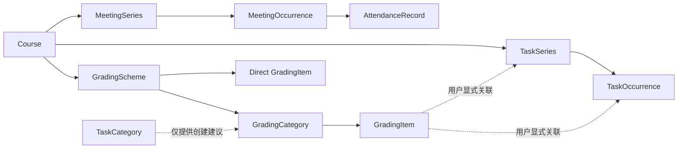

# Course、Task、Grade 与 Attendance 一体化体验设计

> 状态：已由用户逐段确认
> 日期：2026-08-28
> 方法：Superpowers brainstorming

## 1. 目的与边界

本设计优化 CourseFlow 的课程、任务、成绩和出席流程。参考软件截图只用于分析操作顺序、信息层级和时间选择方式，
不构成实现指令，也不替换 CourseFlow 已有的桌面端视觉语言。

本轮约束如下：

- 保留现有浅色、克制、卡片化的视觉元素风格，重点调整流程、层级和组件行为。
- 面向 `1120 × 720` 桌面基线；核心流程必须支持键盘、明确焦点和 Reduced Motion。
- Task、Grade 和 Attendance 必须共享 Course、TaskSeries、TaskOccurrence 等稳定身份，不建立仅供页面使用的第二份事实。
- 首次发布仍不提供后台系统通知；Today、本周、倒计时和临近截止继续由本地正式数据派生。
- 本文记录批准过程与跨页面设计意图；产品语义以
  [PRD](../../product/PRD.md)、[Architecture](../../architecture/ARCHITECTURE.md) 和
  [Module Contracts](../../architecture/MODULE_CONTRACTS.md) 为准，页面细节以
  [UI 页面规范](./2026-08-18-courseflow-ui-wireframes-page-spec-design.md) 为准。

## 2. 总体信息架构

Task 采用渐进披露，而不是把八个类型平铺在同一行：

1. 先选择 `Coursework` 或 `Assessment`。
2. 再显示该组的四个类型。
3. Course detail 与 Tasks 列表只在用户需要精确筛选时展开 Type 菜单。

类型定义为：

| 分组 | 类型 |
|---|---|
| Coursework | Homework、Assignment、Project、Research Paper |
| Assessment | Quiz、Term Test、Midterm、Final |

`Midterm` 和 `Final` 是常用的 Term Test 细类；保留通用 `Term Test` 以覆盖不属于两者的阶段考试。两组均允许
`Other`，但自定义标签必须跟随所选分组，不能成为无语义的全局字符串。

Course detail 的筛选保持两层：第一层为 `All / Coursework / Assessment`，第二层 Type 菜单只显示当前组内
类型。这样默认页面只有三个稳定入口，同时仍能精确查看 Project、Quiz 等类别。



PLAN 拥有 TaskCategory 和计划身份，ATTEND 只引用 MeetingOccurrence，GRADE 拥有 GradingCategory、GradingItem 和
成绩公式。虚线表示建议或显式引用，不表示事实所有权或自动同步。

## 3. New Task

### 3.1 页面结构

右侧 Drawer 的首要上下文显示 `<CourseName>`，课程代码作为次要信息；不得用示例代码替代课程名称。表单顺序为：

1. Course context；
2. Category group 与 Type；
3. Title 和可选 Notes；
4. Once / Weekly；
5. Date only / Specific time / TBA；
6. 可选 Progress；
7. 折叠的 Counts toward grade；
8. 固定在 Drawer 底部的 Save Task。

日期采用紧凑、按需展开的月历，不在初始页面永久占用整块高度。Deadline 支持三种不同状态：

- `Date only`：只有本地日期；
- `Specific time`：本地日期与按五分钟递增的时间；
- `TBA`：未知，不以默认日期或零时替代。

Weekly 只选择一个 weekday，必须有当地截止时间和已确认的结束日期，并可选择是否跟随教学周。它生成稳定的任务实例，
Reading Week 只抑制选择“跟随教学周”的实例。表单不提供手工 Reminder 字段；Today、本周、倒计时和临近截止会从
正式 Deadline 自动派生。

### 3.2 进度

Progress 是独立开关，不由任务类型推导。Project 和 Research Paper 默认更显眼，但任何类型均可启用。启用后保存
`0–100` 的明确进度；标记完成时显示完成状态，若用户撤销完成，则恢复完成前的进度值，而不是重置为零。

### 3.3 成绩关联

`Counts toward grade` 默认折叠且可选。用户只能显式选择以下动作之一：

- 关联已有 GradeItem；
- 创建新的 GradeItem 并确认其权重归属；
- 保持不关联。

TaskCategory 只可建议 GradingCategory，不能自动确认，也不能在保存后静默同步两者。任务编辑、完成、改期或改分类
不会偷偷改变分数、权重或 GradeItem 身份。

Weekly Task 若创建成绩项，必须在保存前显示精确数量，并由用户明确选择：

- 为当前有限范围内的每个 occurrence 创建一个 GradeItem；或
- 为整个 series 创建一个 GradeItem。

Task 保存和 Grade 关联是两个明确提交边界。若 Task 已保存而 Grade 写入失败，界面必须报告部分成功，保留已经保存的
Task，并提供重试成绩关联的动作；不得声称整次保存失败，也不得回滚已成功的 Task。

## 4. Grade 与 GPA 的连接

Grade 使用每门课程自定义的 GradingCategory，与 Task 的固定分类体系相关但不锁定。C1 支持两种一层结构：

- 直接 GradeItem：评分项直接占课程总评权重；
- 分类 GradeItem：GradingCategory 占课程总评权重，分类内已计入项目等权平均。

同一 GradeItem 只能属于其中一种父级，不能同时直接计入课程又计入分类。不得在 C1 中加入分类内自定义比例、
drop-lowest、best-N 或更深层级。

设直接评分项集合为 `D`，分类 `c` 的课程总权重为 `W_c`、全部成员数为 `N_c`，已出分成员集合为 `G_c`，项目
百分比为 `p_i`：

```text
effectiveWeight(i in category c) = W_c ÷ N_c
categoryCurrentAverage(c) = average(p_i for i in G_c)
earnedWeightedPoints = Σ(graded direct i, w_i × p_i)
                     + Σ(c, i in G_c, effectiveWeight_i × p_i)
gradedCoverageWeight = Σ(effective weights of graded items)
currentGrade = earnedWeightedPoints ÷ gradedCoverageWeight
```

公式中的百分比使用同一量纲；正式契约可等价地在中间步骤除以并最终乘回 `100`。未出分、缺失、零分和不适用必须
保持不同状态。空分类或没有已出分项目的分类不伪造为 0%；覆盖权重不足时显示估算范围，而不是暗示完整最终成绩。
GPA/SGPA 继续消费每门课程最终或估算成绩的正式 Grade 投影，不直接读取 TaskCategory。

## 5. Course 与 Time Slot

New Course Drawer 先录入课程名称、代码等 Course 信息，再包含零至多条 Time Slot。保存 Course 与当前所有 Time Slot
是一个原子提交：任一 slot 校验失败时均不写入部分课程。

每条 Time Slot 包含：

- 一个 weekday；
- LEC / TUT / PRA；
- Start 和 End，均以五分钟递增；
- `Same day / Next day`，显式表达跨日；
- Location 或明确 TBA；
- Duplicate 和移除动作。

修改 Start 不自动顺延 End。若 End 早于 Start，界面要求用户明确选择 Next day 或修正时间，不能偷偷改变另一字段。
Course 允许不带 Time Slot 保存，表示“稍后添加课节”；它不同于创建一条字段未知的 TBA Meeting。

## 6. Course detail 与 Attendance

Course detail 以 CourseName 为主标题、课程代码为次要信息。顶部提供两个紧凑摘要卡：

- Attendance：状态计数、出席率与覆盖率；
- Current Grade：当前估算、覆盖权重和进入 Grade 详情的入口。

Attendance 子页面保留参考软件的“摘要 → 记录列表 → Log Attendance”顺序，但使用 CourseFlow 现有视觉元素。每个有效
课节实例只有一个状态：`Unmarked / Present / Absent / Late / Excused`，并允许更正或恢复为 Unmarked。

公式为：

```text
attendanceRate = (Present + Late) ÷ (Present + Late + Absent)
coverageRate = (Present + Absent + Late + Excused) ÷ eligibleEndedMeetings
```

分母为零时保持未知。Excused 表示已处理，因此计入覆盖率，但不进入出席率分母；Unmarked 保持未知，不能自动变为
Absent。

Today 的映射为：

| 状态 | Today 语义 |
|---|---|
| Present | 已完成 |
| Late | 已完成，保留 Late 标签 |
| Absent | 单独显示缺席 |
| Excused | 已处理，不计完成、缺席或待确认 |
| 已结束的 Unmarked | 待确认 |
| 进行中或未来的有效课节 | 待完成 |

## 7. 全局导航与 Setup

首个公开版本保持 `Today / Courses / Calendar / Tasks / Files` 五项导航。只有 C1 Grade 真正交付时，才在 Tasks 与
Files 之间加入 Grades；批准设计不等于已经交付入口。

Setup 调整为：

```text
Term → First Course + optional Time Slots → optional First Task
     → optional Holiday → Today
```

当前最低完成条件为 `Current Term + 至少一门 Course`。Meeting、Task 和 Holiday 都可稍后从对应页面的右侧 Drawer
补充，不再为了满足最低条件强迫用户创建虚假数据。

Drawer 宽度为 `440–520 px`，内容区独立滚动，标题和主保存动作保持可达；页面不因长月历或多个 Time Slot 让整个应用
产生难以控制的嵌套滚动。

## 8. 开发期数据替换

当前软件尚未公开发布，用户已明确批准不迁移旧 `Small/Large` Task 数据。实施时应通过受安全副本保护的前向 schema
迁移删除旧 TaskSeries、TaskSegment、task occurrence state/history 和不兼容 Task draft，再建立新 TaskCategory 与
progressTracking 结构。

该授权只覆盖旧任务事实和不兼容任务草稿，不覆盖 Term、Course、Meeting、Holiday、共同操作回执或其他模块数据；也
不能被解释为首个公开版本后的通用破坏性迁移许可。不得保留 Small/Large 兼容层或双写路径。

## 9. 已拒绝的方案与理由

- 八种 Task Type 全部平铺：入口过密，移动端参考结构直接搬到桌面也会削弱扫描性。
- 只保留 Homework / Midterm / Final：无法覆盖高年级 Project、Research Paper 和通用 Term Test。
- TaskCategory 与 GradingCategory 锁定：课程评分结构因教师而异，会把任务组织误当成成绩事实。
- 改 Start 时自动顺延 End：会静默改变用户尚未确认的课节时间。
- Excused 计作 Present 或 Absent：都会扭曲出席率语义。
- 恢复 Small/Large 兼容：当前没有公开用户数据需要承担该复杂度，且会长期保留两套相互冲突的模型。

## 10. 实施状态

本设计已获批准，但本文提交只更新规范与决策记录：没有修改运行时代码，没有创建新 Backlog 工作包，也没有执行任何
数据删除。后续必须先按 Backlog 登记可验证的纵向切片，再依据适用 Requirement、FLOW、接口、ADR 和 TEST obligation
实施。
